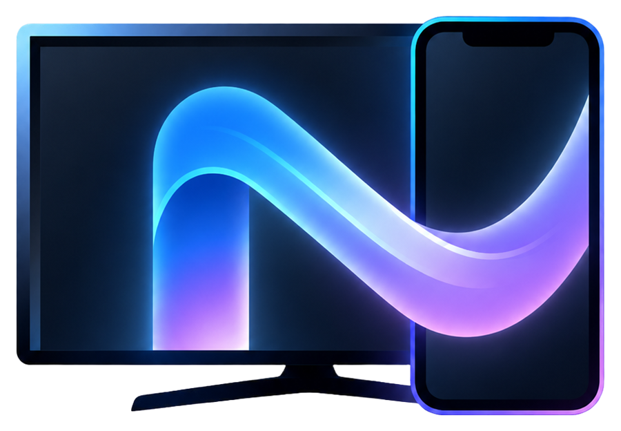
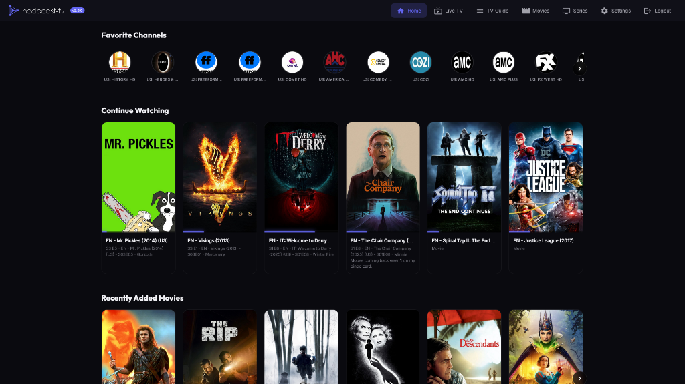
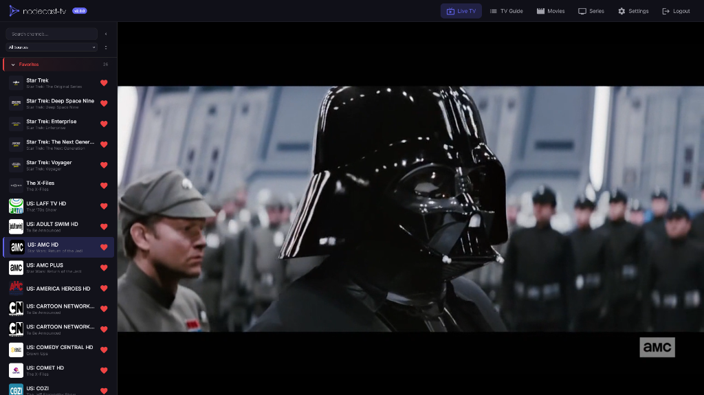
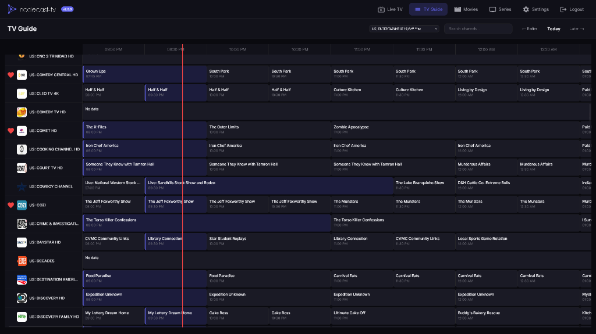
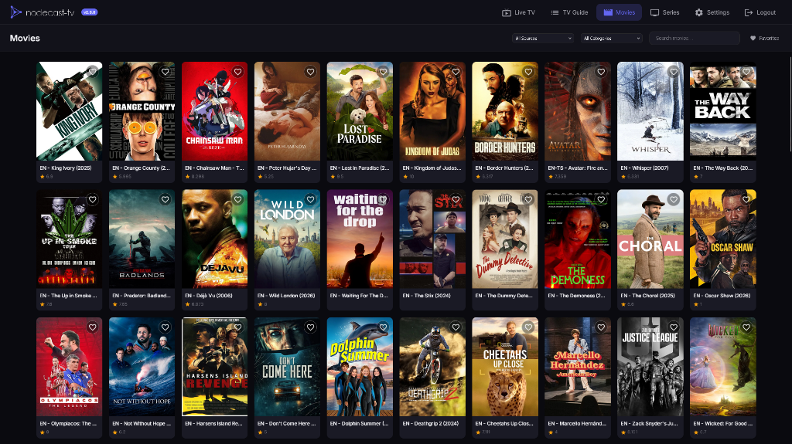
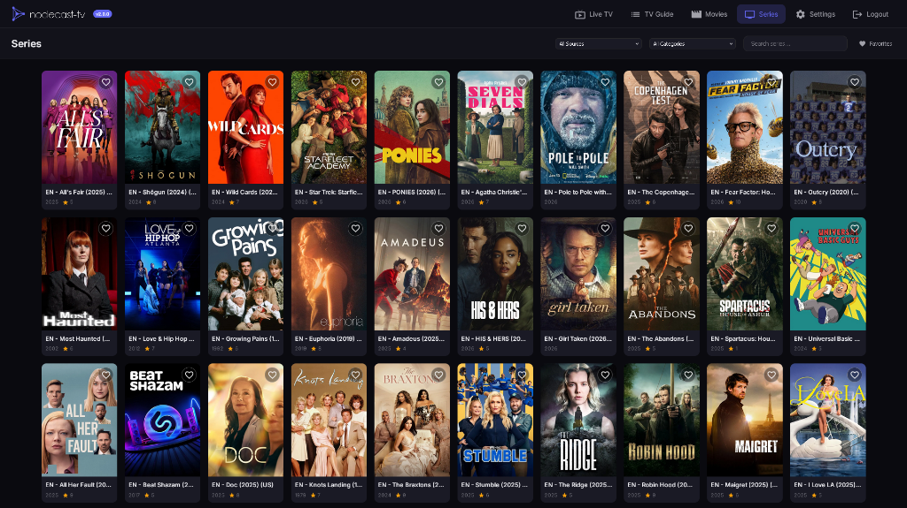
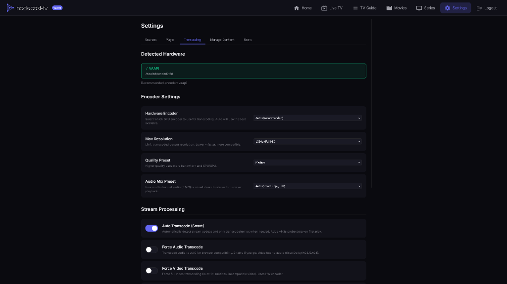

  

# Norva

**Your playlists, beautifully connected.**

Norva is a premium media player ecosystem designed to bring personal playlist libraries to every screen with a refined, fast, and connected experience.

The project is built around a simple idea: users should be able to manage their own media sources once, then enjoy them seamlessly across TV, desktop, web, and mobile.

## Product Vision

Norva is not just a player. It is a connected media environment.

The ecosystem is designed to support:

- A polished TV-first experience for the living room
- A responsive web interface for desktop and browser access
- A mobile companion for pairing, remote control, and future casting flows
- A unified account layer for identity, sessions, and device ownership
- A cloud registry for secure device linking and synchronization
- A local hub model that keeps playback infrastructure close to the user

Norva focuses on ownership, speed, clarity, and long-term product value.

## Ecosystem

| Product | Role |
| --- | --- |
| **Norva Player** | Main media experience for playlists, live content, movies, series, and guide navigation |
| **Norva TV** | TV-optimized application for Android TV and living-room usage |
| **Norva Mobile** | Mobile companion for QR pairing and future remote interactions |
| **Norva Web** | Browser-accessible interface for desktop and remote access |
| **Norva Account** | Identity layer for sign in, sign up, session continuity, and account-owned devices |
| **Norva Link** | Device pairing and identity layer |
| **Norva Cloud** | Registry and synchronization layer for paired devices and future account services |

## Experience

Norva is designed to feel modern, quiet, and premium. The interface prioritizes fast navigation, readable layouts, and a strong visual identity without unnecessary complexity.

Core product areas include:

- Live playlist browsing
- Program guide navigation
- Movie and series libraries
- Favorites and history
- Multi-device pairing
- Smart stream handling
- Local and remote hub access

## Architecture

Norva uses a hybrid architecture built for product independence:

- Norva Cloud Core manages accounts, devices, sources, pairing, favorites, and history
- Norva Account provides the authenticated identity and session layer across web, mobile, and TV pairing flows
- Playback Sessions give every app a single cloud contract for direct, relay, or gateway playback
- Norva Relay handles lightweight stream access concerns such as CORS, headers, HLS playlists, and signed URLs
- Norva Media Gateway provides dedicated remux/transcode capacity for streams that need FFmpeg
- The local hub remains useful for desktop and local-network experiences, but it is no longer the long-term dependency for every app

This structure keeps Norva adaptable: cloud-first where continuity and ecosystem UX matter, local-capable where proximity and personal infrastructure still add value.

## Brand

Norva is positioned as a premium playlist media ecosystem.

Public naming should favor:

- **Norva**
- **Norva Player**
- **Norva TV**
- **Norva Mobile**
- **Norva Web**
- **Norva Account**
- **Norva Link**
- **Norva Cloud**

The product should avoid presenting itself as a generic technical IPTV project. Norva is a branded media platform for user-provided playlist sources.

## Screenshots

  
  
  
  
  
  

## Repository Notice

This repository is maintained as the internal product codebase for Norva.

Operational documentation, release details, credentials, infrastructure configuration, and commercial roadmap material are intentionally not exposed in this README.

Norva, its product identity, visual assets, naming system, and distribution strategy are intended to remain controlled as part of a long-term product and brand portfolio.
