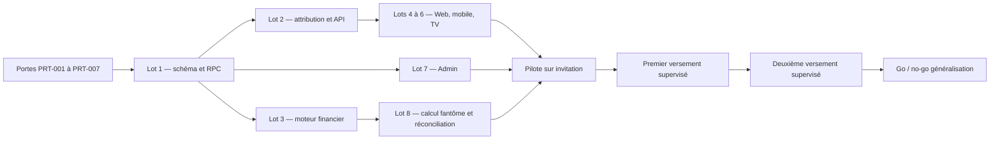

# Norva Partners — Backlog d'implémentation P0 ordonné

> **État directeur au 5 août 2026.** Le modèle frictionless remplace le parcours
> historique « KYC avant lien » : adhésion, lien, attribution, commission,
> maturation et conversion en accès Norva sont sans KYC. Didit et le profil
> fiscal/bénéficiaire ne concernent que le virement cash. L'adhésion est
> publique ; le cash initial reste France, allowlist, `revolut_manual`, deux
> opérateurs Finance MFA et `partners_payouts_live=false` hors fenêtre de lot.
> Les tickets plus bas qui exigent KYC/pays avant la création du lien décrivent
> l'ancien ordre et sont réputés satisfaits uniquement selon cette séparation.

**Date :** 30 juillet 2026
**Source produit :** [NORVA-PARTNERS-P0.md](./NORVA-PARTNERS-P0.md)
**Statut :** socle P0 livré en mode fail-closed ; pilote non activé tant que
Didit, le rail de versement individuel, le parcours fiscal Web, les juridictions
et les preuves runtime ne sont pas configurés et validés
**Priorité :** P0 — pilote mondial contrôlé par allowlist de juridictions
**Modèle :** affiliation directe, 20 % récurrents du montant HT réellement payé
**Éligibilité P0 :** personnes physiques uniquement ; KYC individuel, aucun KYB

Ce document conserve l'ordre, les dépendances et les critères d'acceptation du
P0 désormais implémenté. Il sert aussi de registre d'écarts : une ligne de code
livrée ne vaut ni activation du pilote, ni validation juridique, financière ou
opérationnelle.

## 1. Résultat attendu

Le P0 est livré lorsque Norva peut :

1. attribuer de façon déterministe un nouveau compte à un partenaire ;
2. calculer et journaliser une seule commission exacte par mouvement financier ;
3. exposer au partenaire uniquement ses agrégats et des filleuls pseudonymisés ;
4. conserver l'attribution lors d'un changement Web ↔ Google Play ;
5. traiter remboursement, maturation, blocage, versement et correction sans
   modifier les droits d'abonnement ;
6. faire fonctionner les parcours Web, Android et Android TV validés dans les
   maquettes ;
7. fournir à l'Admin une réconciliation complète et auditable ;
8. effectuer deux versements mensuels supervisés avant toute généralisation.

## 2. Constat d'architecture actuel

- `public/app.html`, `public/js/pages/Settings.js` et `public/css/main.css`
  portent la SPA et les Réglages Web/WebView.
- `clients/android-phone/` et `clients/android-tv/` encapsulent cette SPA dans
  des WebView, avec des comportements natifs distincts.
- `cloud_billing_ledger` est déjà le ledger cross-rail et doit rester la source
  financière autoritative.
- `norva-billing-webhook`, `norva-revolut-webhook` et
  `norva-revolut-billing` sont les principaux producteurs financiers.
- `admin_feature_flags` et `feature_flag(key)` fournissent déjà le mécanisme de
  déploiement progressif.
- `functions/api/signup-context.js` confirme que le dépôt héberge déjà des
  Cloudflare Pages Functions de même origine.
- `public/js/pages/AdminPage.js` et `supabase/functions/norva-admin/index.ts`
  portent le back-office existant.
- Le rail Web facture actuellement en USD dans le code Revolut. L'estimateur ne
  doit donc jamais figer `4,99 €` : il doit consommer le prix, la devise, la taxe
  et l'exposant réels.
- Revolut Merchant est aujourd'hui un rail d'encaissement. Il ne faut pas
  supposer qu'il fournit le KYC ou les virements sortants du programme.
- Le flux Revolut actuel réserve uniquement des remboursements intégraux. Le P0
  exige une extension transactionnelle pour les remboursements partiels.
- `TRANSFER`, `PURCHASE_REDEEMED`, chargebacks et remboursements externes ne
  disposent pas encore tous d'une provenance financière exploitable sans
  ambiguïté.
- Le contrôle Admin actuel repose sur `app_metadata.role='admin'`. Il n'existe
  pas encore de permissions Support/Risk/Finance cloisonnées.
- `norva-admin` écrit certains `admin_events` en best-effort et ce journal est
  purgé après 180 jours. Il ne peut pas être la preuve canonique d'une décision
  financière ou contractuelle.
- Les flags existants sont des booléens CRUD génériques. Les kill switches
  Partners nécessitent des transitions métier justifiées et impossibles à
  supprimer.
- La CI actuelle couvre principalement des contrats Node textuels ; elle ne
  rejoue pas encore les migrations et transactions Partners sur une base
  jetable réelle.
- Les scripts de dump audités ne sauvegardent que `public`. Le futur schéma
  `affiliate_private` doit être ajouté au backup, au restore et au contrôle de
  parité avant toute donnée pilote.
- Le Supabase CLI n'est pas présent dans le `PATH` de l'environnement audité.
  Toute migration devra néanmoins être créée par
  `supabase migration new <nom>` après installation/découverte du CLI, ou
  préparée via le workflow MCP recommandé puis extraite proprement.

## 3. Contraintes techniques non négociables

### Données et sécurité

- Les données canoniques résident dans le schéma non exposé
  `affiliate_private`.
- Aucun `GRANT` direct à `anon` ou `authenticated` sur les tables privées.
- Les façades publiques sont des RPC minimales avec droits explicites.
- Toute fonction `SECURITY DEFINER` :
  - définit `SET search_path = ''` ;
  - dérive l'identité avec `auth.uid()` ;
  - n'accepte jamais de `user_id` pour sélectionner le propriétaire ;
  - est révoquée à `PUBLIC` et `anon`, puis accordée explicitement au rôle
    strictement nécessaire.
- Aucun contrôle d'accès ne dépend de `raw_user_meta_data`.
- Aucune `service_role` n'est disponible dans Web, Android ou TV.
- Les vues exposées utilisent `security_invoker` lorsqu'elles ne passent pas par
  une RPC fermée.
- Les migrations explicitent les `GRANT` et `REVOKE`. Supabase a annoncé que les
  nouvelles tables `public` ne seraient plus automatiquement exposées à la Data
  API ; RLS et privilèges restent deux couches séparées :
  <https://supabase.com/changelog/45329-breaking-change-tables-not-exposed-to-data-and-graphql-api-automatically>.

### Finance

- Montants en unités mineures entières, devise et exposant obligatoires.
- Arrondi `round_half_up`, jamais de flottant JavaScript.
- Snapshots fiscaux immuables.
- Remboursements sous forme de contre-écritures append-only.
- Une donnée fiscale inconnue produit un blocage explicite, jamais zéro.
- Une commission appartient au plus à un lot de versement.
- Tous les producteurs et workers sont rejouables sans changer le résultat.

### Traitements asynchrones

- L'écriture du ledger et l'enqueue du travail appartiennent à la même
  transaction PostgreSQL.
- Les workers réclament des lignes avec lease et `FOR UPDATE SKIP LOCKED`.
- Les erreurs sont classées retryables, terminales ou quarantaines.
- Ne pas créer une chaîne récursive de fonctions Edge. Supabase applique
  désormais une limite aux appels Edge imbriqués ; les workers doivent drainer
  la base plutôt que s'appeler en cascade :
  <https://supabase.com/changelog?tags=edge+functions>.

### Interfaces

- Les maquettes Superdesign de la spécification sont la référence visuelle.
- Web : clavier/pointeur ; Android : tactile/TalkBack ; TV : D-pad.
- Les états loading, vide, bloqué, rate-limit, offline, erreur terminale et
  retry sont obligatoires.
- Aucune réponse provider, UUID, e-mail de filleul ou donnée bancaire brute dans
  l'interface ou les analytics.

## 4. Portes bloquantes avant développement irréversible

| ID | Propriétaire | Taille | Dépend de | Travail | Critère de sortie |
|---|---|---:|---|---|---|
| `PRT-001` | Produit + Juridique | L | — | Définir la matrice des premières juridictions pour personnes physiques : disponibilité, capacité contractuelle, règles publicitaires/disclosures, contrat localisé, fiscalité individuelle, auto-facturation éventuelle, rétention et transferts de données. Exclure explicitement personnes morales/KYB du P0. Mettre à jour `public/privacy.html`, `public/terms.html` et créer `public/partners-terms.html`. | Avis écrit pour chaque pays/subdivision activé, version contractuelle numérotée/hashée, DPA/transferts du prestataire et textes approuvés. La France n'est ni obligatoire ni privilégiée ; aucun compte professionnel n'est activable. |
| `PRT-002` | Security + Privacy | M | `PRT-001` | Qualifier Didit comme candidat KYC individuel prioritaire : offre gratuite, couverture documents/pays, âge, liveness, suppression, rétention, sous-traitants, DPA, transferts, consentement, webhooks signés, reprise et disponibilité. Exclure tous les modules KYB. | ADR KYC signé ; compte pilote opérationnel ; matrice pays ; quota public vérifié dans les conditions applicables ; coût AML/adresse documenté ; aucune donnée biométrique stockée par Norva. |
| `PRT-003` | Billing + Finance | M | — | Créer `docs/NORVA-PARTNERS-FINANCIAL-DATA-CONTRACT.md` : source autoritative par rail pour capture, remise, taxe, frais, devise/exposant, refund partiel/complet, chargeback, `TRANSFER` et `PURCHASE_REDEEMED`. Résoudre les inconnues déjà consignées dans `docs/TVA-OSS.md`. | Chaque événement possède origine et mouvement parent ; toute donnée manquante devient `blocked_missing_financial_fact`, jamais taxe/frais à zéro par défaut. |
| `PRT-004` | Sécurité + Privacy | M | `PRT-001` | Produire threat model, registre des données, rétention, suppression, matrice Staff Support/Risk/Finance/Admin, antifraude et réponse à incident. | Menaces et mitigations acceptées ; durées de conservation et base légale documentées ; aucun accès n'est accordé par `user_metadata`. |
| `PRT-005` | Architecture | M | `PRT-001` à `PRT-004` | Figer les contrats API, enums d'état, politique pays/subdivision versionnée, âge/capacité, événements analytics, schéma de pseudonymes et codes d'erreur sanitisés. | Contrat versionné relu par Backend, Web, Android, Admin et QA ; aucun pays, numéro fiscal, seuil ou âge local n'est codé en dur dans un client. |
| `PRT-006` | DevOps + Backend | S | — | Rendre reproductible l'environnement Supabase : découvrir/installer le CLI, documenter `--help`, exécuter la baseline, figer Deno/imports et préparer une base jetable dans `.github/workflows/partners-integration.yml`. | Versions enregistrées ; tests de référence verts ou écarts consignés ; aucune migration créée manuellement ; job DB réel prêt à devenir requis. |
| `PRT-007` | Finance + Juridique | L | `PRT-001`, `PRT-002` | Choisir séparément le rail fiscal/versement pour personnes physiques : pays, devises, identifiant fiscal personnel, compte bancaire ou stablecoin, contrôles sanctions, retours, frais, rejets, clôture et export. Vérifier s'il accepte une preuve Didit afin d'éviter un second KYC. | ADR payout signé ; matrice pays/capabilities ; sandbox ; champs/webhooks connus ; coûts complets documentés ; aucun parcours entreprise/KYB. |

`PRT-002` bloque l'activation KYC réelle.
`PRT-007` bloque les versements réels et la vérification du bénéficiaire.
`PRT-003` bloque toute commission payable. Les autres chantiers peuvent avancer
avec contrats simulés, sous feature flag.

## 5. Chemin critique



Le moteur financier et l'attribution sont deux branches parallèles après le
socle de données. Aucun pilote ne démarre tant qu'elles ne convergent pas dans
la réconciliation Admin.

## 6. Lot 0 — cadrage exécutable et feature flags

| ID | Équipe | Taille | Dépend de | Chemins probables | Travail et définition de terminé |
|---|---|---:|---|---|---|
| `PRT-010` | Backend + Admin | M | `PRT-005` | migration créée par CLI ; `supabase/migrations/20260701190000_admin_feature_flags.sql` comme référence | Ajouter `partners_enabled`, `partners_invite_only`, `partners_shadow_mode`, `partners_payouts_live` et `partners_tv_relay_enabled`, tous désactivés. Les rendre non supprimables et modifiables uniquement par une RPC métier qui valide préconditions/transitions, acteur et justification, puis écrit l'audit dans la même transaction. Interdire le CRUD générique pour ces clés. |
| `PRT-011` | Produit + Backend | S | `PRT-010` | migration créée par CLI ; `public/js/pages/AdminPage.js` | Créer une allowlist pilote distincte des rôles Admin. Aucun flag client ne suffit à autoriser l'activation. |
| `PRT-012` | QA | S | `PRT-006` | `tests/norva-partners-feature-flags.test.js` | Écrire le test de contrat garantissant defaults `false`, contrôle Admin, allowlist et absence d'accès direct. |
| `PRT-013` | Architecture | S | `PRT-005` | `docs/NORVA-PARTNERS-API-CONTRACT.md` | Documenter routes, payloads, codes d'erreur, idempotency keys, états et compatibilité avant les clients. Le contrat n'accepte que `individual` et expose `business_accounts_not_supported`, `business_waitlist` et `kyc_billing_unavailable`, sans payload KYB. |
| `PRT-014` | Backend + Ops | M | `PRT-002`, `PRT-010` | configuration serveur ; RPC métriques ; `norva-partners` | Ajouter le contrôle de coût KYC sans plafond bloquant à 500 : compteurs atomiques gratuit/payant, passage transparent au paiement à l'usage, alertes 80 %/100 % du gratuit puis seuils de dépense, recharge par petits paliers et plafonds journalier/mensuel anti-abus. Seul un incident de facturation ou une dépense anormale ouvre le circuit. |

## 7. Lot 1 — base de données et contrats RPC

Toutes les migrations de ce lot doivent être créées avec
`supabase migration new <nom_descriptif>`. Les noms ci-dessous décrivent le
contenu, pas un timestamp à inventer.

| ID | Équipe | Taille | Dépend de | Chemins probables | Travail et définition de terminé |
|---|---|---:|---|---|---|
| `DB-001` | Database | L | `PRT-005`, `PRT-010` | `supabase/migrations/<généré>_norva_partners_program.sql` ; `ops/hetzner/docker-compose.supabase.yml` | Créer `affiliate_private`, les types contrôlés, `affiliate_program_versions` et `affiliate_country_policies` : pays/subdivision, disponibilité individuelle, âge/capacité, niveau KYC, prestataire, devises/seuils, contrat et disclosure. Contraindre le P0 à `account_type='individual'`, sans table/champ KYB. Révoquer `PUBLIC`/`anon`/`authenticated`, conserver RLS et exclure le schéma de PostgREST. |
| `DB-002` | Database | M | `DB-001`, `PRT-002` | `supabase/migrations/<généré>_norva_partners_accounts_links.sql` | Créer `affiliate_accounts` et les liens publics opaques. Stocker provider + référence KYC opaque, résultat âge/capacité, juridiction et version de politique, jamais document/selfie. Rejeter atomiquement tout type autre que `individual` avec motif `business_accounts_not_supported`. Contraintes : un compte actif par utilisateur, code unique, révocation et rotation auditables. |
| `DB-003` | Database | L | `DB-001`, `DB-002` | `supabase/migrations/<généré>_norva_partners_attribution.sql` | Créer `affiliate_link_claims` et `affiliate_attributions`. Unicité du filleul, hash du claim, expiration, consommation atomique, version/taux figés, rejet explicite et verrou concurrent. |
| `DB-004` | Database | M | `DB-002` | `supabase/migrations/<généré>_norva_partners_tv_relay.sql` | Ajouter `affiliate_tv_relay_sessions` pour le relais TV → téléphone : token hashé, code court, expiration, consommation unique, état et TV liée. Aucune donnée financière dans la ligne exposable au TV. |
| `DB-005` | Database + Billing | L | `PRT-003`, `DB-001` | `supabase/migrations/<généré>_norva_partners_financial_facts_jobs.sql` | Créer `affiliate_financial_facts` et `affiliate_commission_jobs`. Snapshot immuable du brut, remise, taxe, frais, net, devise/exposant, rail, type d'événement, identifiants provider originaux et mouvement parent ; provenance et date d'observation obligatoires. Ajouter lease, retries, prochaine tentative et dead letter. |
| `DB-006` | Database + Finance | L | `DB-003`, `DB-005` | `supabase/migrations/<généré>_norva_partners_commissions.sql` | Créer `affiliate_commission_entries` append-only et journaliser chaque transition métier dans `affiliate_events`. Les états accrual/reversal/adjustment/hold/release résultent de nouvelles écritures, jamais d'un `UPDATE`/`DELETE` direct sur le ledger. Contraintes devise/exposant, origine, mouvement parent, maturation et clés d'idempotence. |
| `DB-007` | Database + Finance | L | `PRT-007`, `DB-006` | `supabase/migrations/<généré>_norva_partners_payouts.sql` | Créer profils individuels tokenisés par devise, `affiliate_payout_cycles` et `affiliate_payout_items`. Le bénéficiaire doit correspondre à la personne KYC ; aucun bénéficiaire entreprise/UBO. Une commission au plus par lot, seuil/version par devise, états provider, retours et idempotence. |
| `DB-008` | Database + Privacy | L | `DB-002` à `DB-007`, `PRT-004` | `supabase/migrations/<généré>_norva_partners_privacy_audit.sql` ; `supabase/migrations/20260721235150_billing_receipt_privacy_reliability.sql` comme référence | Créer `affiliate_events` comme audit canonique append-only, avec acteur pseudonymisé, action, motif, avant/après sanitisés et politique de rétention légale. Toute mutation financière/contractuelle échoue si son événement ne peut pas être écrit dans la même transaction. `admin_events` n'est qu'un miroir opérationnel sanitisé. Ajouter pseudonymes durables et suppression/nullification sans PII résiduelle. |
| `DB-009` | Database + API | L | `DB-002` à `DB-008` | `supabase/migrations/<généré>_norva_partners_rpc.sql` | Créer les RPC utilisateur, worker et Admin. Révoquer `PUBLIC`/`anon`, droits explicites, `search_path=''`, `auth.uid()` interne, aucun `user_id` client. |
| `DB-010` | Database + Billing | M | `DB-005`, `DB-006` | `supabase/migrations/<généré>_norva_partners_ledger_trigger.sql` ; `20260721235000_billing_receipt_delivery_outbox.sql` comme modèle | Créer le trigger transactionnel depuis `cloud_billing_ledger` vers les jobs. Captures, renouvellements et remboursements produisent un job unique ou un motif d'exclusion. |
| `DB-011` | Database | M | `DB-003`, `DB-006`, `DB-007` | mêmes migrations | Ajouter index, FK, checks différés si requis et invariants SQL : unicité filleul, une commission par mouvement, une allocation par commission, cohérence lease/état. Vérifier les plans des requêtes dashboard et workers. |
| `DB-012` | QA + Security | L | `DB-009` à `DB-011` | `supabase/tests/affiliate_p0.sql` ; `tests/norva-partners-database-contract.test.js` ; `.github/workflows/partners-integration.yml` | Rejouer les migrations sur PostgreSQL jetable, puis tester privilèges/RLS, claims concurrents, policy pays/subdivision, âge limite, rejet personne morale/KYB, replays provider, audit atomique, remboursements, suppression, multi-devises et absence de fuite. Les tests Node restent complémentaires. Exécuter les Advisors avant validation. |

### Critère de sortie du lot 1

- Une migration fraîche reconstruit tout le modèle.
- Les clients ne peuvent lire aucune table privée.
- Deux transactions concurrentes ne peuvent ni attribuer deux partenaires au
  même filleul, ni créer deux commissions.
- Toute capture du ledger devient job, exclusion ou blocage explicite.

## 8. Lot 2 — attribution, Cloudflare et API partenaire

| ID | Équipe | Taille | Dépend de | Chemins probables | Travail et définition de terminé |
|---|---|---:|---|---|---|
| `API-001` | Edge | L | `PRT-002`, `PRT-013`, `PRT-014`, `DB-009` | `supabase/functions/norva-partners/index.ts` ; `supabase/config.toml` | Créer exclusivement l'API utilisateur authentifiée : éligibilité personne physique/pays/âge, session KYC individuelle hébergée, activation, rotation lien, dashboard, historique et profil de versement. Enregistrer coût/quota sans bloquer le passage 500→501. Le webhook KYC est autoritatif ; aucun endpoint KYB. Rejeter les personnes morales avec `business_accounts_not_supported`. |
| `API-002` | Edge + Cloudflare | L | `DB-003`, `PRT-013` | `supabase/functions/norva-partners-referral/index.ts` ; `functions/r/[[path]].js` | Créer un endpoint interne de résolution séparé, non public malgré `verify_jwt=false`, authentifié par signature HMAC courte durée entre Cloudflare et Edge. Résoudre `/r/{code}` côté serveur, créer le claim une fois, ne conserver que son hash, puis poser depuis Pages Functions un cookie `__Host-norva_referral` `Secure; HttpOnly; SameSite=Lax; Path=/; Max-Age=2592000`. Rediriger vers une URL sans code. |
| `API-003` | Edge + Cloudflare | M | `API-001`, `API-002`, `DB-003` | `functions/api/partners/claim.js` ; `supabase/functions/norva-partners/index.ts` ; `public/js/authApi.js` | Après authentification, la Pages Function lit le cookie HttpOnly et transmet le claim à l'API utilisateur avec le JWT. Consommer atomiquement, puis expirer le cookie après succès, expiration ou rejet terminal. Une panne d'attribution n'interrompt jamais l'authentification et expose un état reprenable. |
| `API-004` | Edge + TV | M | `DB-004`, `PRT-013` | `supabase/functions/norva-partners-device/index.ts` ; `supabase/config.toml` | Créer une API device séparée pour créer, lire, régénérer et consommer les relais TV. Vérifier le token appareil existant, appliquer portée minimale, expiration courte et rate-limit. Aucune RPC financière, partenaire ou profil ne doit être appelable avec une identité TV. |
| `API-005` | Edge + Privacy | S | `API-001`, `API-002`, `API-004` | `supabase/functions/_shared/` ; fonctions Partners | Centraliser validation stricte, CORS par surface, erreurs publiques, logging sanitisé, signatures serveur et correlation IDs. Aucun provider payload, secret, claim brut ou token appareil dans les réponses/logs. |
| `API-006` | QA | L | `API-001` à `API-005` | `tests/norva-partners-api-contract.test.js` | Tester méthodes, JWT, CORS, cookies, rate-limit, séquence 499/500/501 sans rupture, alertes uniques, recharge, circuit sur anomalie réelle, pays désactivé, âge limite, refus personne morale/KYB, faux callback KYC, webhook rejoué/hors ordre, OAuth, retry, TV relay et fuite. |

### Décision de routage

Le cookie du claim doit appartenir à `norva.tv`. Une Edge Function hébergée sur
le domaine Supabase ne peut pas, seule, poser ce cookie pour `norva.tv`. La
Pages Function de même origine est donc le terminateur navigateur ; elle appelle
`norva-partners-referral` avec une signature serveur dédiée, jamais avec la
`service_role` dans le navigateur. L'API utilisateur JWT, l'API TV device et
l'endpoint interne de referral restent trois frontières d'autorisation
distinctes.

## 9. Lot 3 — moteur de commissions et versements

| ID | Équipe | Taille | Dépend de | Chemins probables | Travail et définition de terminé |
|---|---|---:|---|---|---|
| `FIN-001` | Billing | L | `PRT-003`, `DB-005`, `DB-010` | `supabase/functions/norva-billing-webhook/index.ts` ; `supabase/functions/norva-revolut-webhook/index.ts` ; `supabase/functions/norva-revolut-billing/index.ts` | Capturer les faits financiers exacts de chaque rail avec identifiants événement/transaction originaux, horodatage, source et mouvement parent. Les faits absents produisent `calculation_pending`/`blocked_missing_financial_fact`, jamais une estimation payable. |
| `FIN-002` | Billing | L | `FIN-001` | mêmes fonctions ; `supabase/functions/_shared/billing-policy.mjs` ; `supabase/migrations/20260722121000_payment_terminal_reconciliation.sql` | Normaliser remises, essai, annualisation, montants nuls, sandbox, comptes internes et incohérences. Étendre la logique Revolut actuellement intégrale aux remboursements partiels, avec contre-écriture proportionnelle et clé d'idempotence ; couvrir aussi remboursement externe et chargeback. |
| `FIN-003` | Billing + Auth | M | `DB-003`, `FIN-001` | `norva-billing-webhook/index.ts` ; migrations RPC | Mettre `TRANSFER`, `PURCHASE_REDEEMED` et fusion de comptes en quarantaine jusqu'à résolution déterministe de l'utilisateur. Aucun droit ni commission n'est déplacé par heuristique. |
| `FIN-004` | Edge worker | L | `DB-006`, `FIN-001`, `FIN-002` | `supabase/functions/norva-partners-worker/index.ts` ; `supabase/config.toml` ; `ops/hetzner/scripts/register-norva-partners-cron.sql` | Worker lease-based : calcul HT, arrondi exact, accrual, reversal, retry, dead letter. Un retry retourne l'écriture existante. Auth par secret cron vérifié en fonction ; cron reproductible et cadence documentée sans chaîne récursive Edge. |
| `FIN-005` | Edge worker + Fraud | M | `FIN-004` | `supabase/functions/norva-partners-worker/index.ts` ; migration/cron créés par CLI | Maturation à J+45, contrôles auto-parrainage/interne/fraude, passage `pending → available` ou `held`. La suspension partenaire ne touche jamais le filleul. |
| `FIN-006` | Finance + Backend | L | `FIN-004`, `FIN-005` | migrations RPC ; `supabase/functions/norva-partners-worker/index.ts` | Réconciliation shadow : chaque paiement admissible = commission + exclusion + blocage. Produire compteur/détail des écarts et observations exactes du worker : dernière prise en charge, progression, compte occupé, rate-limit, circuit ouvert, auth, dead letter. Un HTTP cron réussi ne peut jamais afficher « sain » si ces observations sont absentes ou périmées. |
| `FIN-007` | Payouts | L | `PRT-007`, `DB-007`, `FIN-005` | `supabase/functions/norva-partners-revolut-payout/index.ts` ; `supabase/config.toml` | Rail initial `revolut_manual` : profil tokenisé/HMAC, correspondance avec la personne KYC, lot mensuel, référence Norva unique, acquittement statement-first `YES`, rejet et reprise. Aucun payout entreprise/KYB. Le flag live bloque les nouvelles préparations, jamais l'observation d'un virement déjà saisi. L'adaptateur `revolut_api` reste multi-gated et sans cron sous Basic. |
| `FIN-008` | Payouts + Finance | M | `FIN-007` | même fonction ; RPC Admin | Générer l'export canonique signé, le rapport de progression séparé, l'import de relevé, le rapprochement exact et la file d'incidents append-only maker-checker. Couvrir seuil par devise/politique, report, solde négatif, retour et contre-écriture post-paiement sans identifiant bancaire saisi manuellement. |
| `FIN-009` | Privacy | S | `FIN-004`, `FIN-007` | tous workers | Logs structurés sans e-mail, IBAN, code affilié brut, claim, UUID public ni réponse provider complète. Stocker seulement codes sanitisés et références d'audit. |
| `FIN-010` | QA | L | `FIN-001` à `FIN-009` | `tests/norva-partners-financial-engine.test.js` | Jeux de données table-driven : taxes, devises/exposants, annualisation, remises, refund partiel/complet, replay, out-of-order, chargeback, `TRANSFER`, batch retry et solde négatif. |

### Critère de sortie du lot 3

Le mode shadow doit atteindre :

```text
paiements capturés admissibles
= commissions + exclusions + blocages
```

avec zéro paiement inexpliqué et zéro doublon sous replay.

## 10. Lot 4 — Web

| ID | Équipe | Taille | Dépend de | Chemins probables | Travail et définition de terminé |
|---|---|---:|---|---|---|
| `WEB-001` | Web | M | `PRT-013`, `API-001` | `public/app.html` ; `public/js/app.js` ; `public/js/pages/Settings.js` ; nouveau `public/js/pages/PartnersPage.js` ; `public/css/main.css` | Créer la route dédiée `#partners`, ouverte depuis Compte/Réglages et la feuille compte, sans ajouter une destination à la navigation principale. Réutiliser composants et tokens Norva ; masquer sous flags/éligibilité serveur. |
| `WEB-002` | Web | M | `API-001` | `public/js/cloudApi.js` ; `public/js/pages/PartnersPage.js` ; `public/js/authApi.js` | Étendre `NorvaCloud.partners` avec validation runtime, machine d'états et annulation des requêtes obsolètes. Conserver un namespace `NorvaCloud.device.partners` séparé pour TV. Aucun cache persistant de données financières privées. |
| `WEB-003` | Web | L | `WEB-001`, `WEB-002` | `public/js/pages/PartnersPage.js` ; `public/css/main.css` | Implémenter découverte/demande/activation individuelle : promesse + disclosure « personnes physiques uniquement », pays, simulateur, âge/capacité, KYC hébergé et contrat versionné. États unsupported/pending/manual-review/underage/verified et `business_waitlist`. Aucun formulaire KYB ; le lien reste inactif jusqu'au webhook serveur. |
| `WEB-004` | Web | L | `WEB-002`, `FIN-004` | `PartnersPage.js` ; `public/js/components/NorvaModal.js` ; `public/js/utils/standalone.js` ; `public/js/vendor/qrcode.js` | Implémenter dashboard : disponible/validation/payé, filtres clavier, historique pseudonymisé, lien, copie, partage, QR et disclosure indissociable. Intégrer les règles standalone/install et la feuille compte sans dupliquer les modales. |
| `WEB-005` | Web | M | `PRT-007`, `WEB-002`, `FIN-007` | `PartnersPage.js` ; `cloudApi.js` ; `main.css` | Implémenter fiscalité personnelle et versement individuel selon le rail retenu. Aucun nom d'entreprise, registre, dirigeant, UBO ou document KYB. Champs/erreurs localisés, sauvegarde différée et aucun secret bancaire/wallet en DOM après tokenisation. |
| `WEB-006` | Web + Auth | M | `API-003` | `public/js/auth.js` ou flux existant ; `public/js/authApi.js` ; `public/js/app.js` ; `public/js/utils/standalone.js` | Consommer le claim après e-mail, OAuth, magic link et Google natif, tout en restaurant profil et route. Afficher une confirmation non bloquante et ne jamais substituer l'attribution à la réussite de connexion. |
| `WEB-007` | Web + Accessibility | M | `WEB-003` à `WEB-006` | `main.css` ; tests frontend | États live-region, focus modal/sheet, retour au déclencheur, 44 px min, contraste AA attendu, zoom 200 %, clavier seul, mobile/tablette et réseau lent. |
| `WEB-008` | QA | M | `WEB-007` | `tests/norva-partners-web-contract.test.js` | Tests DOM/contrat et replay navigateur : activation, dashboard, filtres, partage, erreurs, claim et confidentialité. Comparaison aux deux maquettes Web. |
| `WEB-009` | Web + Release | S | `WEB-001` à `WEB-008` | `public/sw.js` ; `public/js/app.js` ; `public/js/marketing.js` | Inclure le nouveau module dans le packaging Android/Web, incrémenter explicitement la version de cache du service worker et vérifier qu'une mise à jour depuis l'ancien shell ne produit ni route blanche ni chunk absent. |

## 11. Lot 5 — Android mobile et tablette

| ID | Équipe | Taille | Dépend de | Chemins probables | Travail et définition de terminé |
|---|---|---:|---|---|---|
| `MOB-001` | Android | M | `API-002` | `clients/android-phone/app/src/main/AndroidManifest.xml` ; `public/.well-known/assetlinks.json` | Ajouter l'App Link vérifié `https://norva.tv/r/*` et, si retenu dans `PRT-013`, `/partners/relay/*`, sans changer le pairing ni `/t/*`. Valider signatures debug/release et documenter le comportement différé lorsqu'un clic précède l'installation Play Store. |
| `MOB-002` | Android | M | `MOB-001`, `API-003` | `clients/android-phone/app/src/main/java/tv/norva/phone/MainActivity.java` | Gérer démarrage froid et `onNewIntent` chaud : conserver l'URL `/r/`, la charger dans le WebView Norva puis restaurer la destination après auth. |
| `MOB-003` | Android + Web | L | `MOB-002`, `WEB-006` | `MainActivity.java` ; `public/js/cloudApi.js` | Vérifier explicitement la continuité entre les stores de cookies navigateur externe/WebView, Google natif, magic link, installation différée, rotation et reprise après process death. Aucun claim dans SharedPreferences ou logs ; si la continuité automatique est impossible, définir une reprise serveur visible et sûre. |
| `MOB-004` | Android | L | `WEB-004` | `MainActivity.java` ; dépendance AndroidX WebKit | Créer un bridge dédié `NorvaShareNative` avec `WebViewCompat.addWebMessageListener`, limité à `https://norva.tv`, frame principale et schéma de message strict. Ne pas l'ajouter au bridge Cloud existant. Déclencher `ACTION_SEND` avec URL/MIME/taille autorisés ; texte et disclosure indivisibles, annulation et retour sans doublon. |
| `MOB-005` | Android | M | `MOB-004` | `MainActivity.java` ; ressources Android | Enregistrer le QR via MediaStore sur Android 10+ et `ACTION_CREATE_DOCUMENT` avant Android 10, avec confirmation accessible et sans permission de stockage legacy. Ne pas stocker les données dashboard. |
| `MOB-006` | Android + Web | L | `WEB-005` | `MainActivity.java` ; `clients/android-phone/app/src/main/res/values/styles.xml` ; `AndroidManifest.xml` ; `main.css` | Configurer `adjustResize`, gérer insets geste/trois boutons, IME, un seul scroll, Back clavier → sheet → page et restauration focus. Tester police Android 1,3 et paysage tablette. |
| `MOB-007` | Accessibility | M | `MOB-004` à `MOB-006` | strings localisées ; Android tests | TalkBack, labels, annonces uniques, cibles 48 dp, ordre de lecture, erreurs d'identifiant fiscal personnel propres au pays, état `business_waitlist` et partage. |
| `MOB-008` | QA Android | L | `MOB-001` à `MOB-007`, `WEB-009` | `tests/android-phone-partners-contract.test.js` ; `clients/android-phone/app/src/androidTest/` | Tests App Links froid/chaud, `onNewIntent`, installation différée, navigateur ↔ WebView, OAuth/magic link/Google natif, partage, QR, deux modes de navigation système, IME ouverte, font 1,3, offline/retry et process recreation. Comparaison aux maquettes mobile. |

## 12. Lot 6 — Android TV

| ID | Équipe | Taille | Dépend de | Chemins probables | Travail et définition de terminé |
|---|---|---:|---|---|---|
| `TV-001` | Web TV | M | `WEB-001`, `API-004` | `public/app.html` ; `public/js/pages/Settings.js` ; `public/js/pages/PartnersPage.js` ; `main.css` | Ajouter l'entrée Norva Partners dans Compte/Réglages TV, jamais dans la navigation principale. Masquer si TV non pairée ou flag désactivé ; servir l'interface depuis le bundle Web TV existant, sans écran natif parallèle. |
| `TV-002` | Web TV | L | `DB-004`, `API-004`, `TV-001` | `PartnersPage.js` ; `cloudApi.js` ; `qrcode.js` | Implémenter machine d'états tokenisée : loading, ready, expiring, expired, regenerating, offline, rate-limit, success et terminal error. QR et code court privés, aucune donnée financière ; ne jamais conserver le relay token dans `localStorage` et nettoyer tous les timers à la fermeture/navigation. |
| `TV-003` | Web TV | M | `TV-002` | `public/js/utils/tvNavigation.js` ; `PartnersPage.js` ; `main.css` | D-pad déterministe via l'infrastructure TV existante : focus initial sur Fermer si actif, sur « Créer un nouveau code » si expiré, gauche/droite, garde anti-double action et retour après régénération. Back ferme le modal puis restaure l'entrée. Utiliser `aria-disabled` + busy guard sans supprimer brutalement le focus. Zone sûre 5 %, focus ≥ 58 px. |
| `TV-004` | Security | S | `TV-002` | API + UI TV | Expiration/révocation serveur, capture d'écran sans PII, code non journalisé, pas de clipboard, pas de montant ni profil fiscal sur TV. |
| `TV-005` | QA TV | L | `TV-002` à `TV-004`, `WEB-009` | `tests/android-tv-partners-contract.test.js` ; instrumentation/ADB | Rejouer chaque touche D-pad dans tous les états, Back, offline/retour, double action, expiration pendant focus, régénération, changement de page et réouverture. Comparer aux maquettes en 1920×1080 et 1280×720, puis vérifier l'absence de timer/requête résiduelle. |

## 13. Lot 7 — Admin

| ID | Équipe | Taille | Dépend de | Chemins probables | Travail et définition de terminé |
|---|---|---:|---|---|---|
| `ADM-000` | Security + Database | L | `PRT-004`, `DB-009` | migration permissions/RPC créée par CLI ; `supabase/functions/norva-admin/index.ts` | Remplacer le rôle Admin monolithique pour Partners par des capacités serveur `partners_support_read`, `partners_risk`, `partners_finance` et `partners_payout_approve`. Les dériver uniquement de `app_metadata` gérée serveur, appliquer le moindre privilège aux RPC et documenter la séparation des tâches. |
| `ADM-009` | Database + Security | M | `DB-008`, `ADM-000` | migration RPC créée par CLI ; `supabase/functions/norva-admin/index.ts` | Rendre chaque action Partners atomique avec `affiliate_events` : si l'audit échoue, l'action échoue. Conserver l'audit financier/contractuel selon `PRT-004`, sans dépendre du best-effort ni de la purge 180 jours de `admin_events`; n'y publier qu'un miroir sanitisé. |
| `ADM-001` | Database + Admin | M | `ADM-000`, `DB-009`, `FIN-006` | migration RPC créée par CLI ; `public/js/pages/AdminPage.js` ; `public/js/app.js` | Ajouter la route lazy-loadée `#admin/partners` et l'overview : partenaires, revenu attribué HT/TTC, commissions par état, marge par rail et écarts de réconciliation. Incrémenter la version du module Admin. |
| `ADM-002` | Admin | L | `ADM-001`, `ADM-009` | `AdminPage.js` ; `supabase/functions/norva-admin/index.ts` | Fiche partenaire individuel : statut KYC/contractuel/fiscal personnel, lien révoqué, historique pseudonymisé, événements, rétention et raisons de blocage. Aucun panneau KYB, entreprise, dirigeant ou UBO. |
| `ADM-003` | Admin + Ops | M | `ADM-009`, `FIN-004`, `FIN-006` | mêmes chemins | Vue jobs/ledger : en attente, lease, retry, dead letter, taxe manquante, `TRANSFER`, paiement inexpliqué et santé périmée. Actions retry limitées, autorisées et justifiées. |
| `ADM-004` | Risk + Admin | L | `ADM-009`, `PRT-004`, `FIN-005` | RPC/migration ; `norva-admin/index.ts` ; `AdminPage.js` | Dossiers fraude : signaux minimisés, hold/release/reverse/suspend avec justification obligatoire, double confirmation, capability Risk et audit append-only. |
| `ADM-005` | Finance + Admin | L | `ADM-009`, `FIN-007`, `FIN-008` | mêmes chemins | Lots `revolut_manual` : validation séparée, verrouillage, export/hash, `entered_in_revolut=YES`, import du relevé, retours, incidents, contre-écritures et rapprochement. Exiger Finance/AAL2, maker-checker et preuves fraîches distinctes ; aucun identifiant bancaire brut ou bouton API live sous Basic. |
| `ADM-006` | Admin | L | `ADM-009`, `PRT-010`, `PRT-011`, `DB-001` | `AdminPage.js` ; RPC métier flags/politiques | Gérer flags, invitations et ouverture d'une juridiction uniquement via transitions métier : KYC individuel/payout obligatoires, préconditions, justification, impact et audit. Afficher seulement le volume de la liste d'attente professionnelle ; aucune validation KYB manuelle. |
| `ADM-007` | Privacy + Admin | M | `ADM-000`, `ADM-002` à `ADM-005` | RPC Admin ; UI | Appliquer les capacités Support/Risk/Finance dans chaque vue et export. Support ne voit ni identité fiscale complète, ni coordonnées bancaires, ni signaux réseau détaillés. |
| `ADM-008` | QA | L | `ADM-000` à `ADM-007`, `ADM-009` | `tests/admin-norva-partners.test.js` | Tests capabilities, pagination, filtres, exports, double action, échec d'audit, redaction, refus entreprise/KYB et liste d'attente agrégée. Aucun payload brut comme substitut de message. |

## 14. Lot 8 — analytics, observabilité, QA et pilote

| ID | Équipe | Taille | Dépend de | Chemins probables | Travail et définition de terminé |
|---|---|---:|---|---|---|
| `OBS-001` | Data + Backend | M | `PRT-005`, `API-001`, `FIN-004` | migration analytics créée par CLI ; clients/Edge | Émettre les événements de la spécification avec identifiants pseudonymes. Aucun nom, e-mail, IBAN, code public brut ou localisation précise. |
| `OBS-002` | Data + Admin | M | `FIN-006`, `OBS-001` | migration de vues/RPC ; `AdminPage.js` | KPI : activation, clic → compte → paiement, rétention, commission/marge par rail, remboursements, holds, délai premier versement et vérification bloquée. |
| `OBS-003` | Ops | L | `PRT-014`, `FIN-004`, `FIN-006`, `FIN-007` | migrations alertes/cron ; Netdata/Telegram existants si approprié | Mesurer le traitement réel : progression, backlog, compte occupé, rate-limit, circuit, auth, dead letter, faits manquants, réconciliation et payout. Ajouter quota KYC gratuit consommé, dépense payante, recharge et anomalie, sans PII. Afficher `inconnue/périmée` si l'observation manque. |
| `OPS-001` | DevOps + QA | L | `PRT-006`, `DB-012`, `API-006` | `.github/workflows/partners-integration.yml` ; `supabase/tests/affiliate_p0.sql` | Démarrer PostgreSQL/Supabase jetable en CI, appliquer toutes les migrations, charger fixtures synthétiques, exécuter SQL + Edge + Node et publier les diagnostics. Rendre le job requis avant fusion des migrations Partners. |
| `OPS-002` | DevOps + Database | L | `DB-001`, `DB-008` | `ops/hetzner/backup/backup-nightly.sh` ; `ops/hetzner/scripts/01-dump-prod.sh` ; `02-restore-hetzner.sh` ; `05-verify-parity.sh` ; `ops/hetzner/backup/RESTORE.md` | Inclure `affiliate_private`, fonctions, privilèges et audit dans dump/restore/parité. Effectuer un restore drill sur environnement isolé et prouver comptes, commissions, événements et contraintes avant toute donnée pilote. |
| `OPS-003` | Ops + Finance | M | `FIN-006`, `FIN-008`, `OBS-003`, `OPS-002` | nouveau `docs/NORVA-PARTNERS-OPS-RUNBOOK.md` ; `ops/hetzner/scripts/04-deploy-edge-functions.sh` | Documenter déploiement self-host, secrets, cron, rollback, kill switches, reprise worker, dead letter, rapprochement, incident payout, restauration et escalade. Vérifier la parité de déploiement de toutes les fonctions Partners. |
| `QA-001` | QA + Database | L | lots 1 à 3, `OPS-001` | SQL réel + `tests/norva-partners-*.test.js` | Suite déterministe SQL/Edge : replay, ordre inversé, concurrence, exactitude monétaire, authz, audit atomique, remboursement partiel et suppression. |
| `QA-002` | QA Web/Android | L | lots 4 à 6 | tests Node + émulateurs | Matrice E2E Web, Android mobile/tablette et TV ; réseaux lent/offline, Back, IME, font 1,3, D-pad, process death et accessibilité. |
| `QA-003` | Security | L | `QA-001`, `QA-002` | scripts/tests de sécurité | BOLA/IDOR, claim guessing, code rotation, cookie fixation, auto-parrainage, contournement âge/pays/type individuel, faux callback KYC, tentative KYB via payload forgé, replay webhook, double payout, logs, documents et caches. |
| `REL-001` | Backend + Finance | L | `FIN-006`, `ADM-003`, `OBS-003`, `OPS-001`, `OPS-002`, `OPS-003` | flags + dashboards | Activer `partners_shadow_mode` sans UI ni solde payable. Backfill contrôlé du périmètre pilote, backup/restore validé et réconciliation à zéro. |
| `REL-002` | Équipe interne | M | `REL-001`, `QA-003` | flags/allowlist | Dogfood sur comptes non financiers/sandbox. Vérifier parcours, support et incidents sans versement réel. |
| `REL-003` | Produit + Ops | L | `REL-002`, `PRT-001` à `PRT-004` | flags/allowlist pays/Admin | Ouvrir 20–50 personnes physiques invitées dans les premières juridictions validées avec `partners_payouts_live=false`, sans quota France. Suivre conversion KYC, demandes professionnelles, fraude, taxes et exactitude pendant 45 jours. |
| `REL-004` | Finance | M | `REL-003`, `FIN-008`, `ADM-005` | payout dry-run/live | Premier lot mensuel supervisé : dry-run signé, export canonique, saisie manuelle avec références Norva, acquittement `YES`, relevé officiel, rapprochement exact et rétro. |
| `REL-005` | Finance + Produit | M | `REL-004` | mêmes surfaces | Deuxième lot supervisé, incluant au moins un report sous seuil et un remboursement/ajustement testable. |
| `REL-006` | Direction | S | `REL-005`, tous critères P0 | rapport go/no-go | Décider généralisation selon conformité, réconciliation, marge, fraude, fiabilité, support et rétention. Aucun déploiement automatique. |

## 15. Ordre d'exécution recommandé

### Vague A — débloquer

`PRT-001` à `PRT-007`, puis `PRT-010` à `PRT-014`.

### Vague B — socle

`DB-001` à `DB-004` en premier, puis `DB-005` à `DB-011`.
`DB-012` ferme le lot et bloque tout branchement client réel.

### Vague C — deux flux parallèles

- Attribution : `API-001` → `API-002` → `API-003` → `API-006`.
- Finance : `FIN-001` → `FIN-004` → `FIN-005` → `FIN-006` → `FIN-010`.

`API-004`/TV et `FIN-007`/payout avancent parallèlement dès que leurs portes
respectives sont levées.

### Vague D — interfaces parallèles

- Web : `WEB-001` à `WEB-009`.
- Mobile : `MOB-001` à `MOB-008`, après contrats Web/API.
- TV : `TV-001` à `TV-005`.
- Admin : `ADM-000`, `ADM-009`, puis `ADM-001` à `ADM-008`.

Les équipes peuvent travailler avec fixtures contractuelles, mais ne doivent
pas inventer un payload différent du contrat `PRT-013`.

### Vague E — preuve

`OBS-001` à `OBS-003`, `OPS-001` à `OPS-003`, `QA-001` à `QA-003`, puis
`REL-001`.

### Vague F — pilote et argent réel

`REL-002` → `REL-003` → `REL-004` → `REL-005` → `REL-006`.

La maturation de 45 jours et les deux cycles mensuels sont du temps calendaire
incompressible : le code peut être terminé avant que le P0 soit certifiable.

## 16. Travail parallélisable

| Après | Peut démarrer en parallèle |
|---|---|
| `PRT-005` | API contract, schéma, fixtures UI, threat model détaillé |
| `DB-003` | Pages Functions d'attribution, App Links Android, tests de concurrence |
| `DB-004` | UI TV et tests D-pad avec endpoint simulé |
| `DB-006` | moteur de calcul, dashboard Web/Admin avec fixtures |
| `PRT-002` | spike Didit, KYC individuel et états de refus/reprise |
| `PRT-007` | intégration payout individuel et formulaire fiscal réel |
| `PRT-013` | Web, mobile, TV et Admin sans divergence de payload |
| `ADM-000` | vues Admin en lecture avec fixtures et matrice de capacités |
| `WEB-009` | replay de mise à jour Web/WebView et campagnes de cache |
| `FIN-006` | shadow rollout, alertes, réconciliation et pilote interne |

## 17. Critères d'entrée et de sortie par ticket

### Ready

Un ticket est `Ready` seulement si :

- ses dépendances sont terminées ;
- son contrat d'entrée/sortie est figé ;
- les textes juridiques requis sont approuvés ;
- les fixtures ne contiennent aucune vraie donnée client ;
- les flags et le plan de rollback sont identifiés.

### Done

Un ticket est `Done` seulement si :

- code et migration sont relus ;
- tests ciblés et tests de non-régression passent ;
- toute migration a été rejouée sur une vraie base jetable ;
- logs et erreurs sont sanitisés ;
- états loading/empty/error/retry sont couverts ;
- métriques et alertes sont ajoutées lorsque le comportement est asynchrone ;
- la documentation et les contrats sont actualisés ;
- WebView ou natif a été rejoué sur l'émulateur concerné ;
- aucune donnée privée n'apparaît dans capture, analytics ou Telegram.

## 18. Matrice de traçabilité des 25 critères P0

| Critères de la spécification | Tickets principaux |
|---|---|
| 1. Concurrence claims | `DB-003`, `DB-012`, `API-003`, `QA-003` |
| 2. Paiement expliqué | `DB-010`, `FIN-004`, `FIN-006`, `REL-001` |
| 3–5. Calcul HT, taxes, frais | `PRT-003`, `DB-005`, `FIN-001`, `FIN-002`, `FIN-010` |
| 6. Exclusions | `FIN-002`, `FIN-005`, `QA-001` |
| 7–8. Continuité cross-rail | `DB-003`, `FIN-003`, `WEB-006`, `MOB-003` |
| 9–10. Refund et replay | `DB-006`, `FIN-004`, `FIN-010`, `QA-001` |
| 11. Taxe/TRANSFER bloqué | `FIN-001`, `FIN-003`, `ADM-003`, `OBS-003` |
| 12. Isolation utilisateur | `DB-009`, `DB-012`, `API-001`, `API-004`, `API-006`, `QA-003` |
| 13. `/r/` et auth | `API-002`, `API-003`, `WEB-006`, `MOB-001` à `MOB-003` |
| 14. QR TV | `DB-004`, `API-004`, `TV-002` à `TV-005` |
| 15. Mobile système/IME | `MOB-004` à `MOB-008`, `WEB-009` |
| 16. D-pad | `TV-003`, `TV-005` |
| 17. Filleul non identifiable | `DB-008`, `WEB-004`, `ADM-000`, `ADM-007`, `QA-003` |
| 18. Disclosures | `PRT-001`, `WEB-003`, `MOB-004`, `TV-001` |
| 19. Suppression/pseudonymisation | `DB-008`, `API-005`, `QA-001` |
| 20. Réconciliation zéro écart | `FIN-006`, `ADM-003`, `OBS-003`, `REL-001` |
| 21. Juridiction non activée | `PRT-001`, `DB-001`, `API-001`, `WEB-003`, `ADM-006` |
| 22. Âge/KYC non contournable | `PRT-002`, `DB-002`, `API-001`, `API-006`, `QA-003` |
| 23. Aucun document KYC dans Norva | `PRT-004`, `DB-002`, `DB-008`, `API-005`, `QA-003` |
| 24. Personnes morales/KYB exclus | `PRT-001`, `DB-001`, `DB-002`, `API-001`, `WEB-003`, `ADM-008`, `QA-003` |
| 25. Passage KYC gratuit → payant sans rupture | `PRT-014`, `API-001`, `API-006`, `OBS-003` |

## 19. Risques à surveiller

1. **Taxe Google Play non disponible au bon grain.** Bloquer la commission tant
   que la donnée autoritative n'est pas obtenue ; ne pas reconstituer un faux HT.
2. **Confusion entre attribution marketing et attribution financière.**
   `cloud_signup_attribution` reste analytics/Admin ; la relation financière vit
   uniquement dans `affiliate_private.affiliate_attributions`.
3. **Claim perdu lors d'un OAuth ou App Link.** Le cookie de même origine et le
   test froid/chaud sont obligatoires avant pilote.
4. **Payout provider non adapté ou pays non couvert.** Aucun écran ni migration
   ne doit figer identifiant fiscal personnel, IBAN, wallet ou seuil local avant
   `PRT-007`.
5. **Doubles écritures sous webhook/retry.** Les contraintes SQL, pas seulement
   le code Edge, portent l'idempotence.
6. **Fausse santé du worker.** Un cron HTTP réussi ne signifie pas que les jobs
   sont traités ; mesurer backlog, âge, résultat, blocage et dead letter.
7. **Surpromesse commerciale.** Toute estimation affiche hypothèses, devise,
   HT, revenus variables et non garantis.
8. **Fuite de filleul dans Admin/Telegram/analytics.** Les rôles, exports et
   alertes utilisent uniquement pseudonymes et agrégats.
9. **Cookies distincts entre navigateur et WebView.** Tester les deux magasins
   et fournir une reprise serveur ; ne jamais supposer que l'App Link transporte
   silencieusement la session du navigateur.
10. **Lien ouvert avant installation Android.** Le Play Store ne garantit pas à
    lui seul le retour du chemin `/r/` après installation ; mesurer ce cas et
    conserver une voie de reprise explicite.
11. **Audit Admin non atomique.** Une mutation financière sans
    `affiliate_events` canonique est un échec, même si l'action métier aurait
    autrement réussi.
12. **Backup incomplet du schéma privé.** Le pilote reste bloqué jusqu'au restore
    drill incluant données, fonctions, privilèges, audit et contraintes.
13. **Kill switch supprimé ou contourné.** Les flags Partners passent uniquement
    par la RPC métier ; l'UI Admin ne dispose d'aucun CRUD brut.
14. **Fausse promesse de disponibilité mondiale.** La page peut présenter
    l'ambition globale, mais l'activation dépend toujours de la policy serveur
    du pays/subdivision et de la couverture KYC/fiscale/payout vérifiée.
15. **Âge déclaré mais non vérifié.** La case 18+ sert au consentement UX ; seul
    le webhook du prestataire et la politique juridictionnelle peuvent rendre
    le lien partageable.
16. **Entreprise déguisée en personne physique.** Le contrat, l'API et le payout
    refusent toute personne morale en P0 ; aucune vérification manuelle ne doit
    tenter de remplacer un KYB absent.
17. **Rupture au 501e KYC ou dépense incontrôlée.** Le quota gratuit déclenche
    le passage au paiement à l'usage, pas un blocage. Compteurs, alertes, recharge
    par paliers et circuit breaker anti-abus empêchent simultanément interruption
    légitime et dérive de coût.

## 20. Première tranche de travail recommandée

Le premier incrément de code doit rester sans argent réel :

1. `PRT-001` à `PRT-006` ; `PRT-007` avance en parallèle sans bloquer le shadow ;
2. `PRT-010` à `PRT-014` ;
3. `DB-001` à `DB-006`, `DB-008` à `DB-012` ;
4. `API-001` à `API-003`, `API-005`, `API-006` ;
5. `FIN-001` à `FIN-006`, `FIN-009`, `FIN-010` ;
6. `ADM-000`, `ADM-009`, `ADM-001`, `ADM-003`, `OBS-003` ;
7. `OPS-001` à `OPS-003`, puis `REL-001`.

Cette tranche prouve attribution, sécurité, calcul et réconciliation en mode
shadow. Le KYC individuel Didit peut ensuite être branché sans aucune surface
KYB ; les versements réels restent bloqués jusqu'à `PRT-007`.

## 21. État réel du lot au 30 juillet 2026

Cette matrice sépare volontairement le code présent du dépôt, sa validation et
les opérations qui nécessitent encore un compte fournisseur ou un environnement
déployé. « Livré » ne signifie donc pas « activé en production ».

| Domaine | Code livré dans ce lot | Validation obtenue | Configuration ou preuve encore requise |
|---|---|---|---|
| Comptes, liens et dashboard membre | RPC membre bornées et idempotentes, activation/rotation de lien, QR et historique filtré | suites Node/pgTAP et replay PostgreSQL présents ; aucune run immuable du commit candidat n'est encore consignée | exécuter le workflow du commit candidat et valider le runtime Norva déployé avant pilote |
| Référencement Web/mobile/TV | `/r/{code}`, cookie `__Host-` HttpOnly signé, claim post-auth, App Link Android, partage natif et relais TV temporaire | contrats/E2E présents et `assetlinks.json` public contrôlé ; la preuve Play signée reste absente | rejouer l'App Link avec l'AAB signé par Google Play ; le certificat debug reste volontairement refusé |
| KYC individuel Didit | création de session hébergée, callback canonique fail-closed, retour sanitisé et webhook HMAC sur corps brut ; KYB exclu | contrats Node et type-check configurés ; aucune preuve sandbox du commit candidat | créer/configurer compte Didit, API key, workflow, application, IDs des nœuds, webhook secret/URL et callback canonique ; exécuter sandbox puis pilote |
| Faits financiers | ingestion immuable RevenueCat/Revolut, déduplication économique, lineage, refunds, chargebacks, TRANSFER entitlement et contre-correction | suites Node/Deno/pgTAP présentes ; aucune run immuable du commit candidat ni preuve provider | configurer les webhooks/HMAC, clé RevenueCat serveur et événements Revolut ; vérifier sandbox puis production |
| Moteur de commissions | accrual, reversal/reinstatement, arrondi exact, retry/dead-letter, maturation J+45 et réconciliation shadow | suites Node/Deno/pgTAP et replay jetable présents ; crons/heartbeats/shadow déployés non prouvés | déployer les migrations/fonctions dans l'ordre, créer les secrets cron, enregistrer les crons et prouver des observations fraîches |
| `DISPUTE_WON` | type append-only `chargeback_reversal`, inbox out-of-order, lineage exact et `reinstatement` unique après pending ou release | cas de test codés ; run du commit candidat et lecture provider non prouvées | activer `DISPUTE_WON` dans Revolut, vérifier lecture autoritative et cas sandbox/production disponibles |
| Payout individuel | rail de production `revolut_manual` pour Business Basic : ledger et maturation Norva, bénéficiaire lié par HMAC versionné, lots exacts, référence `NORVA-[A-F0-9]{12}`, saisie manuelle, import de relevé autoritaire, maker-checker, retours et récupérations tardives ; adaptateur `revolut_api` dormant derrière ses gates | invariants/tests présents ; aucun secret Business API ni corridor n'est activé, aucun run provider, restore drill ou rapprochement réel du commit candidat n'est encore référencé | configurer seulement les corridors manuels, confirmer l'absence de cron de versement automatisé, rejouer le workflow statement-first et ses incidents, puis réaliser deux cycles supervisés ; conserver le flag DB et le kill switch Edge API à `false` |
| Admin et observabilité | routes overview/détail, capacités Support/Risk/Finance, mutations auditées, lots Revolut manuels, rapprochement, contrôles, retours, incidents et paiements tardifs | contrats et contrôles pgTAP présents ; aucune preuve contre les données réelles du commit candidat | attribuer les capacités serveur, connecter alertes/quotas, vérifier pagination et compteurs d'incidents, puis contrôler les dashboards contre les données réelles |
| Juridictions, juridique et pilote | modèles de programme/policy, gates fail-closed, pages Terms/Privacy/Partners | première preuve technique de publication archivée le 30 juillet ; elle ne vaut pas approbation et les hashes live bruts Cloudflare ne sont pas rejouables sans normalisation | avis juridique/fiscal par pays, programme/policies/devises/routes configurés, snapshot DB immuable, allowlist 20–50, invitations et 45 jours d'observation |
| CI, backup et restauration | workflow Node/Deno/Android/Playwright/Postgres, scripts incluant `affiliate_private`, procédure de restore | harness livré ; chaque commit candidat doit produire sa propre preuve immuable | exécuter la CI/Advisors du commit candidat et conserver la preuve d'un restore drill isolé contre le déploiement Norva |

Les gates `partners_enabled`, `partners_invite_only`,
`partners_shadow_mode`, `partners_tv_relay_enabled` et
`partners_payouts_live` restent la source d'autorité. Le pilote ne doit pas être
ouvert par simple présence du code : Didit, secrets, crons, policies et
allowlist doivent d'abord être configurés et vérifiés.
`partners_payouts_live` reste obligatoirement faux tant que le registre
bénéficiaire Revolut, les corridors manuels, l'import de relevé autoritaire,
les résolutions maker-checker d'incidents, la désactivation des anciens crons
provider et les deux cycles de versement supervisés n'ont pas été prouvés.
Le journal de release exige en plus l'App Link signé Play, un snapshot DB
sanitisé et immuable, `partners_tv_relay_enabled=true`, 45 jours calendaires et
la gate `general_release_approved`. Sa cible allowlist 20–50 ne modifie pas la
précondition DB minimale `>= 1`, conservée pour le dogfood technique.
