# Audit UI et pistes de refonte de l’écosystème Norva

Date de capture : 28 juillet 2026
Périmètre : Android mobile, web desktop et Android TV
Nature : audit visuel courant + trois directions de maquette. Aucun comportement de production n’a été modifié.

## Résultat exécutif

Norva possède déjà les bons actifs pour devenir une expérience premium : une identité sombre reconnaissable, un vrai contenu éditorial, des profils, la reprise de lecture et trois surfaces complémentaires. Le problème principal n’est pas un manque de fonctionnalités. C’est que la hiérarchie, la densité et les états ne racontent pas encore une expérience unique et continue.

État observé :

| Axe | Mobile | Web | TV | Écosystème |
| --- | --- | --- | --- | --- |
| Identité visuelle | Solide | Solide mais sous-exploitée | Forte | Cohérente |
| Hiérarchie | Fragmentée | Trop compacte | Cinématographique mais dense | Inconstante |
| Navigation | Surchargée | Petite et utilitaire | Modèle adapté, focus perfectible | Trop proche d’un shell responsive |
| Continuité | Présente mais promotionnelle | Peu visible | Présente dans la reprise | Valeur forte, insuffisamment racontée |
| États système | Des libellés techniques fuient vers l’UI | États pauvres en cas de faible résultat | Démarrage perçu comme bloqué | Vocabulaire à unifier |

La cible premium recommandée est une seule grammaire Norva — contenu, progression, états, actions — avec trois modèles d’interaction distincts :

- tactile et zones sûres Android sur mobile ;
- clavier, souris et densité productive sur web ;
- focus spatial, distance de lecture et télécommande sur TV.

## Références courantes

### Mobile

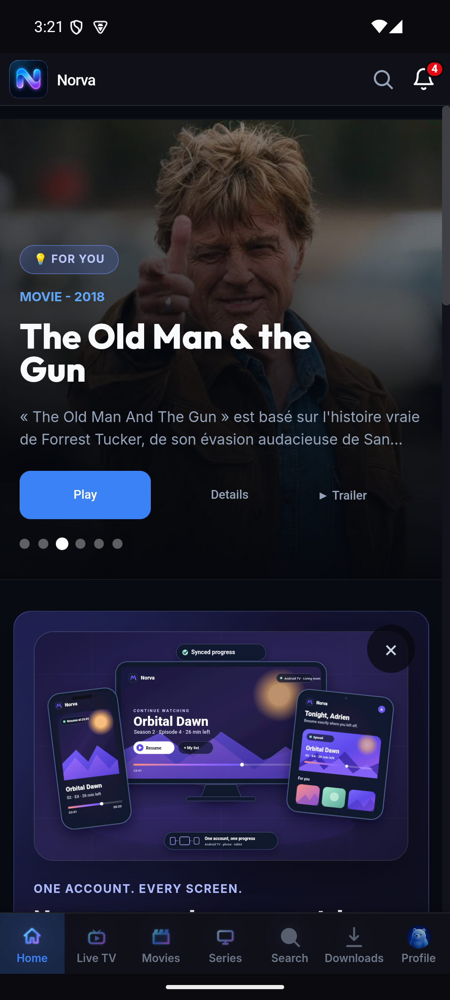

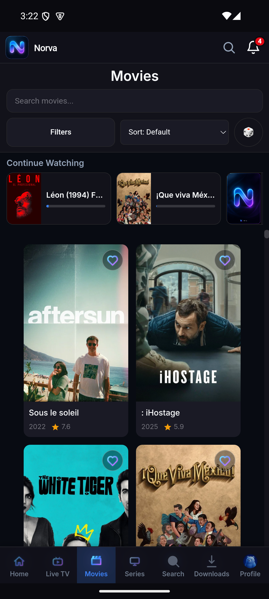

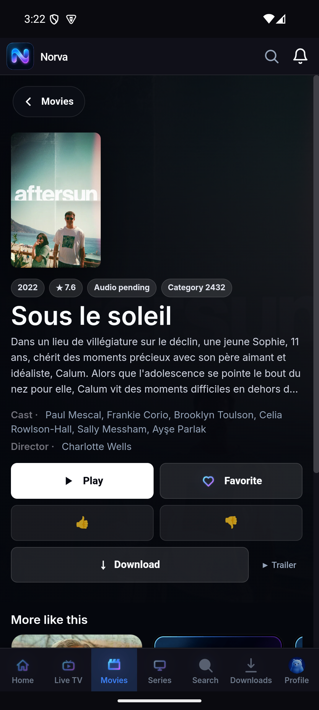

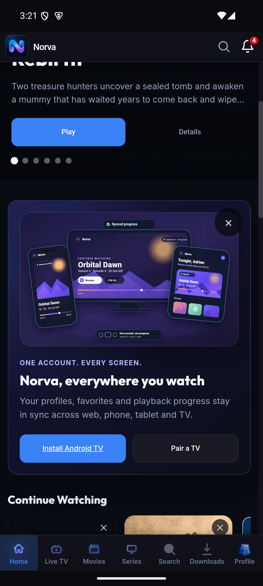

### Web

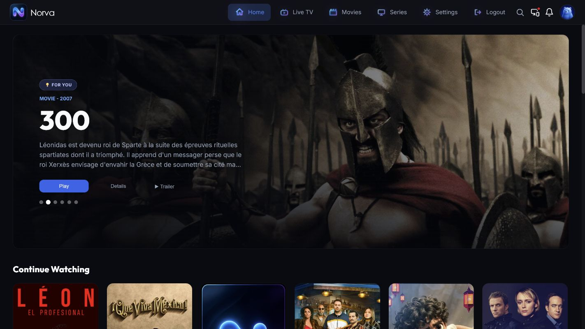

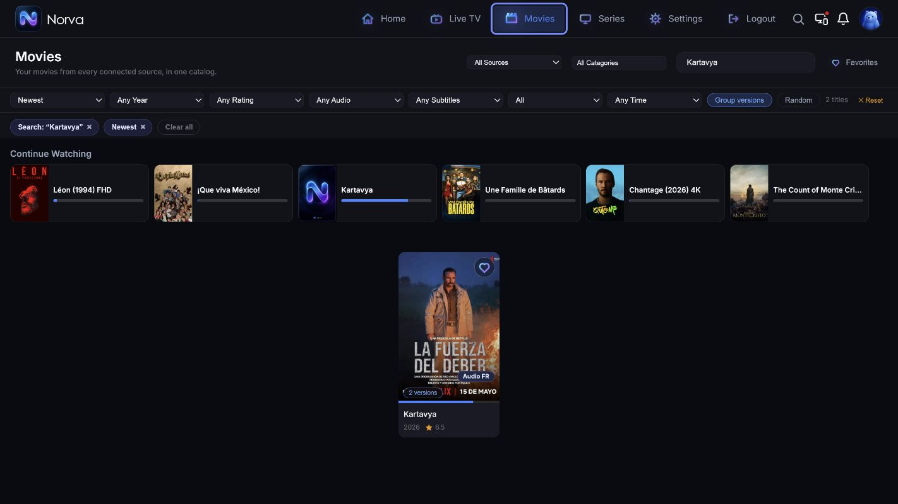

### TV

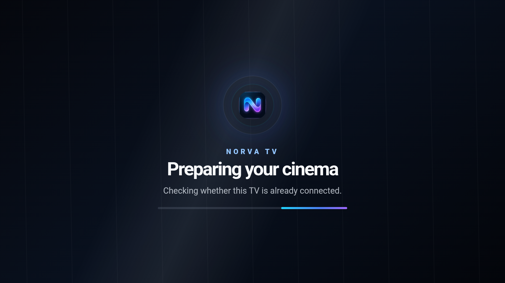

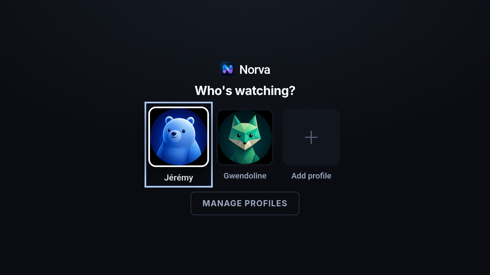

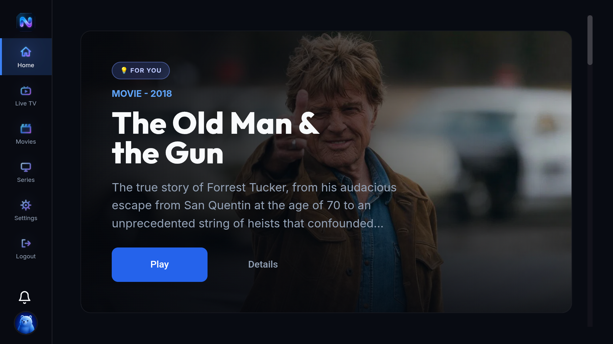

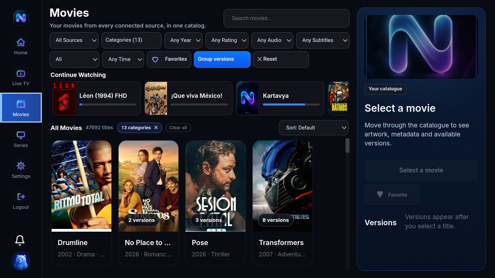

## Problèmes prioritaires

### P0 — Le démarrage TV peut être perçu comme un gel

Sur l’émulateur TV courant, l’écran « Preparing your cinema » est resté affiché plus de 40 secondes. Une pression sur OK a ensuite révélé le sélecteur de profil. Même si les données finissent par être présentes, l’utilisateur voit un chargement sans issue, sans action secondaire et sans délai expliqué.

Objectif :

- révéler toute étape interactive avant le splash terminal ;
- annoncer une progression réelle, puis un état « cela prend plus de temps » ;
- proposer une seule récupération claire ;
- ne jamais dépendre d’une action D-pad invisible.

### P1 — La navigation mobile comporte trop de destinations primaires

Sept destinations avec libellés dans la barre basse réduisent la lisibilité, la largeur de cible et la marge de localisation. Le contenu et les actions de catalogue perdent en priorité.

Objectif :

- garder quatre ou cinq destinations primaires ;
- placer les usages secondaires dans « Plus » ou le profil ;
- conserver des cibles de 48 dp et une marge au-dessus de la navigation Android, en mode gestes comme en mode trois boutons.

### P1 — Le web ressemble à une version compacte plutôt qu’à un grand écran premium

Le héros est contenu dans une carte avec de grandes marges, la navigation et les filtres sont petits, et un faible nombre de résultats laisse une grande zone morte. La surface disponible ne sert ni le contenu ni l’aide à la décision.

Objectif :

- faire du héros un vrai plan éditorial ;
- agrandir la typographie et les actions sans grossir toute l’interface ;
- remplacer les deux rangées de filtres par une barre lisible et une surface de filtres avancés ;
- prévoir une composition premium pour faible résultat, vide et chargement.

### P1 — Des données techniques dégradent le détail mobile

Le détail observé affiche notamment « Audio pending » et « Category 2432 ». Ces informations ne répondent à aucune question utilisateur et donnent l’impression d’un produit inachevé. La multitude d’actions de même poids fragmente aussi la décision.

Objectif :

- Play ou Resume comme action dominante ;
- Favorite et Download comme secondaires ;
- avis et actions rares dans « Plus » ;
- métadonnées sanitaires uniquement : langue connue, qualité, année, genre et disponibilité ;
- aucun identifiant, état fournisseur brut ou JSON visible.

### P1 — Le catalogue TV est trop dense pour la télécommande

Le catalogue Films empile deux lignes de filtres, une rail de reprise, une grille et un panneau latéral. Les états bleu « page sélectionnée », « contrôle actif » et « focus D-pad » peuvent se concurrencer.

Objectif :

- une ligne de contexte et un seul point d’entrée « Filtres » ;
- filtres dans un panneau latéral avec ordre spatial stable ;
- un focus D-pad à double couche, distinct de l’accent de sélection et de la progression ;
- panneau de détail progressif uniquement après sélection d’un titre.

### P1 — La continuité existe mais n’est pas un langage produit

Le mobile possède un module promotionnel écosystème et la reprise existe sur les trois surfaces, mais le bénéfice « commencer ici, continuer ailleurs » n’est pas exprimé par les mêmes composants, le même titre et la même progression.

Objectif :

- même composant de progression sur mobile, web et TV ;
- CTA contextuel discret « Continuer sur TV » ou « Reprendre sur ce téléphone » ;
- statut de synchronisation rassurant, jamais un grand panneau publicitaire au milieu de la découverte ;
- continuité de profil, route, filtre et position comme comportement par défaut.

## Principes de refonte

1. Le contenu mène, le chrome s’efface.
2. Une seule action primaire bleue par zone.
3. Focus, sélection, progression et disponibilité sont quatre états visuellement distincts.
4. Les cartes gardent une géométrie 2:3 stable pendant le chargement.
5. Les erreurs décrivent ce que l’utilisateur peut faire, pas ce que le fournisseur a répondu.
6. Mobile, web et TV partagent les tokens Norva mais jamais le même modèle de navigation.
7. Le système respecte les couleurs canoniques `#080B12`, `#12121A`, `#1A1A25`, `#3B82F6`, `#8B5CF6`, Inter et Outfit.
8. Les zones tactiles, le clavier, TalkBack, les barres système Android et la D-pad sont des contraintes de composition, pas des validations tardives.

## Trois pistes visuelles

Ces images sont des directions de design. Elles ne sont pas encore des spécifications Figma mesurées ni une autorisation de modifier le produit.

### 1

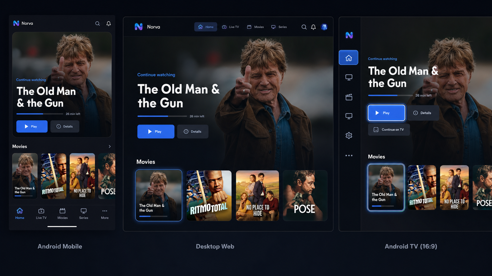

### 2

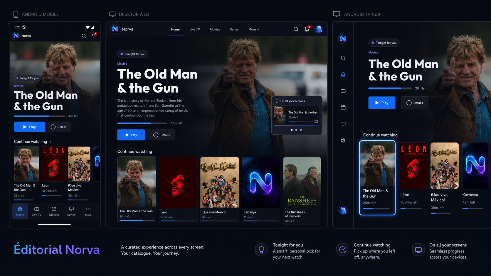

### 3

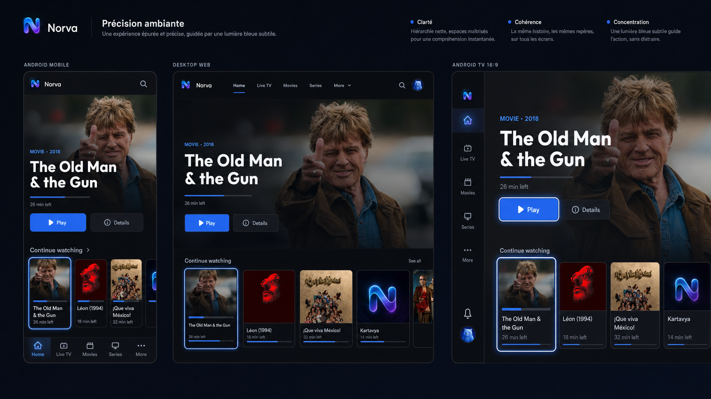

## Étape suivante après sélection

La piste choisie doit être convertie en système de composants et en états mesurés :

1. Home et reprise multi-écran ;
2. Movies/Series et filtres ;
3. détail, versions et actions ;
4. profils, pairing et réglages ;
5. chargement, vide, hors-ligne et récupération ;
6. lecteur VOD et continuité ;
7. variantes mobile, web, TV et accessibilité ;
8. comparaison visuelle à viewport identique, puis validation sur émulateurs.

## Limites de cette passe

- L’audit est fondé sur les états courants visibles et des captures de cette session.
- Il ne certifie ni les douze parcours complets, ni TalkBack, ni les performances vidéo.
- Les maquettes générées servent à choisir une direction. La précision des espacements, composants, textes et états viendra dans le canvas structuré après sélection.
