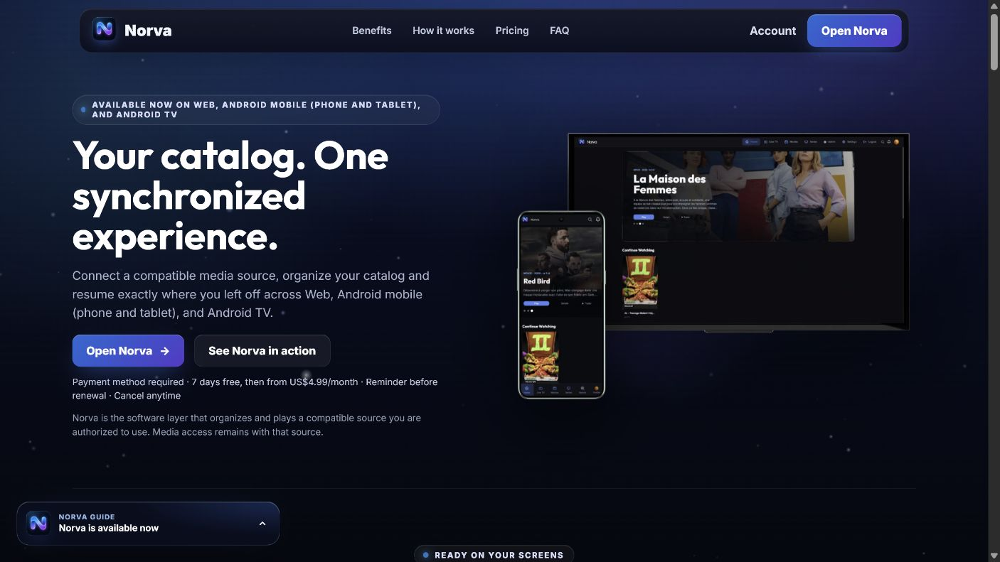
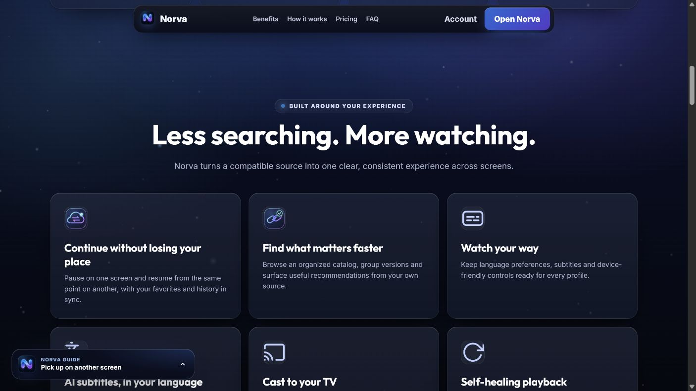
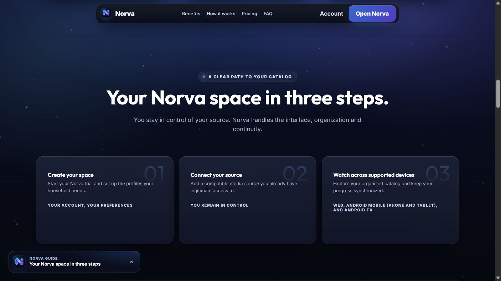
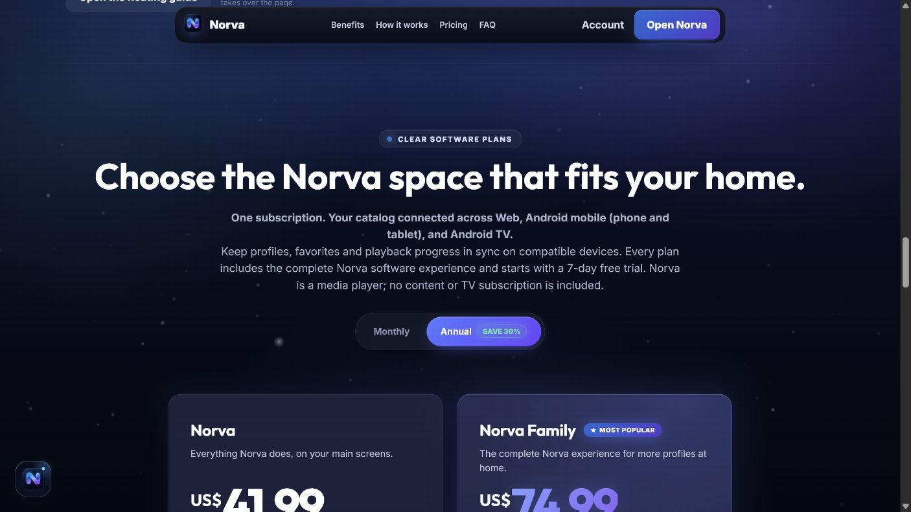
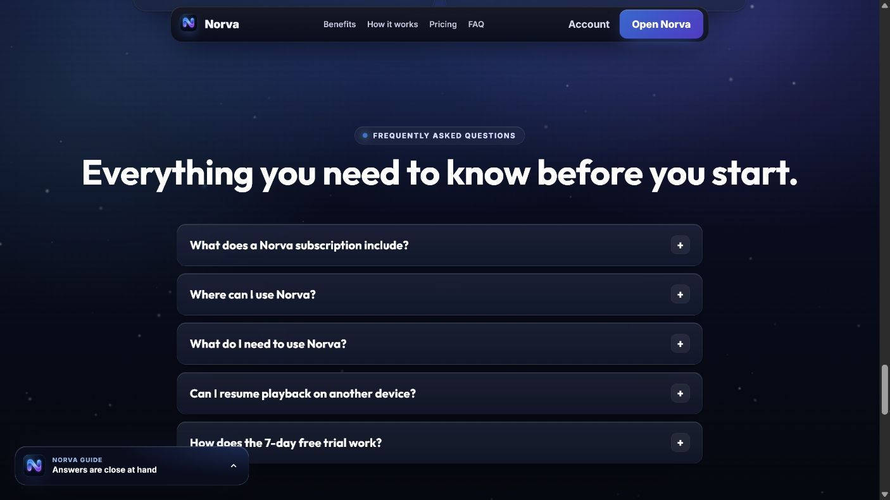
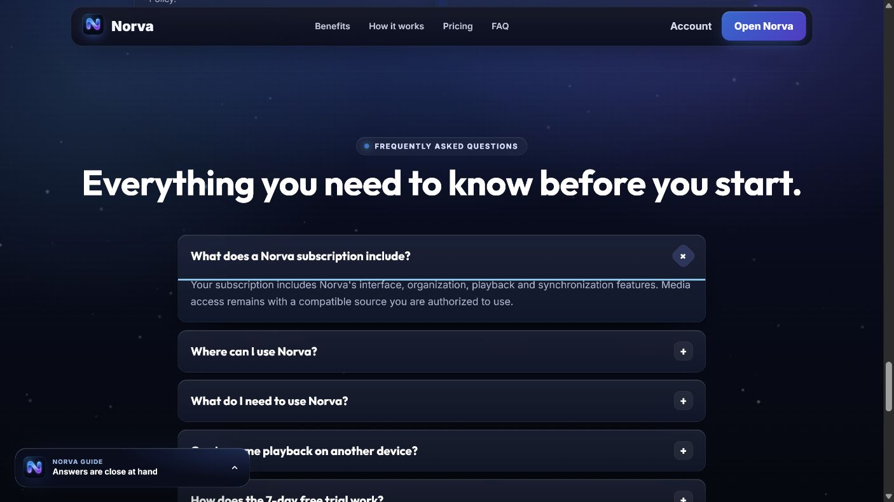

# Audit et maquettes premium de la landing page Norva

Date : 28 juillet 2026
Périmètre : landing publique Web, état authentifié observé sur `https://norva.tv/`
Livrable design : [canvas Superdesign](https://superdesign.dev/teams/235f8bb0-73fd-4f0f-affc-7debc947fe7e/projects/514a848c-7272-4585-9a8a-acf398927e36?live=1)

## Verdict

La landing actuelle possède déjà une identité Norva cohérente, une proposition multi-écran visible et une transparence commerciale supérieure à la moyenne. Elle n'atteint cependant pas encore un niveau premium de conversion : elle explique plusieurs fois la même promesse avant de montrer une preuve produit forte, donne le même poids à six bénéfices, repousse la décision tarifaire et laisse le guide flottant concurrencer le contenu.

La meilleure base de refonte est la direction **Conversion cinématique**. Elle conserve les codes Norva, rend le produit immédiatement tangible et raccourcit le chemin vers l'essai. La direction **Continuité éditoriale** est plus émotionnelle et différenciante ; ses chapitres téléphone → Web → TV peuvent enrichir la version finale.

## Méthode

- Inspection de la landing réelle dans le navigateur intégré, avec état authentifié.
- Lecture des sources `public/index.html`, `public/css/landing.css` et `public/js/landing.js`.
- Capture de six états représentatifs.
- Reproduction témoin de la landing actuelle dans Superdesign.
- Exploration de deux directions, puis correction des défauts visibles des premiers jets.
- Vérification visuelle des héros, preuves produit, chapitres multi-écran, setup et tarification.

Cette revue ne constitue pas une certification WCAG. Les états mobile, zoom, clavier complet, lecteur d'écran et mouvement réduit devront être rejoués lors de l'implémentation.

## Santé des six étapes observées

| Étape | État | Santé | Diagnostic |
|---|---|---|---|
| 1 | Hero | À renforcer | La promesse est claire, mais générique. La preuve Web/mobile/TV est présente, trop petite et trop sombre pour convaincre immédiatement. |
| 2 | Benefits | Moyen | Les six cartes ont le même poids ; l'utilisateur doit lui-même trouver les trois bénéfices décisifs. |
| 3 | How it works | Moyen | Les trois étapes sont compréhensibles, mais génériques et peu soutenues par le produit réel. |
| 4 | Pricing | Moyen | Les conditions sont transparentes, mais la décision arrive tard. La navigation par ancre laisse parfois du contenu précédent rogné sous l'en-tête fixe. |
| 5 | FAQ fermée | Bon | Structure d'accordéon claire et rassurante, mais le volume vertical prolonge encore une page déjà longue. |
| 6 | FAQ ouverte | Moyen | L'état ouvert est lisible ; le guide flottant peut néanmoins couvrir le contenu et ajouter un second point d'attention. |

### 1. Hero actuel

Points solides :

- marque Norva immédiatement identifiable ;
- disponibilité multi-écran annoncée ;
- CTA principal et secondaire visibles ;
- essai, paiement, renouvellement et responsabilité de la source explicités.

Friction :

- le titre ne verbalise pas la continuité d'usage aussi fortement que le produit le permet ;
- les interfaces réelles servent davantage de décoration que de preuve ;
- le guide flottant arrive avant que la proposition de valeur soit assimilée.

### 2. Benefits actuels

Les six bénéfices sont utiles, mais leur grille uniforme dilue la hiérarchie. La continuité, les sous-titres et la récupération de lecture devraient constituer le trio principal ; les autres capacités peuvent devenir des preuves secondaires.

### 3. How it works actuel

Le parcours est simple, mais les cartes sont très textuelles et laissent beaucoup d'espace sans preuve visuelle. Des extraits réels du profil, de la connexion de source et du catalogue rendraient la mise en route plus crédible.

### 4. Pricing actuel

La transparence est un vrai atout. En revanche :

- la tarification arrive après plusieurs sections répétitives ;
- l'ancre de section n'est pas suffisamment compensée pour l'en-tête fixe ;
- le contexte « logiciel sans contenu inclus » gagnerait à être condensé près du premier CTA et rappelé sans répéter un bloc long.

### 5. FAQ fermée

L'accordéon est compréhensible et la zone de décision est saine. Une sélection de quatre questions fortes, suivie d'un accès aux réponses complètes, réduirait la longueur de page.

### 6. FAQ ouverte

L'état ouvert est clair. Le guide flottant reste toutefois trop concurrentiel avec un contenu de réassurance qui doit être lu sans distraction.

## Problèmes prioritaires

### P1 — Conversion et hiérarchie

1. Remplacer le titre générique par une promesse de continuité propre à Norva.
2. Montrer les interfaces Web, mobile et TV comme preuve principale dans le premier écran.
3. Réduire les six bénéfices à trois bénéfices dominants, avec une histoire visuelle.
4. Faire apparaître le prix et les conditions de l'essai plus tôt.

### P1 — Guide flottant

1. Ne plus ouvrir automatiquement une carte riche au-dessus du contenu.
2. Utiliser un lanceur compact et optionnel.
3. Garantir qu'il ne couvre ni CTA, ni texte, ni contrôle, y compris au zoom et sur petits écrans.
4. Conserver fermeture, restauration du focus, annonce accessible et préférence persistante.

### P1 — Navigation par ancres

Appliquer un décalage cohérent à toutes les sections ciblées par l'en-tête fixe. Les captures Pricing et FAQ montrent du contenu précédent rogné en haut après navigation.

### P2 — Densité et répétition

- fusionner disponibilité et preuve multi-appareil ;
- remplacer les cartes de setup génériques par des preuves réelles ;
- compacter la confiance, le juridique et la FAQ sans supprimer la transparence ;
- maintenir un seul CTA principal cohérent du hero à la tarification.

## Maquettes Superdesign

### Référence — reproduction de l'existant

- [Ouvrir dans le canvas](https://superdesign.dev/teams/235f8bb0-73fd-4f0f-affc-7debc947fe7e/projects/514a848c-7272-4585-9a8a-acf398927e36?node=draft-variant-79796412-593d-496e-a5dd-26c0f681feed)
- [Aperçu plein écran](https://p.superdesign.dev/draft/79796412-593d-496e-a5dd-26c0f681feed)

Cette version sert de témoin contrôlé : même ordre de sections, même langage visuel et même contenu principal que la landing actuelle.

### Direction recommandée — Conversion cinématique

- [Ouvrir dans le canvas](https://superdesign.dev/teams/235f8bb0-73fd-4f0f-affc-7debc947fe7e/projects/514a848c-7272-4585-9a8a-acf398927e36?node=draft-variant-4fbfabac-0cb7-4b48-a672-09bb68f6c700)
- [Aperçu plein écran](https://p.superdesign.dev/draft/4fbfabac-0cb7-4b48-a672-09bb68f6c700)

Principes :

- « Start here, continue anywhere » comme promesse centrale ;
- téléphone et TV réels comme preuve au-dessus de la ligne de flottaison ;
- trois bénéfices prioritaires ;
- setup compact et lisible en un écran ;
- prix rapproché du moment de décision ;
- aide réduite à un lanceur discret.

### Direction alternative — Continuité éditoriale

- [Ouvrir dans le canvas](https://superdesign.dev/teams/235f8bb0-73fd-4f0f-affc-7debc947fe7e/projects/514a848c-7272-4585-9a8a-acf398927e36?node=draft-variant-853aacc2-50da-49eb-8be3-876ccd516302)
- [Aperçu plein écran](https://p.superdesign.dev/draft/853aacc2-50da-49eb-8be3-876ccd516302)

Principes :

- « Your evening follows you » comme récit émotionnel ;
- progression téléphone → Web → TV ;
- chapitres de preuve centrés sur la continuité réelle ;
- rythme éditorial plus cinématographique ;
- aide compacte utilisant le vrai logo Norva.

## Recommandation de synthèse

Utiliser la **Conversion cinématique** comme architecture principale, puis reprendre de la **Continuité éditoriale** son récit en trois chapitres pour la section de preuve. Le résultat cible doit conserver :

- le hero direct et la tarification plus proche de la décision ;
- la démonstration visuelle téléphone → Web → TV ;
- les trois bénéfices prioritaires ;
- les mentions commerciales et légales actuelles, condensées sans perte ;
- le guide uniquement comme aide volontaire.

## Critères d'acceptation pour l'implémentation

- aucun changement d'identité visuelle hors des tokens Norva existants ;
- CTA et liens réels pour les états connecté et déconnecté ;
- `scroll-margin-top` ou mécanisme équivalent sur toutes les ancres ;
- cibles tactiles d'au moins 44 px et focus clavier visible ;
- guide sans chevauchement à 320 px, 200 % de zoom et police agrandie ;
- rendu vérifié avec mouvement réduit ;
- comparaisons visuelles aux mêmes viewports que les maquettes ;
- tests sur desktop, téléphone et tablette avant mise en production.
