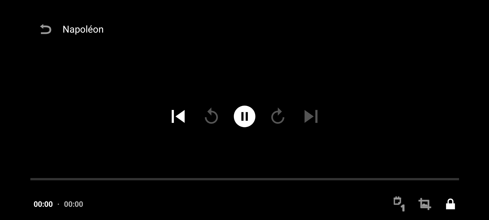
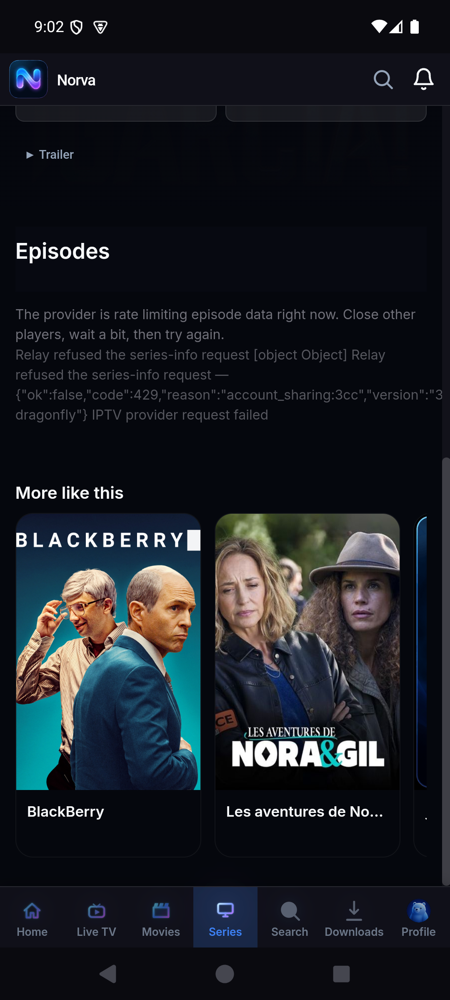
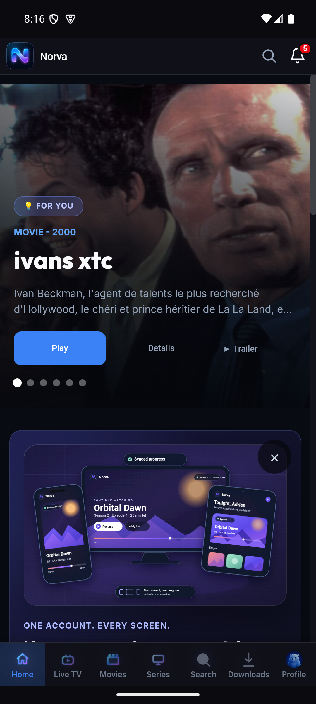
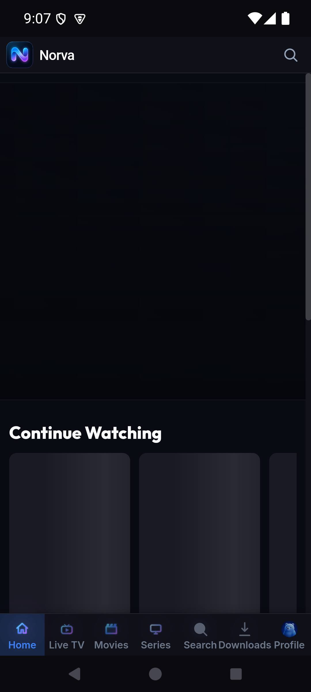
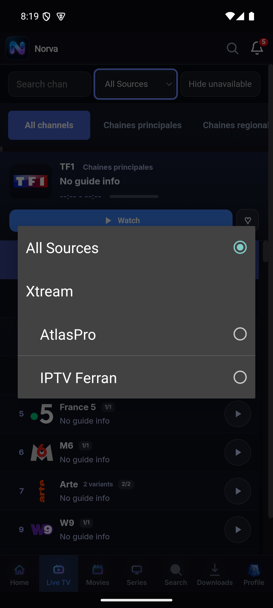
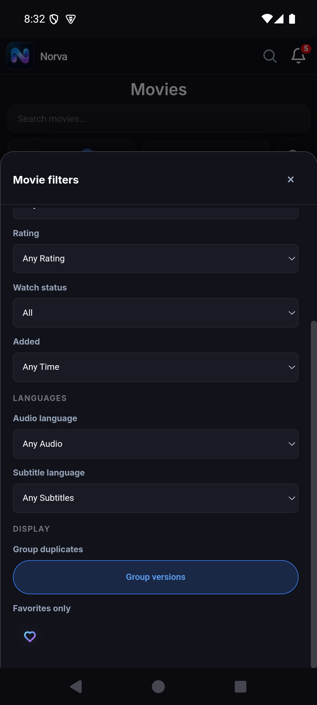
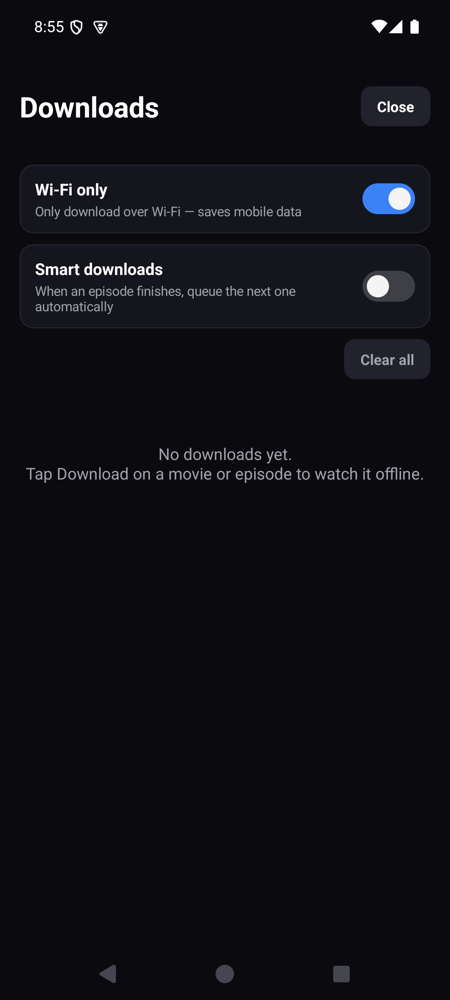
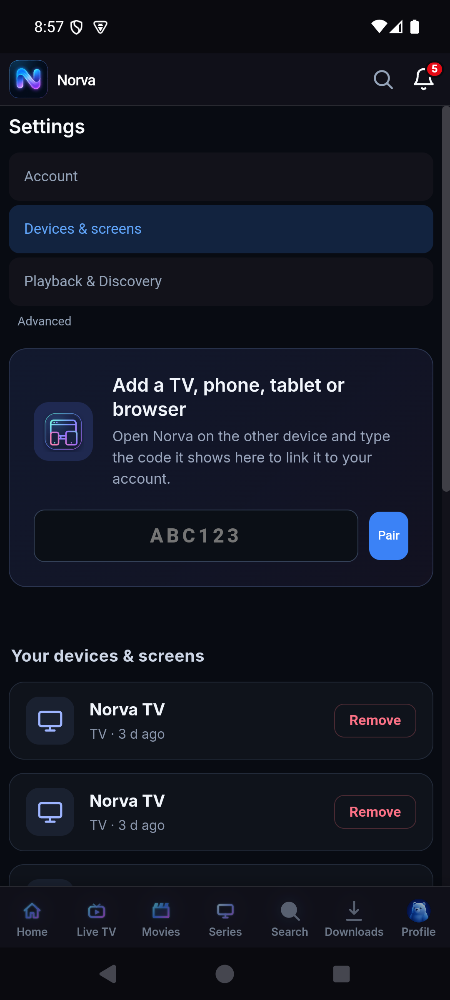
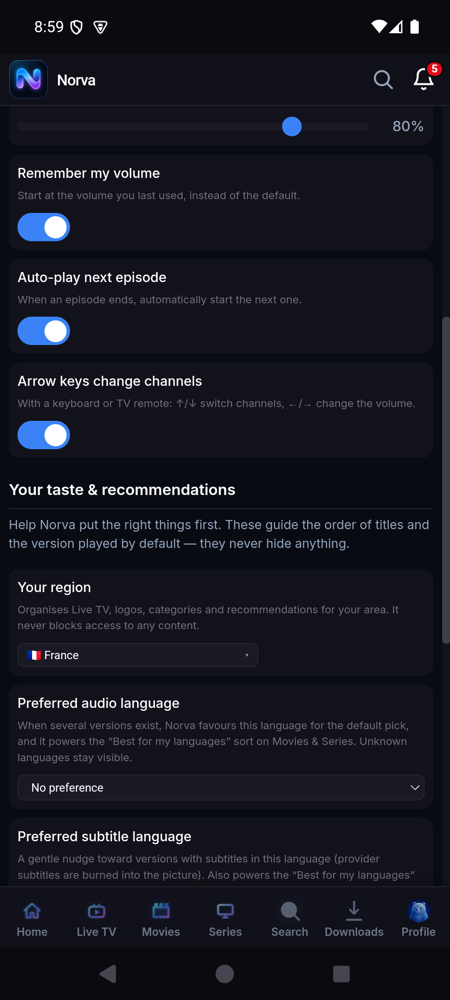

# Audit premium Android mobile — navigation et lecteur VOD

Date : 27 juillet 2026 
Client audité : `tv.norva.phone` 1.3.5 (code 18), cible Android API 36 
Environnement runtime : émulateur Android 15 / API 35, 1080 × 2400, 420 dpi 
Produit chargé : application WebView Norva en production, avec lecteur Media3 natif

Méthode : chaque constat est qualifié comme **runtime** (rejoué sur l’émulateur), **revue statique** (code, manifeste ou arbre UI) ou **non rejoué**. Les mesures de performance sont exploratoires et ne valent pas certification de production.

## Verdict

Norva possède déjà une identité visuelle cohérente et plusieurs fondations solides — reprise de lecture, MediaSession, PiP déclaré, téléchargement chiffré, profils, pairing et navigation globale. En revanche, aucun des 12 parcours ne peut encore être qualifié de premium.

| Santé | Nombre |
|---|---:|
| Premium | 0 |
| Fragile | 3 |
| Mauvaise | 7 |
| Critique | 2 |

Les deux blocages majeurs sont :

1. Le lecteur VOD reste noir pendant le chargement, peut afficher `00:00 · 00:00` avec une icône Pause tout en étant encore en `BUFFERING`, puis superpose des contrôles à ses erreurs.
2. La page Series expose directement une erreur fournisseur et son JSON interne à l’utilisateur, sans épisode disponible ni action de récupération propre.

## Couverture et niveau de preuve

| Surface | Runtime | Revue statique | Non rejoué dans cette session |
|---|---|---|---|
| Lancement, profils, Home, navigation, recherche | Oui | Oui | App Link `/t/*` |
| Live TV | Page et filtre source | Oui | Première image et session Live complète |
| Movies / Series | Filtres, recherche, détails, erreurs | Oui | Épisode Series réellement lisible |
| Lecteur VOD | Chargement, recovery, erreur, lock, Home/retour | Oui | Première image, seek en lecture stable, Cast réussi, PiP en lecture |
| Downloads | État vide et toggles en trois boutons | Oui | Bibliothèque active, geste sur cet écran, 25–100 titres |
| Settings / appareils | Account, Devices, Playback, Advanced | Oui | Scan caméra, pairing neuf, support et suppression |
| Authentification | Session existante | Oui | Connexion, récupération, logout et création de compte |

L’audit couvre toutes les destinations principales et leurs contrats visibles, mais ne transforme pas les parcours non rejoués en succès implicites.

## Résultat des 12 parcours

### 1. Lancement, session et liens profonds — mauvaise

Santé : **Mauvaise**. 
Preuve : **runtime** pour le lancement, la recréation et Home/retour ; **revue statique** pour `/t/*`.

Le lancement et la sélection de profil fonctionnent, mais le démarrage froid mesuré atteint **7,664 s** et saute de nombreuses frames. Changer le mode de navigation Android ou revenir depuis Home après un lecteur en chargement ramène à « Who's watching? ». Le contrat `/t/*` est déclaré côté Android, sans conversion démontrée vers les routes `#movies/open:*` ou `#series/open:*`.

Points solides : splash cohérent, sélecteur de profil lisible, **session authentifiée** conservée après un simple redémarrage. 
UX : le profil actif, la route et le contexte de lecture ne sont pas conservés lors des transitions testées ; la reprise de tâche n’est donc pas prévisible. 
Accessibilité : le sélecteur reste lisible à la police 1,3 ; la restitution du focus et l’annonce d’une erreur de lien profond restent à vérifier. 
Limites : le lien `/t/*`, l’initialisation push à froid et les App Links ont été revus statiquement, pas exécutés.

### 2. Authentification et récupération — fragile

Santé : **Fragile**. 
Preuve : **runtime** sur une session déjà connectée ; **revue statique** des formulaires et dialogs.

Le compte connecté est clairement identifié dans Settings et les actions de connexion sont regroupées. La déconnexion depuis la sheet Account est toutefois immédiate, sans confirmation ni annulation.

Points solides : statut du compte clair, séparation compte/profils. 
UX : confirmations et retours asynchrones ne suivent pas encore un contrat unique. 
Accessibilité : focus de dialog et statuts `aria-live` sont incomplets dans la revue statique ; aucune session TalkBack n’a été exécutée. 
Limites : connexion, création de compte, récupération, logout et suppression n’ont pas été rejoués afin de préserver la session existante.

### 3. Profils — fragile

Santé : **Fragile**. 
Preuve : **runtime** pour la sélection, le texte agrandi et la perte de contexte ; **revue statique** des overlays.

Le sélecteur est visuellement fort, lisible à l’échelle de police 1,3 et les cartes sont généreuses. L’état actif se perd néanmoins après plusieurs changements de configuration et après Home pendant un buffering.

Points solides : identité, taille des cartes, retour entre Select/Manage/Add. 
UX : l’état du profil doit survivre à la recréation, au retour système et à la reprise du lecteur. 
Accessibilité : la revue statique indique un confinement de focus incomplet ; les avatars et la confirmation de suppression doivent exposer un nom et un état explicites. 
Limites : édition complète, profil verrouillé et suppression n’ont pas été rejoués.

### 4. Connexion et synchronisation des sources — mauvaise

Santé : **Mauvaise**. 
Preuve : **runtime** pour Devices & screens ; **revue statique** pour le scanner, les CTA et les contrats de synchronisation.

Le pairing et la liste des appareils existent, mais le parcours mobile ne montre pas les CTA Play Store/Web de l’écosystème. Les erreurs fournisseur peuvent traverser jusqu’à l’UI. La revue statique montre aussi un contrat incomplet autour de la permission caméra du scanner.

Points solides : pairing à six caractères, écrans approuvés, révocation et Cast d’URL. 
UX : validation de lien, états réseau/retry et CTA d’installation doivent former un parcours continu au lieu de surfaces séparées. 
Accessibilité : les statuts Pair/Save/Remove et la synchronisation doivent être annoncés sans déplacer arbitrairement le focus. 
Limites : aucun pairing neuf, scan caméra ou échec réseau contrôlé n’a été rejoué.

### 5. Home — mauvaise

Santé : **Mauvaise**. 
Preuve : **runtime** en navigation gestuelle, trois boutons et police 1,3.

Le shell est reconnaissable et Continue Watching est présent. La promotion de l’écosystème multi-appareil est cependant coupée sous la navigation fixe et ne peut pas être entièrement parcourue. À l’échelle de police 1,3, la navigation et le contenu se densifient fortement.

Points solides : rails, reprise, identité Norva. 
UX : la valeur multi-appareil est présente mais son module non scrollable en masque une partie ; les états de chargement et la hiérarchie du hero manquent de stabilité. 
Accessibilité : contenu important inaccessible sous la navigation fixe et adaptation au texte agrandi insuffisante. 
Limites : les interactions de chaque rail et tous les états Home vide/hors ligne n’ont pas été rejoués.

### 6. Navigation globale, recherche et sheet Account — mauvaise

Santé : **Mauvaise**. 
Preuve : **runtime** pour la navigation, la recherche, Account et la police 1,3 ; **revue statique** pour le focus modal.

Les sept destinations sont atteignables et la barre système Android ne recouvre pas le bottom nav. À l’échelle de police 1,3, les libellés `Search`, `Downloads` et `Profile` se touchent. La recherche de « Leon » ne fait pas remonter nettement l’exact « Léon », ce qui suggère une normalisation/rang d’accent perfectible.

Points solides : destinations persistantes, iconographie cohérente, sheet Account moderne. 
UX : navigation adaptative et ranking accent/ponctuation sont à corriger ; la fermeture de sheet observée mesure environ 36 CSS px, sous le seuil de 44 CSS px du WebView. 
Accessibilité : les noms restent compréhensibles à l’échelle 1,0, mais les libellés se chevauchent à 1,3 ; le focus de sheet doit être déplacé, confiné puis restauré. Les contrôles natifs, eux, gardent un seuil de 48 dp. 
Limites : aucun test à la police 2,0, Switch Access ou TalkBack n’a été exécuté.

### 7. Live TV — fragile

Santé : **Fragile**. 
Preuve : **runtime** pour la page et le filtre source ; lecture Live complète **non rejouée**.

La page charge rapidement dans ce run et le filtre source est atteignable. Le sélecteur reste un panneau radio Android gris très générique, sans finition Norva. La lecture Live complète n’a pas été certifiée.

Points solides : accès rapide, structure simple. 
UX : sélecteur de source on-brand, états chaîne indisponible, première image et reprise restent à consolider. 
Accessibilité : les options sont lisibles et sélectionnables, mais le focus, les états radio et les annonces de chargement n’ont pas été validés avec TalkBack. 
Limites : aucune première image, reprise Live, EPG complet ou erreur chaîne contrôlée n’a été certifié.

### 8. Movies — mauvaise

Santé : **Mauvaise**. 
Preuve : **runtime** pour les deux ordres de filtres, Back, IME et les deux modes de navigation Android.

La navigation `All Sources → All Categories` et l’inverse fonctionne : aucun blocage logique n’a été reproduit. Le filtre reste néanmoins encombrant : un grand panneau radio natif pour Source, un clavier qui recouvre Category, des scrolls imbriqués et une hiérarchie peu premium. Les titres contiennent parfois des préfixes `:` et des notes `0`.

Points solides : les deux ordres Source/Category conservent correctement la sélection ; Back ferme la sheet. 
UX : composant de filtre unifié, un seul propriétaire du scroll, absence d’autofocus clavier, chips actives et données de catalogue nettoyées. 
Accessibilité : les actions restent visibles au-dessus des barres système ; le bouton de fermeture d’environ 36 CSS px et l’IME automatique réduisent l’opérabilité. 
Limites : pagination exhaustive, états vide/hors ligne et lecture réussie depuis chaque variante n’ont pas été rejoués. 
Barre système : les actions de la sheet restent physiquement au-dessus de la barre à trois boutons et de la zone gestuelle.

### 9. Series — critique

Santé : **Critique**. 
Preuve : **runtime** sur la fiche García!, la zone Episodes et l’erreur brute.

La fiche García! est visuellement convaincante, mais le bouton principal indique `Unavailable`. La zone Episodes révèle ensuite le code `429`, `account_sharing:3cc`, une version fournisseur et `[object Object]`.

Points solides : fiche, poster/backdrop, hiérarchie du synopsis. 
UX : mapper les erreurs en états éditoriaux sûrs, offrir Retry/changement de source et ne jamais exposer de payload interne. 
Accessibilité : l’erreur n’expose ni résumé actionnable ni prochaine étape ; son annonce asynchrone n’a pas été validée. 
Limites : aucun épisode Series réellement lisible n’a été atteint.

### 10. Lecteur VOD — critique

Santé : **Critique**. 
Preuve : **runtime** sur trois titres et plusieurs variantes ; **revue statique** des chemins recovery, Cast, PiP, offline et accessibilité.

Trois titres et plusieurs variantes ont été essayés. Aucun premier frame exploitable n’a été atteint. Un MP4 est resté noir et `BUFFERING` au-delà de 30 s. Les variantes HEVC ont abouti à des erreurs codec après récupération. Retry montre des états contradictoires ; les contrôles Media3 chevauchent le panneau terminal ; Back quitte le lecteur même lorsqu’il est verrouillé.

Points solides : Activity dédiée, MediaSession, récupération direct/gateway/fresh URL, contrôles 48 dp, insets, préférences audio/sous-titres. 
UX : rétablir d’abord un flux H.264/AAC connu jusqu’à la première frame, puis garantir une machine d’états exclusive avec poster, progression honnête, retry tokenisé, erreur sans contrôles sous-jacents, lock et PiP cohérents. 
Accessibilité : alternatives explicites aux gestes, annonces Preparing/Recovering/Error et comportement Back en mode verrouillé sont incomplets dans la revue statique. 
Limites : aucune lecture stable n’ayant été atteinte, seek, pistes, vitesse, Cast réussi, next episode et PiP en lecture restent non certifiés.

Voir [l’audit détaillé du lecteur](vod-player-audit.md).

### 11. Téléchargements et hors ligne — mauvaise

Santé : **Mauvaise**. 
Preuve : **runtime** sur l’état vide et les toggles en navigation trois boutons ; **revue statique** du rendu, du manifeste et du chiffrement.

L’état vide est propre et respecte la barre Android dans le mode trois boutons testé. Les toggles Wi‑Fi et Smart Downloads fonctionnent et ont été restaurés. La revue statique montre cependant que la vue reconstruit toute la liste sur le thread UI toutes les 1,5 s, relit le manifeste et redécode les posters. Cela présente un risque élevé de freeze avec une bibliothèque active.

Points solides : réglages clairs, empty state, contrôle hors ligne natif. 
UX : rendu incrémental hors thread UI, manifeste atomique, actions d’épisode visibles/nommées et état de progression durable. 
Accessibilité : la revue de l’arbre UI montre une ligne et son Switch tous deux focusables, tandis que `Clear all` reste cliquable à vide. 
Limites : aucune bibliothèque réelle n’était disponible ; le mode gestuel sur cet écran, 25–100 titres, stockage contraint et lecture hors ligne n’ont pas été rejoués.

### 12. Settings, appareils, support et suppression — mauvaise

Santé : **Mauvaise**. 
Preuve : **runtime** pour Account, Devices & screens, Playback et Advanced ; **revue statique** pour billing, support et actions destructives.

La qualité visuelle est élevée et la page Devices & screens est complète. Changer d’onglet conserve toutefois le scroll du précédent : après avoir descendu Account, ouvrir Playback & Discovery commence au milieu du nouveau contenu. Les CTA Play Store sont volontairement masqués dans l’APK, malgré les URL existantes.

Points solides : pairing, appareils, statut d’accès, réglages de lecture, suppression séparée. 
UX : reset ou mémoire de scroll propre à chaque onglet, CTA écosystème et détection robuste du bridge billing natif. 
Accessibilité : les tabs doivent exposer rôle, sélection, panel associé et navigation cohérente ; Pair/Save/Remove doivent annoncer leur résultat. 
Limites : support, suppression de compte, billing transactionnel, scan et pairing neuf n’ont pas été déclenchés.

## Barre de navigation Android et filtres

L’audit a été exécuté en navigation gestuelle puis en navigation à trois boutons.

- Aucun chevauchement physique n’a été observé entre les actions du filtre Movies/Series et la barre système.
- En trois boutons, le viewport WebView mesurait environ 818 CSS px ; le bouton inférieur du filtre finissait vers 798 px, soit une marge sûre.
- Le changement de mode recrée l’Activity et renvoie au sélecteur de profil.
- Le vrai défaut est la densité du bottom nav avec sept destinations et le texte agrandi, pas l’inset inférieur.
- Le clavier de catégorie et sa barre flottante peuvent masquer le contenu du filtre.

Voir [l’audit détaillé de navigation](navigation-audit.md).

## Performance et stabilité

Mesures exploratoires sur l’émulateur, non assimilables à des chiffres de production :

| Mesure | Résultat observé |
|---|---:|
| Démarrage froid Activity | 7,664 s |
| Frames du processus principal / vues Activity (`gfxinfo`) | 3 515 |
| Frames janky du processus principal | 1 811 — 51,52 % |
| p50 / p90 / p95 / p99 du processus principal | 36 / 93 / 150 / 300 ms |
| Frames du processus principal > 700 ms | 5 |
| Processus principal app PSS / RSS | 145 / 218 Mio |
| Renderer WebView PSS / RSS | 795 / 863 Mio |
| Crash, ANR, OOM détecté pendant ce run | 0 |

Le frame timing du renderer WebView n’a pas été instrumenté séparément : ces chiffres ne certifient ni le rendu du catalogue ni la vidéo. La session inclut démarrages, rotations du lecteur, captures et changements de configuration ; elle ne constitue donc pas un benchmark reproductible. Elle signale néanmoins une marge très importante avant un niveau premium.

Seuils de certification proposés : 0 crash/ANR/renderer perdu ; moins de 5 % de frames lentes ; p95 frame ≤ 32 ms ; Home chaud ≤ 2,5 s ; VOD premier frame p50 ≤ 1,5 s et p95 ≤ 3 s ; fallback p95 ≤ 5 s ; mémoire après 20 cycles ≤ baseline + 50 Mio.

## Priorités

### P0 — rendre le produit fiable

1. Remplacer le noir du lecteur par une machine d’états claire et supprimer les états contradictoires.
2. Rétablir un chemin H.264/AAC connu jusqu’à une première frame réelle et en faire un gate de release.
3. Tokeniser et annuler les récupérations aux deux extrémités afin qu’une réponse tardive ne puisse jamais écraser la tentative active.
4. Masquer toutes les erreurs fournisseur internes et fournir Retry/changement de source.
5. Conserver profil, route et état lors d’une recréation ou d’un retour depuis Home.

### P1 — atteindre une interaction premium

1. Refaire la sheet de filtres sans panneau radio système ni autofocus clavier.
2. Corriger le bottom nav à sept items pour le texte agrandi.
3. Réinitialiser le scroll des onglets Settings.
4. Sortir les lectures/decodes de Downloads du thread UI.
5. Rendre Account, Notifications, Profiles et Settings réellement modaux pour le focus.

### P2 — finition

1. Uniformiser bleu natif `#6366F1` et bleu produit `#3B82F6`.
2. Corriger les contrastes des boutons : texte clair sur `#3B82F6` ≈ 3,52:1 ; préférer texte sombre ou un bleu plus profond pour le texte blanc.
3. Nettoyer les titres, notes zéro, placeholders et libellés `Audio pending`.
4. Remplacer les contrôles Media3 historiques par une iconographie Norva cohérente.

## Vérification de la palette

La palette canonique a été rejouée dans Color Designer puis contrôlée par calcul de contraste :

| Combinaison | Contraste | Décision |
|---|---:|---|
| `#F8FAFC` sur `#3B82F6` | 3,52:1 | Réserver au grand texte ; pour un petit label blanc, utiliser `#2563EB` (5,17:1) |
| `#080B12` sur `#3B82F6` | 5,35:1 | Valide pour un petit texte sombre sur action bleue |
| `#94A3B8` sur `#12121A` | 7,27:1 | Solide pour le texte secondaire |
| `#71717A` sur `#16161E` | 3,72:1 | Trop faible pour du petit texte informatif |
| Blanc sur `#10B981` | 2,54:1 | Utiliser du texte sombre (7,76:1) ou un vert `#047857` sous texte blanc (5,48:1) |
| Blanc sur `#EF4444` | 3,76:1 | Pour un petit label d’erreur, préférer `#B91C1C` (6,47:1) |

## Artefacts design

- [Canvas Superdesign — état observé et branches premium](https://superdesign.dev/teams/235f8bb0-73fd-4f0f-affc-7debc947fe7e/projects/2ec1ee02-daee-43eb-a616-f6ef87bea620)
- [Préparation premium interactive](https://p.superdesign.dev/draft/67bae2d1-165a-482b-832c-a1a3c4a6a823)
- [Récupération VOD tokenisée — contrat d’état unique](https://p.superdesign.dev/draft/0229ef1e-022a-40a8-adb5-fdb7ae98419f)
- [Erreur terminale interactive](https://p.superdesign.dev/draft/78bd7763-ce87-450a-ade1-dc6035b2341a)
- [Erreur Series sanitisée](https://p.superdesign.dev/draft/5fa3c6b2-6a97-4a3a-a9a0-cc95015c5aef)
- [Continuité exacte fiche / profil / route](https://p.superdesign.dev/draft/04461f42-fb0e-4025-bbc4-a4f764a9fb07)
- [Fondations Figma — variables et styles Norva](https://www.figma.com/design/4cqE0obt3T1UPDE7gwbM17)
- [Règles de design du dépôt](../../../AGENTS.md) et [design system extrait](../../../.superdesign/design-system.md)

Le lot P0 du canvas constitue désormais le contrat d’implémentation validé : poster conservé avant la première image, états `PREPARING` / `RECOVERING` / `TERMINAL` exclusifs, erreurs Series sans diagnostic interne et reprise exacte du profil, de la fiche et de la route. Le fichier Figma contient les fondations de tokens/styles, mais le connecteur a refusé la génération du board d’audit avec `INVALID_ARGUMENT` : aucune maquette d’écran Figma non vérifiée n’est présentée comme livrable.

## Limites de cet audit

- Un état VOD réellement en lecture n’a pas été atteint ; seek, pistes, vitesse, Cast réussi, next episode et PiP pendant lecture restent à certifier.
- TalkBack et Switch Access n’ont pas été activés ; la vérification accessibilité combine inspection visuelle, arbre UI Android et revue statique. Ce rapport ne constitue pas une déclaration de conformité WCAG.
- Android 16/API 36 n’a pas été exécuté ; l’APK cible bien API 36 mais l’émulateur utilisé est API 35.
- Les téléchargements actifs, réseau contraint, bibliothèque volumineuse et soak test 30 minutes restent à exécuter.

## Certification après correction

Le verdict historique ci-dessus décrit l’état observé avant implémentation. La matrice corrigée, les 12 statuts premium-ready et les gates rejouées sont consignés séparément dans [CERTIFICATION.md](CERTIFICATION.md).
