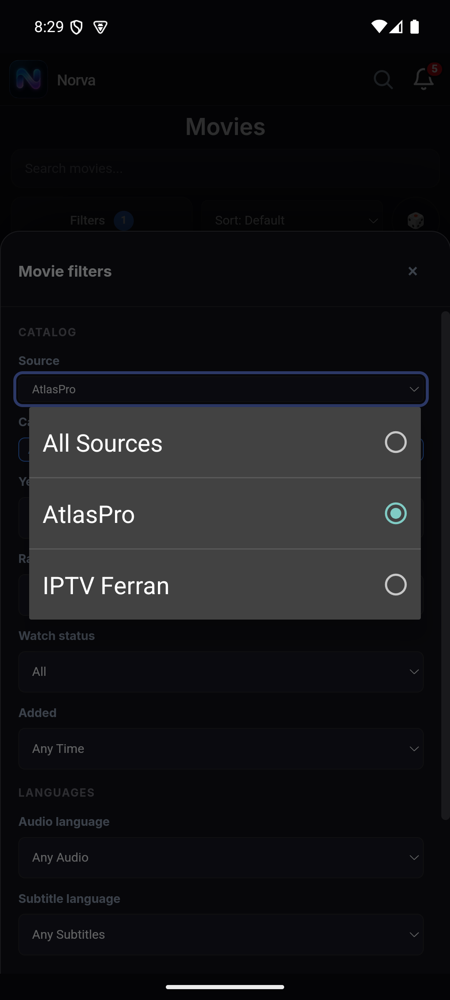
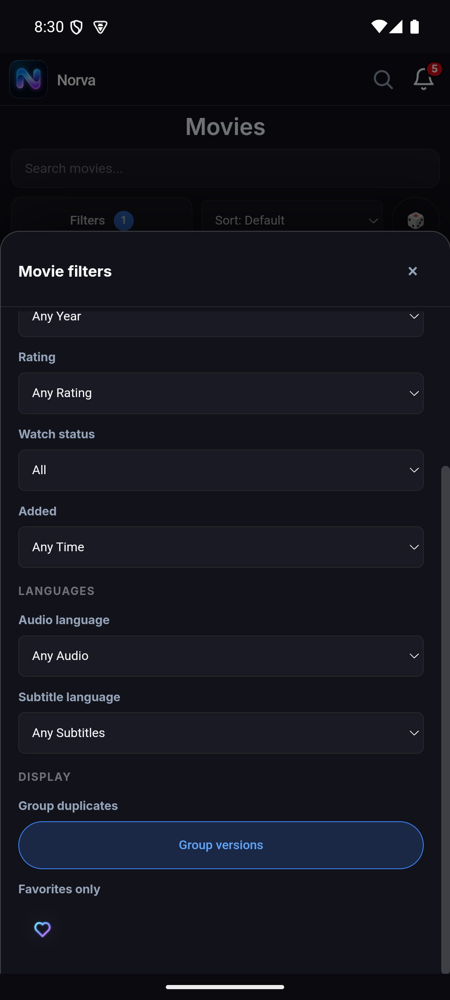
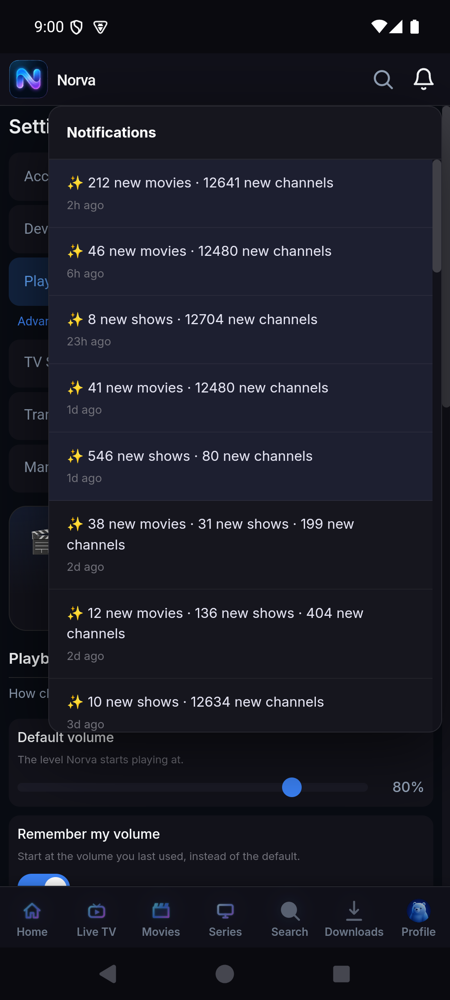

# Audit détaillé — navigation Android mobile

## Périmètre

Pages et surfaces couvertes : lancement, profils, Home, Live TV, Movies, Series, recherche globale, détail Movie, détail Series, filtres, Account sheet, Notifications, Downloads natif, Settings Account/Devices/Playback/Advanced et retours depuis le lecteur.

Modes Android couverts :

- Navigation gestuelle.
- Navigation système à trois boutons.
- Police Android 1,0 et 1,3.
- Clavier visible dans le filtre Category.

## Filtres Movies et Series

Niveau de preuve : **runtime** sur l’émulateur pour les séquences, l’IME, Back et les deux modes de navigation.

### Résultat fonctionnel

Les séquences suivantes ont été rejouées :

1. Ouvrir Filters.
2. Choisir Source.
3. Ouvrir Category.
4. Revenir à All Sources.
5. Fermer avec Back.
6. Recommencer dans l’ordre Category → Source.

Les deux ordres fonctionnent. La catégorie sélectionnée reste conservée lors du retour à All Sources. Aucun deadlock ni élément impossible à atteindre n’a été reproduit.

### Ce qui bloque la fluidité

- Source ouvre un très grand panneau radio natif gris, visuellement étranger à Norva.
- Category place immédiatement le focus dans Search et fait apparaître l’IME, alors que l’utilisateur veut souvent simplement choisir une catégorie.
- La barre flottante Gboard masque une partie des options sur l’émulateur.
- La sheet cumule scroll de page, scroll du panneau et scroll du composant multiselect.
- La valeur active est moins évidente qu’un chip récapitulatif directement modifiable.
- Le bouton de fermeture fait environ 36 px, sous la cible recommandée.

### Barre système

Le problème suspecté n’est pas un chevauchement avec la barre Android :

- Les actions restent visibles au-dessus de la zone gestuelle.
- En trois boutons, elles restent au-dessus des 126 px physiques réservés au système.
- Back ferme d’abord le filtre.

Le défaut d’inset réellement constaté est la perte de contexte lors de la recréation de l’Activity après un changement du mode système.

## Bottom navigation

Niveau de preuve : **runtime** en police 1,0 et 1,3, avec navigation trois boutons pour la capture ci-dessous.

Sept destinations sont affichées en permanence. À l’échelle de police 1,3 :

- `Search`, `Downloads` et `Profile` entrent visuellement en collision.
- La cloche de notification disparaît de l’en-tête dans l’état capturé.
- Les libellés ne disposent plus d’espace pour s’adapter sans réduire leur lisibilité.

Recommandation : garder cinq destinations principales et déplacer Downloads/Profile dans une surface `More`, ou passer à des libellés visibles uniquement pour l’item actif avec des noms accessibles complets. Cette décision doit être testée à 320/360/412 dp et aux échelles 1,0/1,3/2,0.

## Settings

Niveau de preuve : **runtime** pour le scroll conservé ; **revue statique** pour les rôles et relations ARIA.

Le changement d’onglet ne remet pas le contenu en haut. Après avoir scrollé Account jusqu’à Privacy/Delete account, ouvrir Playback & Discovery montre directement un slider `80 %` sans titre ni contexte.

Recommandation : chaque tab possède son propre scroll mémorisé uniquement lorsqu’on y revient volontairement ; la première ouverture d’un tab commence à son titre. Les boutons doivent exposer `role=tab`, `aria-selected`, un panel nommé et la navigation par flèches/clavier.

## Account, profils et notifications

Niveau de preuve : **runtime** pour l’ouverture, le contenu et la fermeture observables ; **revue statique** pour le confinement du focus et les noms accessibles. TalkBack n’a pas été exécuté.

La sheet Account est la surface la plus aboutie visuellement. Défauts :

- La croix est sous 44–48 px.
- La revue statique n’établit pas un déplacement et un confinement complets du focus.
- La revue DOM/arbre UI indique que l’arrière-plan resterait parcourable pour TalkBack.
- Logout est immédiat.

Notifications :

- Le panneau n’affiche pas de fermeture visible.
- Back n’est pas explicitement traité comme une fermeture prioritaire.
- Le badge ne fait pas partie du nom accessible de la cloche.
- Les messages de milliers de nouvelles chaînes dominent la valeur éditoriale et ressemblent à une télémétrie brute.

## Catalogue et recherche

Niveau de preuve : **runtime** pour le ranking, les données visibles et l’erreur Series ; **revue statique** pour les recommandations de normalisation.

- La liste Movies/Series commence par de nombreux titres ponctués ou arabes, avec notes zéro et `Audio pending`.
- La recherche « Leon » retourne des résultats approchants sans mettre clairement « Léon » en tête.
- La fiche Movie ouverte depuis Search peut conserver des chips de catégorie du contexte précédent.
- La page Series révèle des erreurs fournisseur brutes.

Recommandations :

- normaliser accents et ponctuation pour le ranking ;
- séparer titre éditorial et nom fournisseur ;
- remplacer notes `0` par absence de note ;
- n’afficher `Audio pending` que comme état d’administration, jamais comme badge consommateur ;
- réinitialiser les décorations de liste en entrant sur une fiche.

## Downloads

Niveau de preuve : **runtime** en navigation trois boutons pour l’état vide et les toggles ; **revue statique** pour la structure focusable et les traitements de données.

L’état vide respecte les insets dans le mode trois boutons testé ; ce même écran reste à recertifier en navigation gestuelle :

L’arbre UI révèle toutefois deux éléments focusables pour chaque réglage : la ligne entière et son Switch. `Clear all` reste exposé comme cliquable alors que la liste est vide. Avec des titres actifs, les actions sont dans un scroll horizontal sans indication.

## Matrice d’acceptation navigation

| Cas | Résultat |
|---|---|
| Source → Category | Passe |
| Category → Source | Passe |
| All Sources conserve Category | Passe |
| Back ferme Filters | Passe |
| Actions Filters au-dessus de gesture nav | Passe |
| Actions Filters au-dessus de 3-button nav | Passe |
| Changement mode Android conserve profil/route | Échec |
| Bottom nav à font scale 1,3 | Échec |
| Settings change de tab au bon point de départ | Échec |
| Account/Notifications focus modal complet | Échec statique |
| Recherche exacte avec accents | Fragile |
| Série avec erreur fournisseur | Échec critique |

## Tests à ajouter

1. Test instrumenté des deux ordres Source/Category.
2. Screenshot tests gesture/3 boutons avec IME affichée.
3. Font scale 1,0/1,3/2,0 sur bottom nav et Settings.
4. Contrat Back prioritaire : keyboard → picker → filter → modal → page → exit.
5. TalkBack : ordre de focus, nom/état, restauration du trigger.
6. Recréation Activity : profil, hash, scroll utile et filtres actifs.
