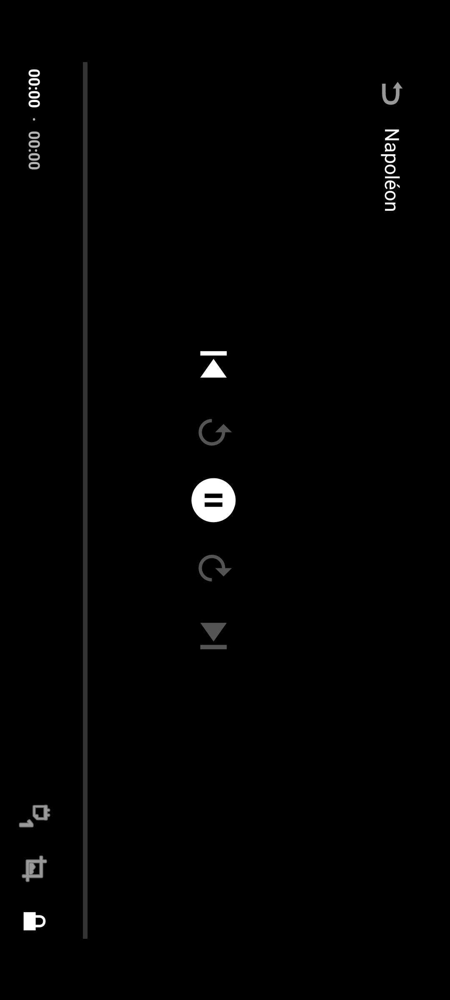
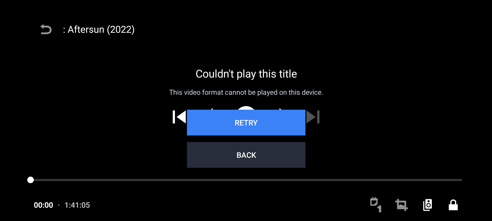
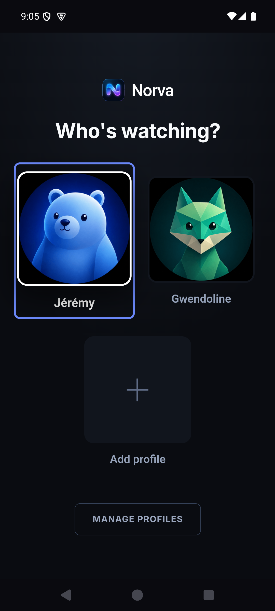

# Audit détaillé — lecteur VOD Android mobile

## Verdict

Le lecteur dispose d’une architecture fonctionnelle avancée, mais ses états réels ne communiquent pas ce qui se passe. Tant que l’utilisateur voit un écran noir, un contrôle Pause pendant `BUFFERING` ou une erreur recouverte par les contrôles du player, le lecteur ne peut pas être qualifié de premium.

## Replays effectués

Niveau de preuve : **runtime** pour les titres, timings, Retry, verrouillage et Home/retour ; **revue statique** pour les contrats Cast, PiP, offline, recovery et accessibilité qui n’ont pas atteint un état de lecture stable.

Titres :

- Napoléon — variante IPTV Ferran MKV.
- Napoléon — variante AtlasPro MP4 / FR Films SD.
- Aftersun — récupération automatique après erreur source.
- Léon (1994) FHD — Continue Watching.

États observés :

| Temps approximatif | État |
|---:|---|
| 0,2–1,0 s | Activity paysage, contrôles visibles |
| 1–3 s | écran noir, timeline `00:00 · 00:00`, bouton Pause |
| 3–30+ s | écran entièrement noir après auto-hide, MediaSession `BUFFERING` |
| 10–13 s sur HEVC | erreur codec terminale après récupération |
| Retry + 0,25 s | titre terminal + `Reconnecting…` + Retry/Back encore visibles |
| Retry + 2 s | retour au noir avec état de lecture ambigu |

## Points solides

- `PlayerActivity` dédiée et immersive.
- MediaSession et commandes système.
- PiP déclaré.
- Reprise multi-appareil et progression.
- Téléchargement chiffré et lecture hors ligne.
- Préférences audio/sous-titres.
- Contrôles principaux de 48 dp.
- Insets calculés pour les bords/cutouts.
- Récupération direct → gateway → URL fraîche.
- Télémétrie `native_first_frame` basée sur la vraie première frame.

## P0 — machine d’états

Le lecteur doit avoir des états mutuellement exclusifs :

1. **Preparing** — poster plein écran, titre, spinner discret, texte « Préparation… ».
2. **Buffering initial** — poster encore visible, spinner, aucune icône Pause, timeline non interactive.
3. **Recovering** — « Reconnexion automatique 1/2 », source en cours, bouton Annuler ; pas de Retry terminal.
4. **Playing** — vidéo et contrôles normaux.
5. **Rebuffering** — vidéo figée ou poster flouté, spinner compact, contrôles cohérents.
6. **Terminal error** — panneau unique, Retry et Back ; contrôles Media3 masqués/désactivés.
7. **Offline error** — message local spécifique et action de retéléchargement, sans fallback réseau trompeur.

Le poster est déjà transmis au lecteur pour Cast ; il doit aussi être utilisé visuellement dans l’Activity.

## P0 — chemin de lecture connu bon

L’habillage des états ne suffit pas à sortir le parcours du critique. La release doit embarquer une fixture contrôlée H.264/AAC MP4 et échouer si `native_first_frame` n’est pas reçu dans le budget. Il faut corriger le chemin source/démux/décodeur jusqu’à une première frame réelle, puis seulement certifier recovery et variantes HEVC.

## P0 — récupération

Niveau de preuve : **revue statique** du couplage `PlayerActivity` / `MainActivity`, cohérente avec les états contradictoires observés au runtime.

Le token de récupération est effacé localement dans `PlayerActivity`, mais l’attente côté `MainActivity` est associée surtout par source/item. Une ancienne réponse peut être appliquée à une nouvelle tentative du même titre.

Contrat cible :

- un `recoveryToken` unique par tentative ;
- validation du token aux deux extrémités ;
- annulation explicite au Back, timeout, changement de variante ou relance ;
- une seule tentative active ;
- réponse ancienne ignorée et journalisée ;
- compteur d’étapes visible sans révéler de détails fournisseur.

## Contrôles

Niveau de preuve : contrôles et verrouillage partiellement rejoués ; priorisation, compact, `performClick()` et accessibilité issus de la **revue statique**.

### Navigation principale

Les contrôles précédent/suivant sont affichés pour un film alors qu’ils n’ont pas d’action utile. Les icônes Android historiques donnent un aspect système, pas Norva. La priorité devrait être :

- Play/Pause.
- Recul/avance 10 s.
- Timeline.
- Audio/sous-titres.
- Vitesse.
- Fit/Zoom.
- Cast.
- Lock.

Les contrôles non applicables doivent être absents, pas seulement grisés.

### Verrouillage

Le verrouillage fonctionne, mais :

- `UNLOCK CONTROLS` n’est visible que trois secondes ;
- aucun focus ou annonce n’est déplacé ;
- Back quitte le lecteur au lieu de déverrouiller ;
- au retour de PiP, le contrôleur peut se réactiver malgré `controlsLocked`.

Contrat cible : premier Back affiche/déverrouille, second Back quitte ; l’action Unlock reste atteignable par TalkBack et Switch Access.

### Compact et accessibilité

Sous 480 dp, luminosité et resize disparaissent et ne restent disponibles que par gestes. La surface gestuelle annonce « Afficher les commandes », mais son `performClick()` n’exécute pas cette action. Il faut des alternatives explicites, activables sans geste.

Ce rapport ne constitue pas une certification WCAG ; aucune session TalkBack complète n’a été jouée.

## PiP et cycle de vie

Niveau de preuve : **runtime** pour Home/retour pendant buffering ; **revue statique** pour le contrat PiP en lecture et la restauration complète.

Appuyer sur Home pendant un buffering n’est pas entré en PiP. Revenir par l’icône Norva a ouvert MainActivity au sélecteur de profil, au lieu de rendre le lecteur ou la fiche active.

Contrat cible :

- PiP seulement si une frame ou un état visuel sûr est disponible ;
- sinon pause propre et reprise du même lecteur au retour ;
- jamais de perte de profil/route ;
- actions PiP synchronisées avec Play/Pause réel ;
- verrouillage conservé ;
- erreur PiP renvoyée vers un panneau plein écran cohérent.

## Cast

Niveau de preuve : **revue statique** ; aucun appareil ni handoff Cast réussi n’a été rejoué.

La lecture locale est arrêtée avant confirmation de `loadMedia()`. Les échecs de session/load sont ignorés et le MIME retombe sur MP4 pour les URL sans extension. Un échec Cast peut donc laisser l’utilisateur sans lecture.

Contrat cible : transition transactionnelle — préparer Cast, confirmer session et load, puis arrêter local ; restaurer local en cas d’échec ; transmettre pistes et préférences.

## Performance

Niveau de preuve : cibles de release proposées à partir de la télémétrie existante ; elles ne sont pas des résultats de production de cette session.

La télémétrie disponible doit devenir le critère de release :

| Indicateur | Cible |
|---|---:|
| Premier frame direct | p50 ≤ 1,5 s ; p95 ≤ 3 s |
| Premier frame après fallback | p95 ≤ 5 s |
| Reprise après seek | p95 ≤ 2 s |
| Rebuffering après démarrage | < 1 % du temps |
| Frame > 700 ms | 0 |
| Crash/ANR/OOM/renderer perdu | 0 |
| Soak | 30 min sans dérive mémoire ou thermique sévère |

Les gestes luminosité/volume envoient de la télémétrie sur chaque mouvement ; cela doit être throttlé. Les sélecteurs de pistes sont construits synchroniquement et doivent être profilés avec de nombreux tracks.

## Matrice de certification restante

1. H.264/AAC MP4 direct.
2. HEVC/AC3 avec et sans décodeur logiciel.
3. HLS, URL gateway et URL signée expirée.
4. Reprise 30 s, milieu, près de la fin.
5. Seek, double tap, timeline, vitesse.
6. Zéro/une/plusieurs pistes audio.
7. Zéro/une/plusieurs pistes de sous-titres.
8. Lock/Unlock, Back, TalkBack, Switch Access.
9. 401/403, 429, HTML 200, timeout sans octet.
10. Retry double, timeout puis relance du même titre, réponse tardive.
11. PiP, appel, casque, Bluetooth, MediaSession.
12. Cast sans appareil, échec de session, échec load, perte réseau.
13. Offline absent/corrompu/mauvaise clé.
14. Next episode et dernier épisode.
15. Navigation gestuelle, trois boutons, cutout, tablette.
