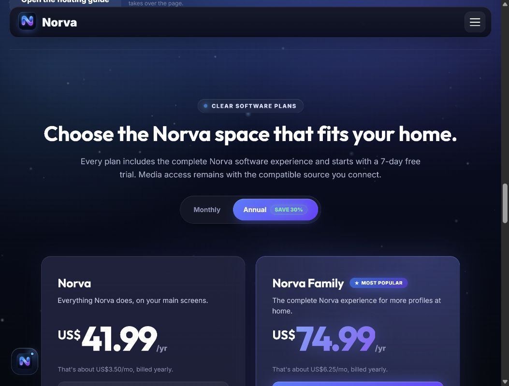
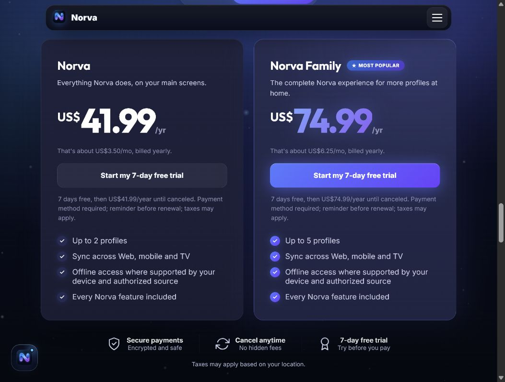
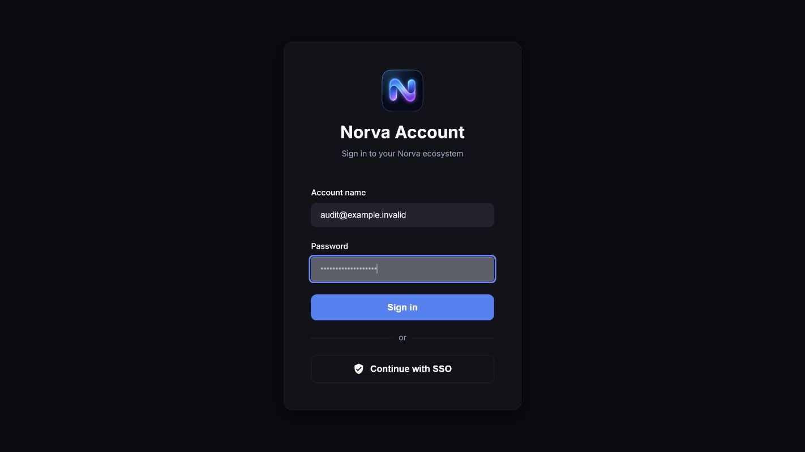
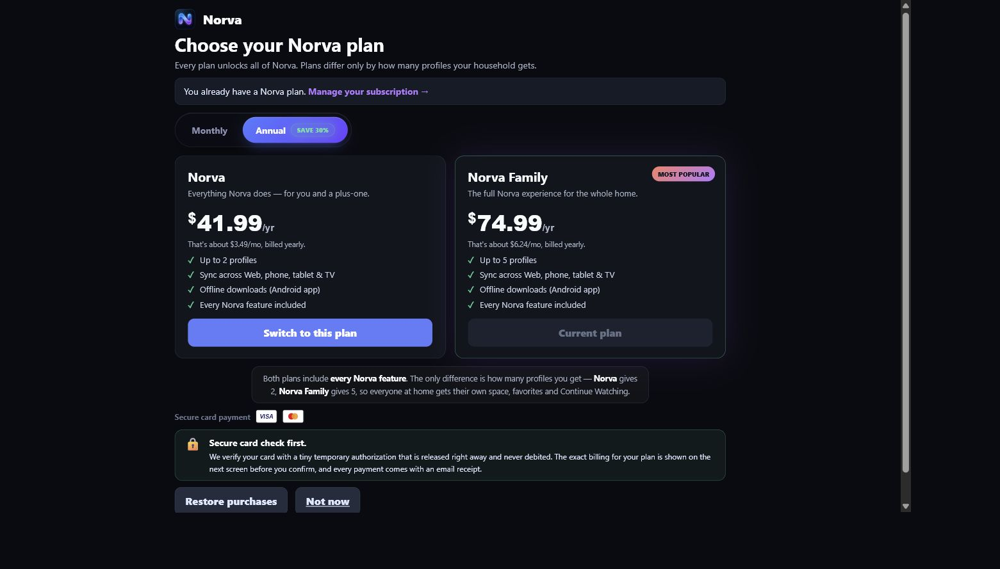

# Audit onboarding, paiement, upsell et paywalls Norva — 2026-07-21

## Portée

Audit du tunnel public → inscription/connexion → choix de profil → abonnement/paiement → paywall → gestion d'abonnement, avec lecture du code pour les états non accessibles proprement via le navigateur : nouvel utilisateur, abonnement expiré, `past_due`, TV/native, checkout Revolut, webhooks, crons et limites de plan.

Important : la page `checkout-revolut.html` n'a pas été ouverte en navigateur, car le code crée une commande Revolut au chargement. Cette branche est donc auditée par le code et les agrégats prod, pas par capture.

## Captures acceptées

1. Landing authentifiée

2. Pricing, choix annuel/mensuel

3. Cartes de plans

4. Login legacy / simple

5. Choix de profil

6. Subscribe avec abonnement actif

## Verdict court

Le tunnel principal est globalement cohérent : promesse 7 jours gratuits avec moyen de paiement, annuel bien mis en avant, abonnement actif reconnu, TV/native protégées contre un checkout web inadapté, et les états `trialing`, `active`, `cancelled_at_period_end`, `past_due/grace`, `expired/free` existent côté back.

Les deux vrais risques avant scale sont ailleurs :

- la relance d'abandon checkout est cassée/inactive pour Revolut, car le job legacy cible encore Stancer ;
- le tunnel paiement/entitlement n'a quasiment pas de tests automatisés dédiés, alors qu'il porte le plus gros risque business.

## État des corrections

Les constats ci-dessous décrivent l'état observé au début de l'audit. Le lot correctif associé a depuis été implémenté et couvert par des tests automatisés :

- checkout Revolut réutilisable et idempotent, avec propriété immuable, expiration et protections entre rails de paiement ;
- webhooks Revolut rejouables, finalisation transactionnelle et changements de plan appliqués uniquement après confirmation du paiement ;
- projection RevenueCat monotone, produits inconnus sans attribution silencieuse et changement de produit appliqué seulement à l'événement financier effectif ;
- états d'abonnement durcis : un plan gratuit ne conserve plus des capacités premium, et une incohérence de facturation affiche un état de vérification explicite ;
- relance d'abandon basée sur les commandes Revolut réelles, consentement marketing explicite et synchronisation Resend via une outbox durable ;
- emails transactionnels séparés des emails marketing ; opt-out, adresse postale et lien de désinscription réservés au marketing ;
- navigation de retour validée pour empêcher les redirections externes, et pages login/paywall/abonnement harmonisées ;
- funnel corrigé avec étapes immuables et séparées (`checkout_open`, `order_authorized`, `entitlement_active`, conversion, renouvellement, win-back) ;
- contrôles CI obligatoires avant les builds Windows/Android et avant le déploiement Cloudflare.

Validation avant déploiement : suite Node complète, tests contractuels ciblés, vérification TypeScript/Deno des Edge Functions, contrôle syntaxique des scripts frontend et exécution des migrations en transaction annulée sur le PostgreSQL de production.

## Parcours audité

| Étape | Description | Santé | Preuves |
|---:|---|---|---|
| 1 | Landing publique / authentifiée | Bonne | Capture 01, `public/index.html`, `public/js/billing-config.js` |
| 2 | Pricing annual/monthly | Bonne avec micro-risque | Capture 02 ; annuel par défaut, Family visuellement poussé |
| 3 | Cartes de plans | Bonne | Capture 03 ; prix, essai, paiement requis, annulation/rappel visibles |
| 4 | Inscription / connexion principale | Bonne côté `account.html` | Magic link, Google, password optionnel, TV pairing |
| 5 | Login legacy/simple | À clarifier | Capture 04 ; si cette page est encore atteignable, elle est moins rassurante que le flux principal |
| 6 | Choix de profil | Bonne | Capture 05 ; limites de profils pilotées par API |
| 7 | Subscribe utilisateur actif | Bonne | Capture 06 ; plan courant détecté, changement de plan possible |
| 8 | Checkout Revolut | Mitigée | Code uniquement ; bonne copie selon intent, mais crée beaucoup de commandes pending |
| 9 | Paywall / entitlement denied | Bonne côté logique | Code uniquement ; sign-in si no session, see plans si denied, fail-open prudent si vérification impossible |
| 10 | Gestion abonnement | Bonne avec dette | Code uniquement ; cancel/resume/update card, provider-aware ; dunning/abandoned à fiabiliser |
| 11 | Webhooks / crons | Mitigée | State machine solide, mais abandoned checkout legacy et couverture tests faible |

## Matrice des statuts utilisateur

| Statut | Comportement attendu lu dans le code |
|---|---|
| No session | Redirection sign-in/account ; paywall propose de se connecter |
| Pas de projection en prod RevenueCat | Browse gratuit, playback bloqué par capacité à 0 |
| Trialing | Accès jusqu'à fin d'essai/période ; copie "free trial" ; annulation possible |
| Active | Accès complet ; gestion/changement de plan selon provider |
| Cancelled at period end | Accès jusqu'à la fin de période ; reprise possible si Revolut |
| Past due / grace | Accès temporaire pendant grâce/fail-open ; update card ; dunning côté lifecycle |
| Expired / free / none | Browse possible ; playback/paywall vers plans |
| Revoked / refunded / fraud | Blocage dur |
| Admin/system | Accès manuel actif |
| Google Play / Apple | Gestion externe store, pas de duplication web forcée |
| TV shell | Pas de checkout TV ; instructions web/téléphone |

## Constats prioritaires

### P0/P1 — Abandoned checkout Revolut non récupéré

Le code lifecycle dit explicitement que `runAbandoned` est bloqué car il lit encore `cloud_stancer_payments`, table/rail legacy, alors que le rail live est Revolut avec `cloud_revolut_orders`. En prod, il y a beaucoup d'ordres Revolut `PENDING` par type (`trial_setup`, `card_update`, `plan_change`, `resubscribe`). Donc la donnée existe, mais le job de relance ne la consomme pas.

Impact : pertes de conversion silencieuses, relances inutiles ou inexistantes, dette invisible parce que le parcours manuel "voit" bien les plans.

Correction recommandée : migrer la relance abandoned vers `cloud_revolut_orders`, ajouter une fenêtre anti-spam, un état `reminder_sent_at`/event dédié, puis tester sur cohortes récentes.

### P1 — Le checkout crée une commande au chargement

`checkout-revolut.html` appelle la création d'ordre dès l'initialisation. Ce n'est pas forcément mauvais pour Revolut, mais sans expiration/réutilisation/nettoyage UX visible, cela explique l'accumulation d'ordres `PENDING`.

Correction recommandée : idempotence par utilisateur+intent+plan+period sur une courte fenêtre, expiration des commandes abandonnées, et relance liée à l'ordre le plus récent seulement.

### P1 — Pas de couverture automatisée dédiée billing/paywall

Recherche dans `tests/` : pas de tests dédiés au tunnel Revolut/RevenueCat/paywall/subscribe/subscription. Pour un tunnel d'abonnement, c'est trop fragile.

Tests minimum à ajouter :

- no session → account ;
- free/expired → browse OK mais playback bloqué/paywall ;
- trialing/active/cancelled_at_period_end → accès ;
- past_due/grace → accès temporaire + update card ;
- revoked/refunded/fraud → blocage dur ;
- Revolut checkout intents : trial_setup, plan_change, resubscribe, card_update ;
- RevenueCat unknown product mapping.

### P1/P2 — Fallback RevenueCat produit inconnu → Plus

Le webhook RevenueCat mappe les produits inconnus vers `plus`. C'est prudent pour ne pas bloquer un payeur, mais cela peut sous-attribuer un abonnement Family si l'identifiant produit n'est pas mappé.

Correction recommandée : alerte admin + événement `unknown_product_id`, et refuser le fallback silencieux en staging/tests.

### P2 — Login legacy incohérent si encore atteignable

La capture login simple n'a pas la même qualité d'explication que `account.html` : pas de création de compte évidente, pas de forgot visible, pas de promesse paiement/essai. Si cette page est encore une vraie entrée utilisateur, elle doit être soit redirigée vers `account.html`, soit harmonisée.

### P2 — Copy plans : "tout inclus" cohérent, mais différence Plus/Family à clarifier encore plus

Le backend confirme que Plus et Family ont les mêmes capacités produit principales ; la différence visible est surtout le nombre de profils. La page le dit déjà, mais Family est très mis en avant par défaut, donc il faut éviter qu'un utilisateur solo se sente poussé vers un plan trop cher.

Suggestion : une micro-copy sous les cartes : "Choisis Family seulement si tu veux plus de profils."

### P2 — Valeur des upsells faible aujourd'hui

Il y a des restes backend de save offer / discount, mais l'UI de cancel actuelle semble simple : confirmer l'annulation, raison optionnelle, retour abonnement. Pas de vraie stratégie d'upsell/winback visible aujourd'hui.

## Données prod vérifiées en lecture seule

- 5 utilisateurs auth.
- 5 projections d'entitlement.
- Statuts : 3 `active`, 1 `past_due`, 1 `expired`.
- Providers : 3 `system`, 1 `google_play`, 1 `revolut`.
- Plans : 3 `family`, 2 `plus`.
- Profils : 6 profils sur 5 utilisateurs.
- Ordres Revolut observés : beaucoup de `PENDING`, notamment `trial_setup`, `card_update`, `plan_change`, `resubscribe`.
- Crons observés : lifecycle toutes les 15 min, Revolut billing toutes les heures, trial ending reminders à J-3 et J-1.

Aucune donnée personnelle sensible n'est reprise ici.

## Ce qui est déjà bien

- Le paywall ne coupe pas brutalement l'accès si la vérification billing tombe en erreur : fail-open raisonnable.
- TV/native ne forcent pas un checkout web.
- L'abonnement actif est reconnu dans `/subscribe`.
- La logique profile limit existe côté API et UI.
- Les états `past_due`, `grace`, `cancelled_at_period_end`, `expired` sont traités explicitement.
- Les webhooks sont idempotents.
- Le paiement Revolut sépare bien trial setup, card update, plan change et resubscribe.

## Limites de l'audit

- Les branches nouveau compte et checkout réel n'ont pas été exécutées pour éviter de créer un vrai paiement/ordre supplémentaire.
- La page subscription active n'a pas été capturée en final, car elle peut afficher des fragments de carte bancaire (`last4`).
- Les parcours Apple/Google Play sont audités par code, pas par store réel.
- Les chiffres prod sont des agrégats ponctuels du 21 juillet 2026, pas une analyse cohortée complète.

## Recommandation d'ordre d'exécution

1. Corriger la relance abandoned checkout Revolut.
2. Ajouter les tests billing/paywall minimum.
3. Nettoyer ou rediriger `login.html` si cette page est encore accessible.
4. Ajouter alerte sur RevenueCat product ID inconnu.
5. Clarifier la micro-copy Plus vs Family.
6. Ajouter un vrai reporting funnel : landing → account → checkout_open → order_authorized → entitlement_active → first_play.
