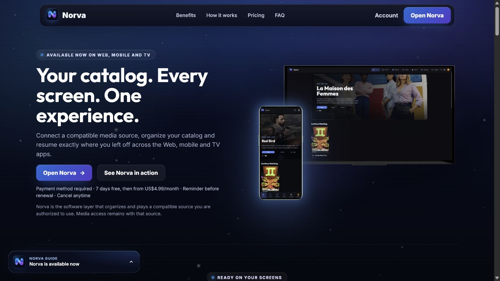
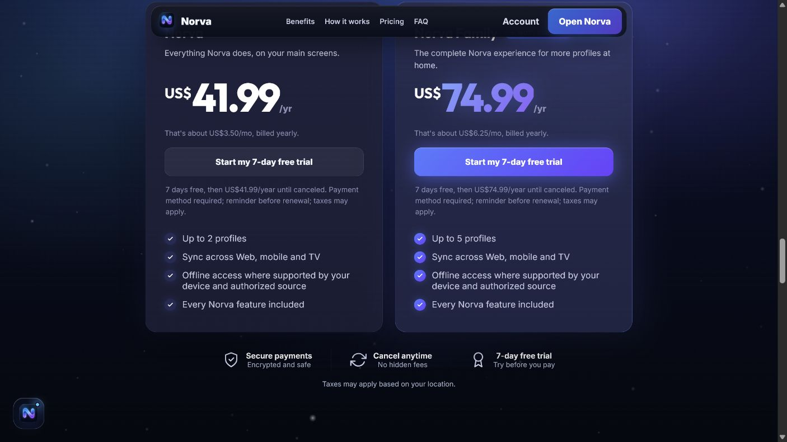
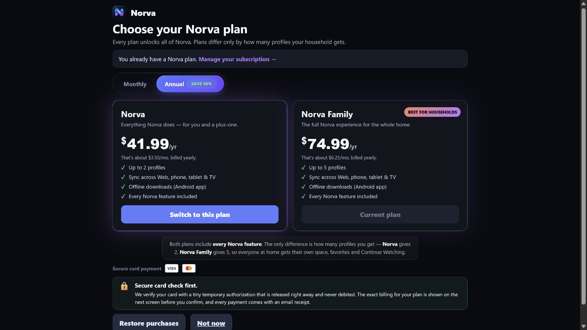
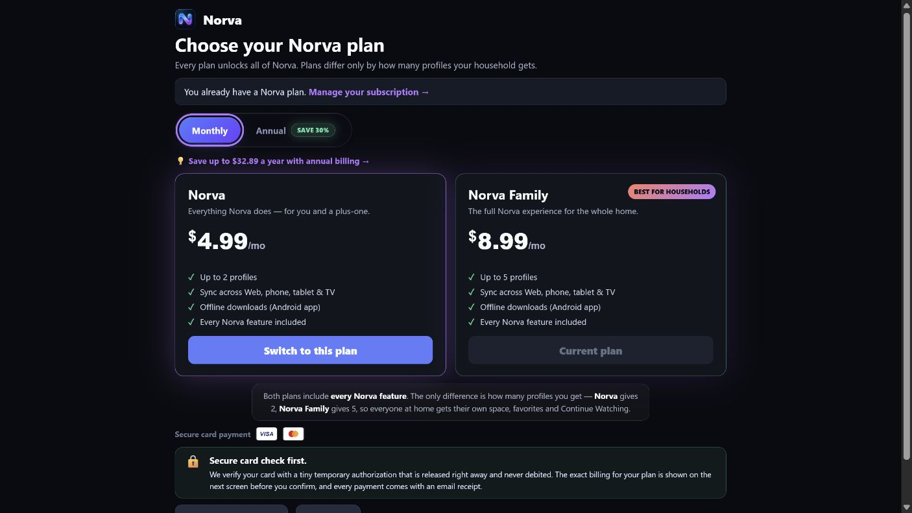
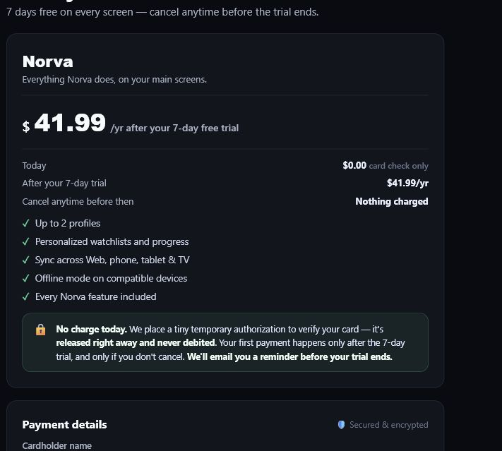
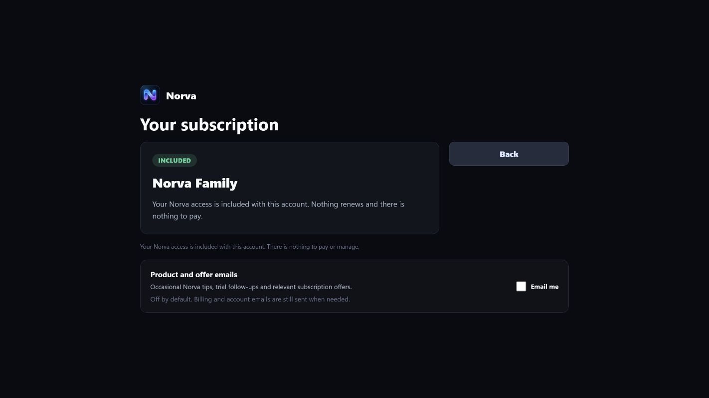
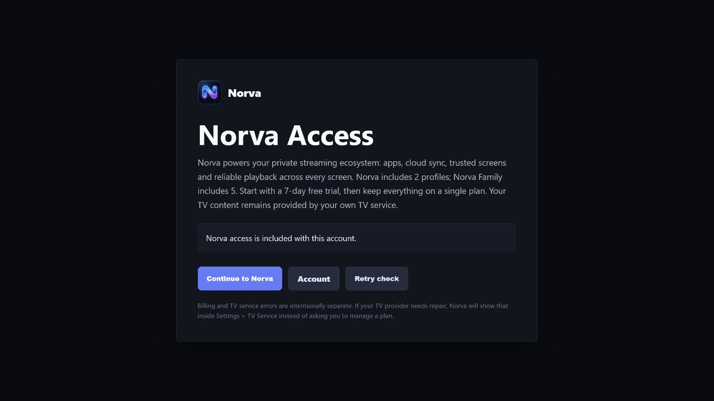

# Audit des paywalls Norva — 22 juillet 2026

## Verdict

Les quatre P0 et le socle de mesure ont été corrigés le 22 juillet 2026. Score heuristique après remédiation : **92/100** (contre 62/100 avant correction). Ce score mesure la vérité de l’offre, la clarté, la gestion des états et la qualité des données ; ce n’est pas un taux de conversion ni une garantie juridique.

L’observation de départ est confirmée : Norva est bien disponible sur le Web, mobile Android et Android TV, avec les droits attachés au même compte. Ces trois environnements sont déjà mentionnés, mais surtout comme une puce secondaire dans les écrans proches de l’achat. Le statut de publication sur une boutique est une question de distribution distincte de la disponibilité réelle des applications et ne doit pas modifier la promesse produit.

## Priorités

### P0 — corrigés

1. **Essai contradictoire.** Les récapitulatifs et rappels e-mail indiquent désormais la conversion automatique, la date exacte, le montant, la cadence et le chemin d’annulation.
2. **Prix Android non fiables avant l’achat.** L’application mobile charge les offres RevenueCat/Google Play localisées avant d’autoriser l’achat, lie l’achat au compte Supabase vérifié et échoue fermée si le produit exact n’est pas disponible.
3. **Mesure checkout fausse.** `begin_checkout` n’est émis qu’après création/récupération de la commande authentifiée, avec le snapshot serveur, et est dédupliqué par `order_id` malgré un rechargement.
4. **Termes commerciaux divergents.** Le fallback Family annuel et le catalogue de production sont alignés ; plan, cadence, prix, devise, mode de débit, date du premier débit et variante sont désormais figés dans le journal serveur. Une valeur HTML ou cliente n’est jamais autorité de paiement.

### État de remédiation vérifié

| Contrôle | État | Preuve |
|---|---:|---|
| `paywall_exposed` réellement visible et éligible | Corrigé | Résolution d’entitlement avant armement, `IntersectionObserver`, reprise réseau et déduplication serveur |
| Variante stable par compte | Corrigé | Affectation persistante `(user_id, experiment_key)` ; le client ne choisit ni expérience ni variante |
| Snapshot commercial immuable | Corrigé | Quote/commande Revolut et journal serveur ; pour Google Play, sélection produit/cadence validée côté serveur puis prix/devise confirmés par le webhook RevenueCat |
| Achat → paiement → entitlement → première lecture | Corrigé | Événements causaux dédupliqués ; `first_frame` Web et natif alimente `cloud_playback_events` |
| Remboursement intégral | Corrigé | Réconciliation asynchrone, ledger idempotent, arrêt de la récurrence et expiration de l’accès Revolut |
| RevenueCat `TRIAL` / `INTRO` | Corrigé | Seul `TRIAL` est gratuit ; un `INTRO` sans montant fiable échoue avant ledger/projection |
| Comptes internes/pilotes | Corrigé | Exclus des expériences, du funnel commercial, des e-mails de relance et des mutations de paiement |

### P1 — corrigés

1. La **date calendaire exacte** et le montant du premier débit proviennent du serveur pour l’essai, la réactivation et le changement de plan.
2. Une réactivation n’est plus annoncée active avant confirmation de la capture ; l’interface conserve un état de traitement.
3. `paywall_exposed` et l’affectation persistante par compte sont en place.
4. Le motif d’annulation est facultatif mais exploitable ; l’utilisateur peut continuer sans friction.
5. Le contexte d’un profil verrouillé est préservé, Family est présélectionné et l’attribution utilise le placement `locked_profile`.
6. Android TV présente un parcours d’achat externe unique ; aucun SDK ni pont de paiement natif n’y est exposé.

### P2 — corrigés dans les surfaces transactionnelles

1. La promesse anglaise nomme désormais les supports livrés de façon constante : « Web, Android mobile and Android TV ».
2. Les anciens codes techniques `premium` restent lisibles pour compatibilité, mais sont présentés comme « Norva » et n’annoncent plus un plan Premium inexistant.
3. Le token des textes secondaires dépasse désormais 4,5:1 sur les fonds transactionnels Norva ; les contrôles ont un focus visible, les textes longs peuvent se replier et les mises en page étroites empilent les éléments sans masquer le copy légal. Ces garanties sont couvertes statiquement ; elles ne remplacent pas un test manuel complet de lecteur d’écran, du widget carte, du zoom à 200 % et du D-pad sur appareil réel.

## Parcours capturé

### Étape 1 — Promesse publique

**Santé après correction : bonne.** La hiérarchie est forte et vend la continuité entre appareils. La promesse de disponibilité utilise maintenant « Web, Android mobile and Android TV », sans laisser déduire une application iOS ou une compatibilité avec toutes les Smart TV.

### Étape 2 — Prix et choix annuel

**Santé après correction : bonne.** Les plans et la différence 2/5 profils sont compréhensibles. La valeur multi-supports précède le prix. Les prix affichés sont chargés dynamiquement ; si leur source est indisponible, le sélecteur n’annonce plus un ancien montant et bloque l’action commerciale jusqu’au retour d’une donnée fiable.

### Étape 3 — Sélecteur de plan

**Santé après correction : bonne.** Bonne reconnaissance du plan existant, CTA contextuels et explication claire de la différence entre Norva et Family. La valeur commune Web/mobile/TV est portée au-dessus des cartes, près du prix et du CTA.

### Étape 4 — Variante mensuelle

**Santé après correction : bonne.** Le passage annuel/mensuel est accessible et le coût facturé reste visible. Sur Android mobile, les offres Store localisées sont chargées avant l’achat et l’ensemble offre/package/produit rendu doit correspondre exactement au produit acheté.

### Étape 5 — Récapitulatif avant paiement

**Santé après correction : bonne.** Zéro aujourd’hui, montant futur, date exacte, cadence, renouvellement, annulation et carte vérifiée sont expliqués depuis la quote serveur. La capture est recadrée pour ne montrer aucune donnée de compte.

### Étape 6 — Gestion d’un compte interne

**Santé : bonne pour cet état.** Le compte système/pilote est correctement marqué « Included » et ne reçoit aucun CTA de paiement. Les états trialing, active, ending, past due, grace, expired et hard-blocked ont été vérifiés dans le code, mais n’étaient pas tous reproductibles visuellement avec la session disponible.

### Étape 7 — Gate d’accès

**Santé après correction : bonne pour l’accès interne.** L’état autorisé fonctionne et la promesse énumère les trois environnements livrés avec le bénéfice de synchronisation.

## Copy cible

> **Un seul abonnement. Votre catalogue connecté sur le Web, mobile et TV.**
> Norva est disponible dès maintenant sur le Web, mobile Android et Android TV. Retrouvez vos profils, favoris et votre progression sur vos appareils compatibles.

Garder immédiatement dessous :

> Norva est un lecteur multimédia. Aucun contenu ni abonnement TV n’est inclus.

Éviter « trois écrans » ou « trois supports », qui peut être interprété comme trois lectures simultanées.

## Ce que la vidéo apporte — et ce qu’il ne faut pas copier

- À reprendre : valeur avant le prix, paywall contextualisé, réduction du risque, timeline d’essai claire, rétention/LTV plutôt que volume d’essais.
- À tester plus tard : pré-écran « votre catalogue est prêt », format long, comparatif, annuel présélectionné.
- À ne pas copier comme règle : chiffres de conversion anecdotiques, faux compte à rebours, roue de remise, fausse preuve sociale, parcours d’annulation volontairement long.

Les hausses annoncées dans la vidéo n’incluent pas, dans la transcription fournie, de protocole, d’échantillon, de durée ni de garde-fous. Elles servent à générer des hypothèses, pas de benchmark pour Norva.

## Mesure recommandée

Il n’existe pas encore de baseline commerciale exploitable : les cinq comptes actuels sont internes et sont correctement exclus du funnel, et la vue `norva_funnel_daily` est vide.

Le socle requis avant tout A/B test est désormais implémenté : impression réellement visible (`paywall_exposed`), affectation par compte, quote commerciale serveur sur le Web, sélection Google Play validée contre le catalogue serveur, paiement capturé, entitlement activé et première lecture réussie. Avant l’achat Google Play, le prix localisé observé par l’application est conservé séparément comme donnée non autoritative ; le prix et la devise commerciaux ne deviennent vérité serveur qu’avec le webhook RevenueCat. L’expérience initiale reste volontairement à **100 % contrôle** tant que les cinq comptes présents sont internes et qu’aucune baseline commerciale réelle n’existe.

Métrique principale à maturité : **revenu net à J90 par compte éligible réellement exposé**.

Indicateurs précoces : exposition → checkout, exposition → premier paiement, essai → paiement, entitlement → première lecture. Garde-fous : remboursement, chargeback, annulation 24 h/72 h, échec checkout/activation, support et rétention J30/J90.

## Limites

- Session disponible : compte interne/pilote ; impossible de capturer chaque état commercial réel sans modifier les données d’abonnement.
- Le widget carte a refusé le compte interne, ce qui est le comportement attendu ; aucune transaction n’a été soumise.
- Les parcours Android téléphone et Android TV sont disponibles via la distribution actuelle. Les deux APK debug compilent ; aucun achat Google Play réel ni installation/mise à jour par la boutique n’a été exécuté dans cet audit.
- Le `first_frame` natif est authentifié et émis au vrai rendu, sans bloquer la lecture. Il reste volontairement best-effort si le token n’est pas disponible dans les 250 ms précédant le lancement.
- Avant une publication Google Play d’Android TV, Norva devra soit rétablir Google Play Billing sur TV, soit être inscrit au programme d’offres externes applicable et intégrer ses API. La distribution actuelle n’est pas encore publiée sur Google Play selon le snapshot du dépôt.
- Aucun test de lecteur d’écran, contraste instrumenté, zoom 200 %, navigation D-pad complète ou achat Store réel n’a été effectué dans cet audit.
- Les recommandations légales sont des contrôles produit à valider avec un conseil juridique si nécessaire.

## Fichiers clés

- `public/index.html`
- `public/subscribe.html`
- `public/checkout-revolut.html`
- `public/paywall.html`
- `public/subscription.html`
- `public/js/app.js`
- `public/js/marketing.js`
- `public/js/billing.js`
- `supabase/functions/_shared/entitlements.ts`
- `supabase/functions/_shared/entitlement-evaluator.mjs`
- `clients/PLAY_STORE_RELEASE_STATUS.md`
