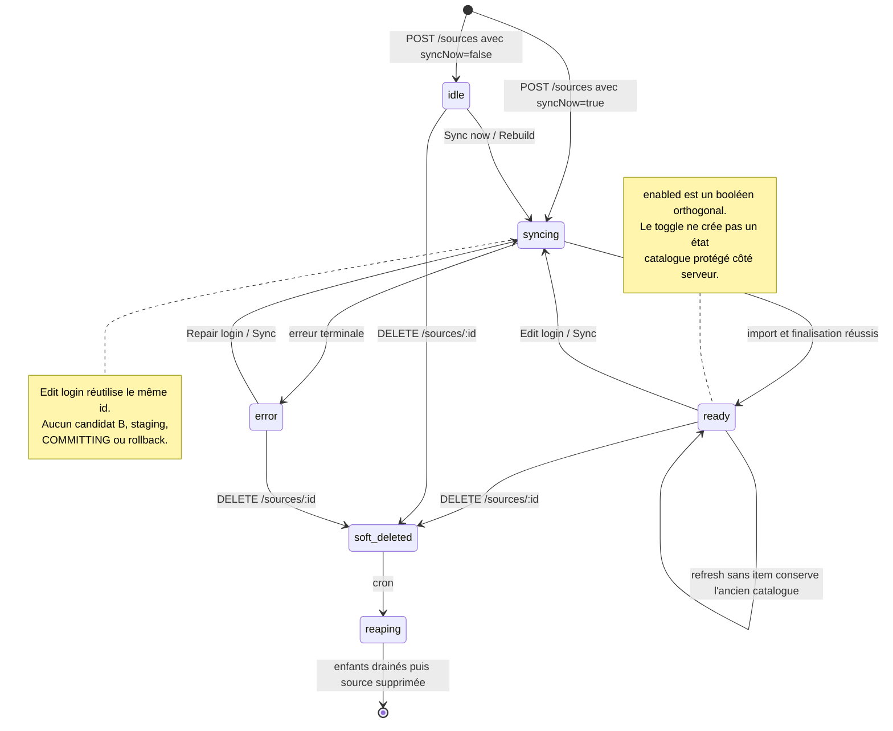
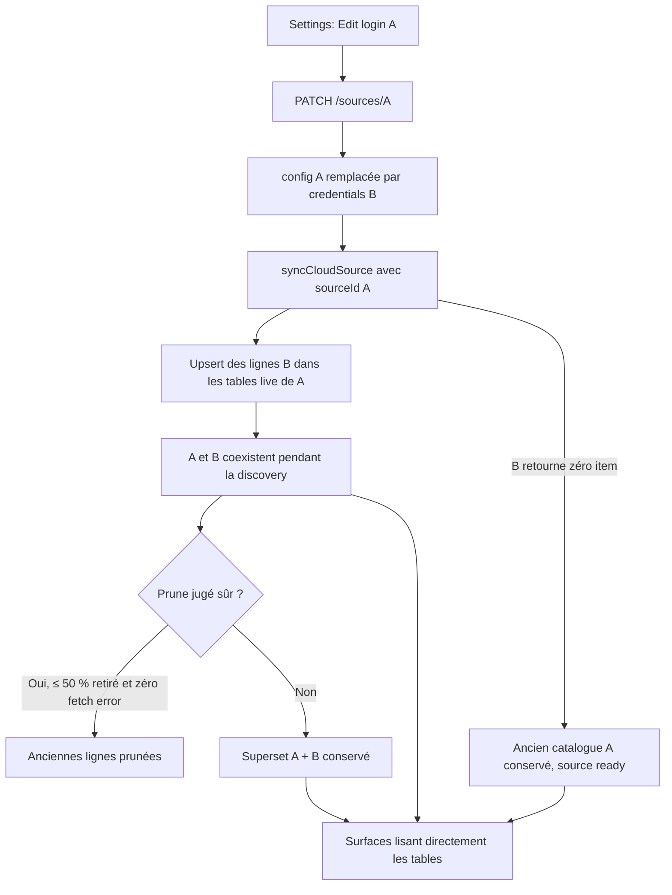

# Phase 0 — architecture actuelle et lifecycle des sources

Date : 2026-08-22  
Statut : description du système observé, sans implémentation  
Décision : **l’architecture actuelle ne possède pas de lifecycle de remplacement**

## 1. Objet du document

Ce document décrit :

- le modèle source et catalogue actuellement visible dans le dépôt ;
- le comportement réel de Create, Edit login, Sync, Disable et Remove ;
- la relation entre cloud_sources, les tables catalogue, les clients et les jobs ;
- les raisons pour lesquelles un changement de credentials peut mélanger deux catalogues ;
- l’écart entre santé technique et Provider Access ;
- le contrat cible recommandé avant toute migration ou modification produit.

Racine des preuves :

    C:\Users\AdrienHernandez\Documents\Norva repo

Tous les chemins fichier:ligne sont relatifs à cette racine.

## 2. Architecture actuelle

### 2.1 Couche client

La même SPA vanilla JavaScript sert :

- le navigateur ;
- le WebView Android phone ;
- le WebView Android TV cloud ;
- le bundle embarqué Android TV standalone.

Les adaptations cloud sont centralisées dans :

- public/js/api.js:247-353 pour les aliases, normalisation et caches en mémoire ;
- public/js/cloudApi.js:4303-4536 pour les contrats user/device ;
- public/js/pages/HomePage.js, MoviesPage.js, SeriesPage.js et WatchPage.js ;
- public/js/components/ChannelList.js, EpgGuide.js, LiveGuideFusion.js et SourceManager.js.

Android phone et TV ne reconstruisent pas le catalogue nativement. Les bridges reçoivent une URL, un sourceId, un itemId et parfois un sessionId depuis la SPA :

- phone : clients/android-phone/app/src/main/java/tv/norva/phone/MainActivity.java:1277-1343 ;
- TV : clients/android-tv/app/src/main/java/tv/norva/tv/MainActivity.java:1293-1430.

### 2.2 Couche Edge

Trois fonctions dominent le lifecycle :

- norva-cloud : CRUD source, favoris, historique, EPG et routes de compte/device ;
- norva-catalog : grilles, recherche, rails, facettes et Live ;
- norva-playback : création de session et résolution serveur de la cible.

La synchronisation/finalisation est portée par norva-source-sync et le moteur partagé xtream-sync :

- supabase/functions/norva-source-sync/index.ts:395-425 ;
- supabase/functions/norva-source-sync/index.ts:1771-2005 ;
- supabase/functions/_shared/xtream-sync.ts:296-382.

### 2.3 Données

Le modèle initial de cloud_sources expose notamment :

- config_ciphertext et config_hint ;
- sync_status, sync_error ;
- catalog_version et last_synced_at.

Preuve : supabase/migrations/20260613150937_cloud_core_playback.sql:55-63.

Les axes ajoutés ensuite restent indépendants :

- enabled : supabase/migrations/20260706210000_source_enabled.sql:5 ;
- deleted_at : supabase/migrations/20260706190000_source_soft_delete.sql:12-16.

Les tables dérivées principales sont :

- cloud_media_items, FK source en cascade : supabase/migrations/20260613150937_cloud_core_playback.sql:66-84 ;
- cloud_favorites, FK source en cascade : supabase/migrations/20260613150937_cloud_core_playback.sql:86-95 ;
- cloud_watch_history, source nullable avec ON DELETE SET NULL : supabase/migrations/20260613150937_cloud_core_playback.sql:98-112 ;
- cloud_titles et cloud_title_variants ;
- cloud_live_logical_channels et cloud_live_variants ;
- cloud_playback_sessions et événements ;
- schedules, leases et états d’enrichment.

Le dépôt ne montre pas de champs `source_lifecycle_state`, `catalog_visibility`, `provider_access_status`, `replacement_root_id`, `replaces_source_id` ou `replaced_by_source_id`.

## 3. Lifecycle actuel

Il existe donc :

- un lifecycle de synchronisation : idle → syncing → ready/error ;
- un booléen de pause : enabled ;
- un lifecycle de suppression : deleted_at → reaper.

Il n’existe pas :

- de source candidate B ;
- de machine de remplacement `VALIDATING`/`STAGING`/`IMPORTING`/`READY_TO_SWITCH`/`COMMITTING`/`COMPLETED`/`FAILED`/`CANCELLED` ;
- d’identité de chaîne `replacement_root_id` et de pointeur atomique entre A et B ;
- de rollback A après mutation de ses credentials ;
- de barrière catalog_visibility commune.

## 4. Create

POST /sources :

1. valide le type et les credentials ;
2. chiffre la configuration ;
3. insère directement une ligne cloud_sources ;
4. met sync_status à syncing si syncNow ;
5. lance syncCloudSource en arrière-plan.

Preuve : supabase/functions/norva-cloud/index.ts:1317-1354.

La ligne créée appartient immédiatement au même ensemble que les sources actives. GET /sources renvoie toutes les lignes non soft-deleted, sans projection management/catalog séparée :

supabase/functions/norva-cloud/index.ts:1306-1315.

Le client crée aussitôt un alias numérique local pour son UUID :

public/js/api.js:247-275, public/js/api.js:300-328.

## 5. Edit login actuel

### 5.1 Parcours UI

SourceManager propose :

- Check service ;
- Sync now ;
- Rebuild catalog ;
- Edit login / Repair login ;
- Disable service ;
- Remove.

Preuve : public/js/components/SourceManager.js:207-268.

Le formulaire permet de modifier URL, username et password :

public/js/components/SourceManager.js:359-396, public/js/components/SourceManager.js:461-515.

Save Changes appelle :

public/js/components/SourceManager.js:1554-1579.

### 5.2 Parcours API

Le client appelle PATCH/PUT /sources/:id :

- public/js/api.js:1421-1427 ;
- public/js/cloudApi.js:4303-4320.

Le backend :

1. recharge A ;
2. valide les nouveaux credentials ;
3. remplace config_ciphertext et config_hint sur A ;
4. remet A à syncing ;
5. lance syncCloudSource avec le même id.

Preuve : supabase/functions/norva-cloud/index.ts:1357-1417.

Il n’y a donc aucune étape où A conserve ses credentials pendant que B est validé.

### 5.3 Mélange de catalogue

Preuves :

- le mode versionné n’efface rien au démarrage et upserte sur le catalogue live : supabase/functions/_shared/xtream-sync.ts:296-338, supabase/functions/_shared/xtream-sync.ts:651-668 ;
- les lignes sont visibles pendant la discovery : supabase/functions/_shared/xtream-sync.ts:698-745 ;
- le catalogue ancien est conservé si le refresh ne revoit aucun item : supabase/functions/_shared/xtream-sync.ts:775-800 ;
- le prune n’est permis que si la suppression est ≤ 50 % et sans fetch error : supabase/functions/_shared/xtream-sync.ts:67, supabase/functions/_shared/xtream-sync.ts:805-830.

Le mécanisme est adapté à un refresh prudent du même provider, pas à un changement d’identité catalogue.

### 5.4 Fenêtre de credentials mixtes

norva-playback met en cache la config déchiffrée par userId:sourceId pendant 60 secondes :

supabase/functions/norva-playback/index.ts:6104-6129.

Après Edit login, deux requêtes peuvent donc observer :

- les nouveaux credentials dans norva-cloud/source-sync ;
- les anciens credentials dans un isolate playback qui possède encore son cache.

Cette fenêtre renforce le NO-GO : le même sourceId peut représenter simultanément A et B.

## 6. Sync, Disable et Remove

### 6.1 Sync

Sync existing :

- remet sync_status à syncing ;
- efface sync_error ;
- lance syncCloudSource sur la même ligne.

Preuve : supabase/functions/norva-cloud/index.ts:1420-1431.

Les crons de refresh filtrent enabled=true et deleted_at IS NULL, mais n’ont aucun état lifecycle :

supabase/functions/norva-source-sync/index.ts:1771-1832.

Le watchdog reprend syncing/error de la même manière :

supabase/functions/norva-source-sync/index.ts:1864-1927.

### 6.2 Disable

Le toggle ne fait que retourner enabled :

supabase/functions/norva-cloud/index.ts:1434-1445.

Le commentaire indique que la visibilité repose sur le client. Or :

- le catalogue serveur ne filtre pas globalement enabled ;
- public/js/api.js:322 remplace enabled par source.revoked !== true ;
- les source pickers Movies/Live s’appuient ensuite sur ce enabled incorrect.

Une désactivation n’est donc pas une primitive de masquage fiable.

### 6.3 Remove

DELETE /sources/:id :

- vérifie seulement la propriété ;
- écrit deleted_at ;
- annule le prochain auto-refresh ;
- laisse un cron drainer les enfants.

Preuve : supabase/functions/norva-cloud/index.ts:4916-4933.

Le reaper :

- supprime cloud_media_items, cloud_title_variants et les tables Live par lots ;
- supprime explicitement cloud_favorites ;
- supprime finalement cloud_sources.

Preuve : supabase/migrations/20260707180000_reap_reliable_timeout_via_cron_command.sql:24-73.

Ce cleanup ne peut pas servir tel quel après une promotion A → B parce qu’il détruit les favoris et détache l’historique.

## 7. Santé technique actuelle

sourceHealth déduit des états à partir de sync_status, sync_error et de motifs textuels :

- source technique prête, syncing, degraded, auth_failed, expired ou unreachable : public/js/utils/sourceHealth.js:9-58 ;
- classification « expired » à partir de mots comme subscription, renew, unpaid : public/js/utils/sourceHealth.js:145-200 ;
- action principale vers Edit login : public/js/utils/sourceHealth.js:607-648.

Problèmes :

- une erreur provider « inactive » devient un état d’expiration sans cycle de preuve indépendant ;
- le libellé « Abonnement terminé » peut être confondu avec le forfait Norva ;
- une date déclarative Provider Access n’existe pas ;
- il n’existe pas de verify-before-hide ;
- sync_status porte implicitement une décision produit qu’il ne devrait pas porter.

Le modèle cible doit maintenir deux axes séparés :

    technical_health
    provider_access_status

Une date dépassée peut déclencher une vérification ; elle ne doit pas masquer seule le catalogue.

## 8. Onboarding et Settings actuels

### Onboarding

La première connexion propose URL, nom facultatif, username et password :

public/js/pages/HomePage.js:1079-1127.

Atouts présents :

- erreurs liées aux champs ;
- aria-invalid ;
- focus sur la première erreur ;
- aria-busy ;
- progression de préparation accessible.

Preuves : public/js/pages/HomePage.js:1179-1211, public/js/pages/HomePage.js:1289-1299.

Manques Provider Access :

- étape facultative date/durée ;
- choix de rappels ;
- distinction explicite avec le forfait Norva ;
- possibilité Skip/Not sure ;
- consentement notification/push ;
- état de vérification lors d’une date atteinte.

### Settings

Settings affiche une seule santé source et les actions techniques :

public/js/components/SourceManager.js:220-268.

Manques :

- bloc Provider access séparé ;
- expected expiry et source de la date ;
- prochaine vérification ;
- reminders on/off ;
- Restore catalog access ;
- choix Same access / New login / New provider ;
- progression durable du replacement ;
- cancel/rollback ;
- état staging visible comme métadonnée de gestion, mais contenu non navigable.

## 9. Background et administration

### Enrichment

Le claim du fleet sélectionne toute source :

- sync_status=ready ;
- enabled=true ;
- deleted_at IS NULL ;
- possédant des variantes.

Preuve : supabase/migrations/20260720180000_series_episode_audio_foundation.sql:2895-2955.

Sans lifecycle, une source B arrivée à ready peut entrer dans :

- provider overview ;
- audio/language enrichment ;
- leases et schedules ;
- structures globales ou cross-account.

La source est ensuite chargée directement par id/user :

supabase/functions/norva-source-sync/index.ts:1116-1127.

### Administration

La fiche utilisateur compte les media_items, variantes et titres par source, puis regroupe l’enrichment :

supabase/migrations/20260701170000_admin_user_detail_banned.sql:28-53.

Elle ne filtre pas deleted_at/lifecycle et ne différencie pas :

- source active ;
- source hidden ;
- candidat staging ;
- source replaced en cleanup.

AdminPage rend ces sources et permet un re-sync :

public/js/pages/AdminPage.js:4677-4782.

Le contrat cible doit autoriser les métadonnées opérationnelles nécessaires aux admins sans rendre le catalogue staging comme contenu utilisateur.

## 10. Limites de plan

Le modèle actuel crée une ligne cloud_sources normale pour chaque nouvelle source. Il n’existe pas de notion « replacement candidate ne compte pas dans la limite active ».

Avant implémentation, la règle doit être :

    source active A = compte dans la limite
    candidat B lié à A = ne compte pas comme source active supplémentaire
    promotion B = transfère le slot atomiquement
    échec/cancel B = libère le candidat sans toucher à A

La vérification exacte de tous les chemins de capacité/entitlement reste un angle mort de cette sous-partie et doit être verrouillée par les audits DB/API complémentaires.

## 11. Architecture cible recommandée

### 11.1 Décision

L’ADR retient **l’Option A de manière conditionnelle**, jamais l’ajout isolé d’une colonne d’état :

1. créer une abstraction centrale fail-closed de visibilité pour toutes les lectures et dérivations catalogue ;
2. retirer les grants/lectures directes qui permettent de contourner cette abstraction ;
3. faire appliquer le même contrat aux lecteurs `service_role`, projections, caches, crons et fleets ;
4. créer B comme une vraie `cloud_source` `staging/hidden`, dans les tables source-scopées existantes seulement après fermeture de ces chemins ;
5. conserver un `replacement_root_id` stable et des `source_id` physiques A/B ;
6. promouvoir atomiquement sans déplacement progressif de la visibilité.

Les rollups non source-scopés, notamment `cloud_titles`, doivent être dérivés exclusivement de variants visibles. Une campagne exhaustive doit prouver qu’une source `staging/hidden` ne modifie aucun écran, rail, recherche, facette, historique disponible, playback, cache ou traitement dérivé.

**Option B est uniquement le fallback** : si l’inventaire ne peut pas être fermé et prouvé, ou si un lecteur/projection critique ne peut pas être routé par le contrat central, B doit rester dans des tables, partitions ou générations physiquement séparées, sans grant utilisateur, puis être promue par changement atomique de pointeur. Une copie massive de données dans la transaction de promotion est exclue.

Dans l’état observé, aucune des préconditions de l’Option A n’est prouvée : l’implémentation reste **NO-GO**.

### 11.2 États recommandés

Lifecycle source physique :

    active
    staging
    replaced
    purge_pending
    purged

Lifecycle replacement — concepts canoniques exacts :

    VALIDATING
    STAGING
    IMPORTING
    READY_TO_SWITCH
    COMMITTING
    COMPLETED
    FAILED
    CANCELLED

Visibilité catalogue :

    visible
    hidden

Provider Access indépendant — concepts canoniques exacts :

    UNKNOWN
    ACTIVE
    EXPIRING
    EXPECTED_EXPIRED
    EXPIRED_CONFIRMED
    ACCESS_UNAVAILABLE_CONFIRMED
    CHECK_FAILED_TEMPORARY
    RESTORING

Ces vocabulaires doivent être des contrats persistés, pas des déductions frontend à partir d’un texte d’erreur. Les représentations SQL éventuelles en minuscules doivent avoir un mapping strictement un-à-un ; aucune valeur additionnelle n’est canonique.

### 11.3 Invariants DB/API

- Une seule source physique `active/visible` par `replacement_root_id`.
- `staging`, `replaced`, `purge_pending` ou `purged` implique `catalog_visibility=hidden`.
- une date manuelle seule ne peut pas produire EXPIRED_CONFIRMED.
- la promotion A→B, le transfert du slot de plan et l’incrément du `visibility_epoch` sont une transaction.
- aucune lecture user/device n’accepte includeHidden.
- Settings utilise une projection management distincte.
- playback/EPG/series-info refusent toute source non visible.
- favoris et historique se lient préférentiellement à l’identité logique du titre, pas seulement à sourceId/itemId.
- cleanup n’est jamais déclenché avant commit confirmé.

## 12. Contrat API recommandé

Le contrat HTTP détaillé appartient au livrable API ; la forme architecturale cohérente est :

    POST /v1/sources/{sourceId}/replacements
    GET  /v1/sources/{sourceId}/replacements/{replacementId}
    POST /v1/sources/{sourceId}/replacements/{replacementId}/promote
    POST /v1/sources/{sourceId}/replacements/{replacementId}/cancel

Création :

- A n’est pas modifié ;
- B est créé dans le domaine staging ;
- `replaces_source_id` lie B à A ;
- le job continue serveur-side après fermeture de l’app.

Commit :

    {
      oldSourceId,
      newSourceId,
      replacementRootId,
      visibilityEpoch,
      committedAt
    }

Le commit doit :

1. vérifier que la transition de B est toujours `READY_TO_SWITCH` ;
2. verrouiller A, B et le slot logique ;
3. rendre A hidden/replaced ;
4. rendre B active/visible ;
5. transférer le slot de plan ;
6. incrémenter le `visibility_epoch` ;
7. enregistrer un événement durable ;
8. programmer le cleanup asynchrone ;
9. retourner une réponse idempotente aux retries.

Cancel :

- supprime ou marque B cancelled ;
- conserve A byte-for-byte ;
- invalide les jobs/leases B ;
- ne modifie ni favoris ni historique.

## 13. Contrat client recommandé

Au bootstrap, le client reçoit :

- managementSources ;
- catalogVisibleSources ou leurs ids ;
- visibilityEpoch ;
- replacements actifs ;
- technicalHealth ;
- providerAccess.

Sur changement de génération :

1. annuler les fetch/rendus d’une génération antérieure ;
2. vider les caches en mémoire et SWR ;
3. purger IndexedDB Live et EPG ;
4. exécuter `replaceSourceReferences` ou réconcilier l’identité stable issue de `replacement_root_id` ;
5. recharger sources visibles ;
6. seulement ensuite repeindre Home/catalogue.

Pour une source hidden/staging :

- aucune carte, chaîne, EPG, recommandation ou résultat de recherche ;
- aucune nouvelle session playback ;
- aucune reprise/recovery native ;
- aucune création de favori/historique liée à la source physique ;
- la source reste visible dans Settings avec un état lisible et une action sûre.

## 14. Politique historique et favoris

Le stockage doit rester non destructif :

1. conserver l’événement ou le favori historique ;
2. résoudre A → identité titre Norva/TMDB ;
3. chercher une variante visible B ;
4. rendre la carte avec B si disponible ;
5. sinon conserver la donnée sans rendre de carte injouable ;
6. la faire réapparaître si une variante visible revient.

Le delete/reaper actuel ne respecte pas cette politique et ne doit pas être réutilisé comme commit replacement.

## 15. Observabilité minimale

Événements nécessaires :

- provider_access_verification_started/completed ;
- catalog_hidden/unhidden ;
- replacement_started/importing/ready/committing/completed ;
- replacement_failed/cancelled/rolled_back ;
- staging_visibility_violation ;
- source_reference_reconciled ;
- cleanup_started/completed/failed.

Alertes :

- toute staging_visibility_violation est P0 ;
- replacement bloqué en committing ;
- A et B visibles simultanément ;
- aucune source visible pour un `replacement_root_id` après commit ;
- cleanup en échec durable ;
- rappel Provider Access envoyé après supersession/remplacement.

## 16. Angles morts et décisions ouvertes

1. Politique des sessions playback actives lors d’un hide/commit.
2. Sort des downloads A, y compris licences locales, URLs stockées et smart-download next payload.
3. Périmètre du mode TV standalone.
4. Exposition admin autorisée pour les candidats B.
5. Isolation des catalog_provider_identities, catalog_titles et caches globaux pendant staging.
6. Méthode de comparaison d’identité catalogue A/B et seuils de validation.
7. Compatibilité M3U/EPG, qui ne fournissent pas toujours d’expiration fiable.
8. Comptage exact des limites de plan sur chaque route user/device/admin.
9. Stratégie de rollback après commit si un défaut B est découvert après la transaction.
10. Migration des aliases et préférences déjà présents sur les appareils offline.
11. Idempotence et supersession des emails/push Provider Access.
12. Vérification du schéma live, des crons installés et des versions Edge réellement déployées.
13. Tests physiques TalkBack, D-pad, police Android 1,3, navigation gestuelle/trois boutons et IME.

## 17. Décision Phase 0

Le système observé sait :

- créer, synchroniser, mettre en pause et soft-delete une source ;
- conserver prudemment un ancien catalogue pendant un refresh ;
- reprendre des imports/finalisations en arrière-plan ;
- rendre la même expérience web sur plusieurs shells.

Il ne sait pas :

- tester B sans modifier A ;
- isoler B de toutes les lectures ;
- comparer puis promouvoir B atomiquement ;
- revenir à A après mutation de ses credentials ;
- préserver systématiquement favoris/historique pendant le cleanup ;
- invalider toutes les références locales ;
- distinguer correctement Provider Access de la santé technique.

**Décision : NO-GO jusqu’à mise en place de l’abstraction centrale fail-closed de visibilité et fermeture prouvée de tous les chemins nécessaires à l’Option A. Si cette fermeture exhaustive ne peut pas être démontrée, l’Option B devient le fallback obligatoire avec isolation physique/générationnelle et promotion par pointeur atomique.**
