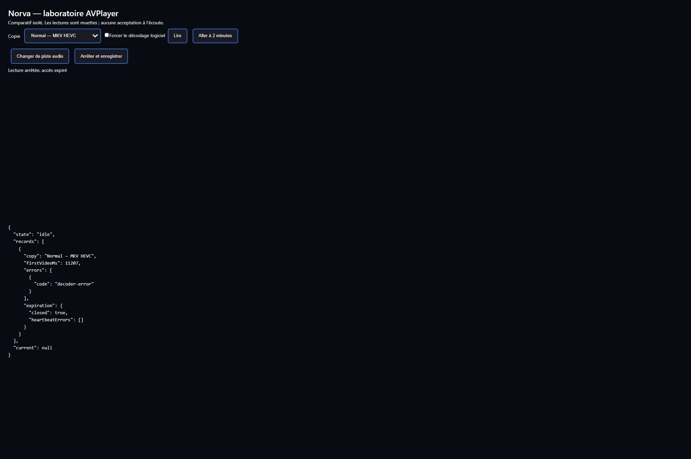

# AVPlayer sur les flux réels du catalogue Norva

Contrôle terminé le **10 octobre 2026 à 14:51 Paris**. **15 essais sur six copies réelles**, films et épisodes. La matrice de lecture synthétique a été interrompue à la demande d'Adrien ; aucune réussite synthétique n'est utilisée comme acceptation ici.

**La compatibilité progresse ; la fluidité reste insuffisante. Aucun remplacement du Gateway ni activation AVPlayer en production.** Les changements ci-dessous concernent exclusivement un banc local, conservé sous [ops/labs/libmedia-real-catalog](../../ops/labs/libmedia-real-catalog/README.md). Le prototype NorvaEngine de PR756 reste une expérience distincte.

## Résultats utiles

| Copie réelle | Parcours observé | Résultat |
| --- | --- | --- |
| Vice-versa 2, MP4 H.264/AAC | Adaptateur borné, rendu canvas | Première image à **52,7 s** ; seulement environ 24 s de progression pendant 92 s d'observation après démarrage. Insuffisant. |
| Le Robot Sauvage, MP4 H.264/AAC | Workers, données progressives, MSE | Lecture et saut fonctionnent, sans erreur déclarée dans cet essai. La mesure SDK de première image n'était pas adaptée à MSE ; pas de valeur exacte publiée. La vidéo atteint 141 s après le saut demandé à 120 s, mais cette observation courte ne certifie pas la continuité durable. |
| Silo S1E1, MP4 | Workers et MSE, plages de 2 Mio | Première image observée à **51,8 s**. Avant le saut : **40 s de vidéo en 40 s**, une image perdue sur 971. Saut avec progression vidéo en **5,0 s**, puis seulement **40,7 s de vidéo en 108 s**, plusieurs pauses jusqu'à 20 s. |
| Silo S1E1, même copie | MSE, plages progressives de 8 Mio | Première image à **16,2 s**, puis expiration d'une réponse et erreur à 77,8 s. Cette variante est écartée. |
| Conclave, MKV H.264/AAC | Workers/MSE, plages de 2 Mio, blocs de 64 Kio | Première image à **7,7 s**. Seulement **16 s de progression en 79 s** avant le saut ; sa reprise n'est pas validée dans la fenêtre d'essai. |
| Severance S1E1, MKV | Transport brut demandé pour l'épisode exact | Refus **HTTP 403** sur `bytes=0-1`, sans octet vidéo livré au décodeur. Aucune conclusion sur la compatibilité ou la fluidité de ce fichier. |
| Normal, copie 4K HEVC/E-AC-3 | Demande web ordinaire | Admission échouée à **65,1 s**, HTTP 502, avant AVPlayer. Le code serveur promeut encore ce profil vers l'adaptation Gateway. |
| Normal, même copie | Transport brut authentifié existant, réservé à cet essai | Première image à **11,2 s**, audio rendu à 10,6 s. **3840 × 1600**, E-AC-3 **6 canaux / 48 kHz**, deux pistes audio et trois pistes de sous-titres découvertes. Ensuite environ **2 s de progression en 128 s**, puis interruption du transport. Compatibilité ponctuelle démontrée, fluidité non validée. |

Les positions de départ sont zéro ; les sauts demandés sont à deux minutes. Le réseau varie entre essais. Les configurations changent aussi : ces lignes ne constituent pas une comparaison causale de tous les gains. Le test HEVC concerne une copie 4K d'environ **13,66 Go**, différente des anciennes copies Normal utilisées dans les rapports précédents.

## Pourquoi les saccades restent visibles

Adrien a confirmé visuellement les saccades pendant le premier essai Silo. En rendu canvas, des pertes d'images et un écart des horloges audio/vidéo apparaissent. Le passage aux workers et à la vidéo MSE produit ensuite une phase Silo continue de 40 s avec très peu d'images perdues. **Cette phase ne couvre pas les interruptions après saut.** Les compteurs de pertes SDK et ceux de la vidéo native ont des définitions différentes ; ils ne sont pas comparés comme un même indicateur.

Les pauses restent concrètes sur MSE aussi. Sur le dernier Conclave, le lecteur de réponse a cumulé **106,7 s d'attente** et **13,47 Mo lus** dans une observation d'environ 188 s. Sur Normal brut, il cumule **78,7 s d'attente** pour **4,22 Mo lus** avant clôture. Ces temps incluent l'attente de résolution des lectures dans le navigateur ; **ce ne sont pas des mesures de débit TCP isolées**. Ils ne départagent pas fournisseur, relais, livraison Gateway et ordonnancement du navigateur. Changer de décodeur ne supprime donc pas, à lui seul, les attentes constatées.

L'essai à 8 Mio montre aussi une limite du banc : le délai absolu de 60 s peut expirer pendant une réponse dont la consommation est ralentie. L'erreur générique affichée par AVPlayer n'est pas une preuve de corruption du fichier. Le journal montre une annulation du lecteur réseau. La variante n'est pas retenue.

## Corrections et instruments du banc

- Le chargeur HTTP SDK par défaut reçoit un HEAD refusé et tente une plage ouverte sur ces accès. Il est remplacé par un adaptateur de plages finies : offsets, taille exacte numérique et longueur vérifiés, lectures sérialisées, arrêt du transport à la fermeture.
- Taille initialisée avant le démuxage, ouverture idempotente et capacité de déplacement déclarée. Deux essais réalisés avec un adaptateur encore incomplet sont exclus de l'évaluation de performance.
- Les épisodes sont admis comme `series` avec leur identifiant d'épisode et `audioSeriesId`, conformément à WatchPage. Le premier Silo envoyé comme `episode` a été refusé avant lecture ; cet échec était celui du banc.
- Octets transmis pendant leur réception ; fenêtres incomplètes exclues du cache. Cache uniquement en RAM de cette session, borné à quatre fenêtres complètes. Aucune mutualisation entre comptes ni stockage interne du film.
- Workers activés et MSE retenu lorsque les codecs sont acceptés. Le rendu canvas/WebAudio reste employé sur le HEVC/E-AC-3 testé : le navigateur refuse `audio/mp4; codecs="ec-3"` en MSE. Ce résultat ne démontre ni décodage HEVC exclusivement en WASM, ni fidélité HDR.
- Regroupement des petits fragments en blocs d'au plus 64 Kio pour limiter les échanges avec les workers. Compteurs propres au transport ajoutés. Le compteur SDK de bande passante présente parfois des valeurs négatives dans ce mode ; il n'est pas utilisé comme preuve de débit.
- Première image et progression MSE observées sur la balise vidéo réelle, avec état, dimensions, images rendues/perdues et réserve. Les premières mesures qui ne regardaient que l'événement canvas `firstVideoRendered` n'ont pas servi à publier un démarrage MSE exact.
- Affichage des métriques borné : il ne réécrit plus tout l'historique toutes les 500 ms. Les reçus complets restent conservés à la clôture.
- Normal HEVC était promu vers le Gateway par `serverPromotedRelay` avant l'entrée dans la branche `enginePipe`. L'essai distinct utilise le transport brut de récupération existant, avec session ordinaire, claims et revalidation, limité à cette copie revue. **Une négociation de capacités web appropriée reste à concevoir avant toute intégration publique.**

## Limites d'acceptation

Les lectures sont **muettes**. Des images et des trames audio sont réellement produites, sans erreur de décodage signalée dans les extraits avant interruption ; **la qualité à l'écoute n'est pas validée**. Pour MSE, les compteurs SDK ne suffisent pas à certifier le décodage audio natif.

Les pistes de sous-titres de Conclave et Normal sont découvertes, contrairement à leur comptage incomplet dans les profils de catalogue. **Leur affichage complet, la réplique traversant un saut et les changements de piste ne sont pas validés ici.** Les conteneurs MPEG-TS/MOV/AVI n'ont pas été joués : aucun fichier réel de ces formats n'était ajouté au manifeste revu. Aucun test mobile ou autre navigateur n'est revendiqué.

L'isolation permettant les threads WASM partagés n'a pas été activée sur ce banc. Les essais ne valident pas un budget CPU, RAM ou batterie pour tous les appareils. Le SDK et les décodeurs restent hors du paquet Norva.

## Suite fondée sur ces observations

1. Garder le décodage local comme option expérimentale ; préserver le lecteur publié.
2. Comparer le trajet des **mêmes fichiers** et positions avec le trajet supplémentaire proposé par NodeMaven, dès disponibilité autorisée. Aucun message ni changement de relais effectué dans cette séance.
3. Examiner l'attente des lecteurs réseau et la temporisation pendant la contre-pression, avec les nouveaux compteurs, avant d'élargir les plages.
4. Pour AVPlayer, négocier les capacités avec Edge sans promotion automatique vers un transcodage inutile, puis valider pistes, sous-titres, écoute et appareils réels. La liste de formats du SDK ne remplace pas ces validations.

## Provenance et clôture

[libmedia](https://github.com/zhaohappy/libmedia) et [AVPlayer](https://zhaohappy.github.io/libmedia/docs/) sont les sources du SDK ; paquet **1.3.1**, commit et empreintes consignés dans le [README du banc](../../ops/labs/libmedia-real-catalog/README.md). Aucun accès fournisseur ou URL signée n'a été envoyé à ces projets.

[JSON de mesures et clôture](2026-10-10-web-avplayer-real-catalog.json). Reçus détaillés privés : `.codex-artifacts/libmedia-20261010/browser.safe.json`, contrôleur sous `/home/adrien/.norva/libmedia-20261010/`. Les erreurs d'admission sont séparées des erreurs de lecture ; les phases excluent les échantillons après événement terminal.

**13 sessions allouées vérifiées sans session encore active.** Le Gateway primaire et les deux Edge du même hôte sont sains. Contrôleur, tunnel SSH et serveur local arrêtés ; onglet temporaire fermé. Aucune autre session utilisateur arrêtée. **Aucun déploiement applicatif, Gateway ou changement de relais.**

